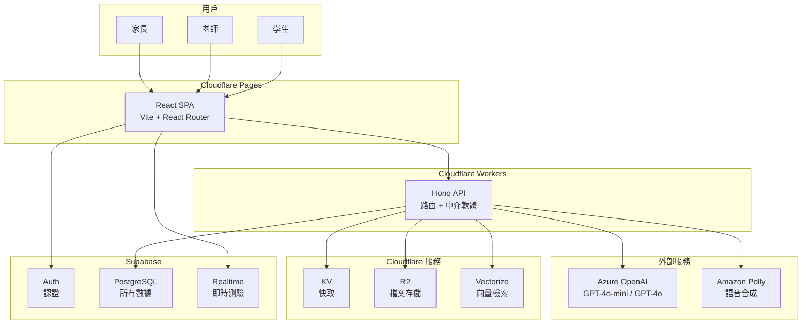

# Cloudflare 技術棧遷移計劃

## 背景

用戶出於 **成本考慮**，希望將整個技術棧從 Vercel + Next.js 架構遷移到 Cloudflare 生態系統，同時加入向量搜索 (Vectorize)、語音合成 (Amazon Polly) 等新能力。教育功能設計 (Part 2-4) 的業務邏輯保持不變。

## 前端框架建議：React SPA (Vite)

推薦使用 **Vite + React + React Router + Tailwind CSS + shadcn/ui** 部署到 Cloudflare Pages，而不是 Next.js，原因如下：

- **完美相容**：純靜態文件，Cloudflare Pages 原生支援，不需要 `@cloudflare/next-on-pages` 適配層
- **無 SSR 複雜度**：這是私人教育工具，不需要 SEO；所有數據通過 Workers API 取得
- **Cursor AI 支援極好**：React 是 Cursor 最擅長的框架
- **shadcn/ui 完全相容**：shadcn 官方支持 Vite + React 項目
- **開發體驗更好**：Vite 的 HMR 比 Next.js 快很多

## 新架構總覽




**數據流：**

1. 用戶打開網頁 → Cloudflare Pages 傳送靜態 SPA
2. 登入 → 前端直接呼叫 Supabase Auth → 取得 JWT
3. 所有 API 呼叫 → 帶 JWT 打 Workers (Hono) → Workers 驗證 JWT → 處理業務邏輯
4. AI 對話 → Workers 查 Vectorize 取相關教材 → 注入 prompt → 呼叫 Azure OpenAI → 串流回前端
5. 默書/朗讀 → Workers 檢查 R2 有無快取音頻 → 沒有則呼叫 Polly 生成 → 存 R2 → 回傳 URL
6. 即時測驗 → 前端直接用 Supabase Realtime（不經 Workers）

## 各 Cloudflare 服務的用途

- **Cloudflare Vectorize (向量檢索)**
  - RAG：嵌入課文、詞彙表、語法規則，讓 AI 回答時引用真實教材
  - 相似題搜索：根據學生的錯題找出相似的練習題
  - Embedding 由 Azure OpenAI (`text-embedding-3-small`) 生成
- **Amazon Polly (語音合成)**
  - 默書朗讀：用 Neural Chinese voice (Zhiyu) 朗讀詞語，取代不穩定的 Web Speech API
  - 課文朗讀：讓學生邊看邊聽（幫助粵語學生理解普通話發音）
  - 生成的音頻快取到 R2，避免重複生成
- **Cloudflare R2 (檔案存儲)**
  - Polly 生成的音頻檔案
  - 學生作文拍照上傳（Phase 2）
  - 老師上傳的教材/工作紙
  - 免費 egress，學生存取音頻不產生流量費
- **Cloudflare KV (快取)**
  - 班級配置和科目配置（讀多寫少）
  - AI 審核通過的題目快取
  - 即時測驗的 join code → session 映射
  - API 回應快取（減少重複 DB 查詢）

## 項目結構變更

從單一 Next.js 項目變為前後端分離的雙目錄結構：

```
eduspark/
├── web/                          # React SPA → 部署到 Cloudflare Pages
│   ├── src/
│   │   ├── App.tsx
│   │   ├── router.tsx            # React Router 路由配置
│   │   ├── pages/                # 頁面（對應原 app/ 結構）
│   │   │   ├── auth/             # 登入/註冊
│   │   │   ├── student/          # 學生功能
│   │   │   ├── teacher/          # 教師儀表板
│   │   │   ├── classroom/        # 課堂投影模式
│   │   │   ├── live/             # 學生即時作答
│   │   │   └── parent/           # 家長報告
│   │   ├── components/           # 共用組件
│   │   │   ├── ui/               # shadcn/ui
│   │   │   ├── chat-bubble.tsx
│   │   │   ├── stroke-animator.tsx
│   │   │   └── ...
│   │   ├── lib/
│   │   │   ├── supabase.ts       # Supabase 客戶端（Auth + Realtime）
│   │   │   ├── api.ts            # Workers API 呼叫封裝
│   │   │   └── subjects/         # 科目前端配置
│   │   └── hooks/
│   ├── vite.config.ts
│   ├── tailwind.config.ts
│   └── package.json
├── api/                          # Cloudflare Worker → 用 wrangler 部署
│   ├── src/
│   │   ├── index.ts              # Hono 入口
│   │   ├── routes/               # API 路由
│   │   │   ├── chat.ts
│   │   │   ├── exercise.ts
│   │   │   ├── generate.ts
│   │   │   ├── tts.ts            # 語音合成 API
│   │   │   ├── search.ts         # 向量搜索 API
│   │   │   └── exam.ts
│   │   ├── services/             # 外部服務封裝
│   │   │   ├── azure-openai.ts   # Azure OpenAI
│   │   │   ├── vectorize.ts      # Cloudflare Vectorize
│   │   │   ├── polly.ts          # Amazon Polly
│   │   │   ├── r2.ts             # Cloudflare R2
│   │   │   └── kv.ts             # Cloudflare KV
│   │   ├── middleware/
│   │   │   ├── auth.ts           # 驗證 Supabase JWT
│   │   │   └── cors.ts
│   │   └── subjects/             # Prompt 模板（同原結構）
│   │       └── chinese/
│   ├── wrangler.toml             # Workers 配置 + bindings
│   └── package.json
├── supabase/
│   └── migrations/
└── README.md
```

## 成本估算更新


| 服務                       | 免費層額度                 | 60-90 學生預估用量             | 月費              |
| ------------------------ | --------------------- | ------------------------ | --------------- |
| Cloudflare Pages         | 無限頻寬、500 builds/月     | ~20 builds/月             | HKD 0           |
| Cloudflare Workers       | 免費：100K req/天（3M/月）   | ~30K req/月               | HKD 0           |
| Cloudflare Workers Paid* | 10M req/月             | 解鎖 Vectorize 高配額         | HKD 39 ($5)     |
| Cloudflare KV            | 含在 Workers 內          | ~50K reads/天             | HKD 0           |
| Cloudflare R2            | 10GB、10M reads        | ~2GB 音頻+檔案               | HKD 0           |
| Cloudflare Vectorize     | 含在 Workers Paid       | ~10K queries/月           | HKD 0           |
| Supabase                 | 500MB DB、50K MAU      | ~~150MB、~~95 MAU         | HKD 0           |
| Azure OpenAI             | 按量付費                  | ~5M in + 1.5M out tokens | HKD 100-300     |
| Amazon Polly             | Standard: $4/1M chars | ~500K chars/月            | HKD 15-40       |
| Cursor                   | Pro 方案                | 開發用                      | HKD 160         |
| **合計**                   |                       |                          | **HKD 314-539** |


*Workers Paid ($5/月) 是可選的——免費層 Vectorize 有 5M queried dimensions/月，可能足夠 Phase 1 使用。超出後再升級。

**對比原 Vercel 架構的成本差異：**

- 新增 Workers Paid: +HKD 39
- 新增 Polly: +HKD 15-40
- Cloudflare 頻寬無限免費 vs Vercel 100GB 限制：大規模使用時 Cloudflare 更划算
- R2 免費 egress vs Supabase Storage 有限額：音頻文件存取完全免費
- 整體略高 HKD 54-79，但多了語音合成和向量搜索能力

## 需要修改的 architecture.md 章節

### 必須完全重寫的章節

- **1.6 技術棧選型與理由** — 所有技術選型更新
- **1.7 系統架構總覽** — 新的 Mermaid 圖和數據流
- **1.8 月度成本估算** — 新的成本表
- **1.9 項目結構** — 前後端分離的新目錄結構
- **1.10 環境變數** — 增加 Azure、AWS、Cloudflare 配置
- **1.11 部署流程** — Cloudflare Pages + Workers 部署
- **附錄 B 啟動清單** — 全新的初始化步驟
- **附錄 C 名詞對照** — 增加 Cloudflare、Hono、Polly、Vectorize 等詞條

### 需要局部修改的章節

- **2.1 用戶角色與認證** — Supabase Auth 保留，但 API 認證方式改為 Workers 驗證 JWT
- **2.5 統一練習框架 - 默書部分** — 新增 Polly 語音合成取代 Web Speech API
- **2.14 課堂模式** — Realtime 部分不變，但 API 路徑更新
- **Part 3 AI Prompt 策略** — OpenAI → Azure OpenAI，新增 RAG 增強段落
- **Part 5 路線圖** — 部分時間調整（新架構初始設置可能多 1-2 週）
- **附錄 A SQL** — 新增 `embeddings_log` 表追蹤向量嵌入狀態

### 不需要修改的章節

- **1.1-1.5** — 產品定位和功能範疇不變
- **2.2 Schema** — Supabase PostgreSQL 保留，Schema 基本不變
- **2.3-2.4** — 登入流程和對話功能的業務邏輯不變
- **4.1-4.5** — 教師儀表板和 Power BI 設計不變（只改底層 API 呼叫方式）

### 新增章節

- **1.6.x Cloudflare Workers 與 Hono** — 說明為何選 Hono 作為 Workers 框架
- **2.x 向量搜索架構** — Embedding 生成、存儲、RAG 流程
- **2.x 語音合成架構** — Polly 調用、R2 快取、前端播放
- **2.x 快取策略** — KV 的使用場景和更新策略

## 技術決策說明

### 為何選 Hono 作為 Workers 框架

- 專為 Cloudflare Workers 設計的輕量 Web 框架
- 類似 Express 的 API，Cursor AI 能輕鬆生成
- 內建 CORS、JWT 驗證、Logger 中介軟體
- TypeScript first，type-safe bindings
- 社群活躍，文檔齊全

### 為何保留 Supabase (Auth + PostgreSQL + Realtime)

- Auth：成熟的認證服務，免費且好用
- PostgreSQL：關聯式數據庫對結構化學習數據最合適
- Realtime：即時測驗的 WebSocket 同步不需要自建
- Cloudflare D1 (SQLite) 雖然也可以用，但 PostgreSQL 功能更完整且已有完整 Schema
- Power BI 直連 PostgreSQL 的方案不受影響

### 為何選 Azure OpenAI 而非直接 OpenAI

- 可選東亞區域部署，澳門延遲更低
- 內建內容安全過濾，適合兒童場景
- 定價相同，但有 enterprise-grade SLA
- 同樣支援 GPT-4o-mini 和 GPT-4o

