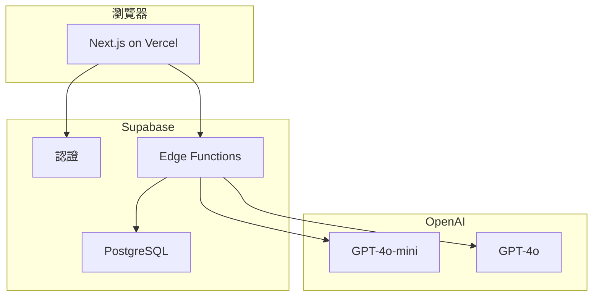

# EduSpark AI — 一人 Cursor 開發架構文件（第四版）

## 根本性重構

第三版是為 6-8 人專業團隊設計的。第四版為真實情況完全重寫：

- 一人開發，非專業開發者，靠 Cursor AI 生成程式碼
- 每週 5-10 小時（週末）
- 預算 < HKD 500/月
- 太太是澳門小學中文老師 = 教育專家 + 首批用戶 + 測試場地
- 第一目標：太太班上 ~30 名學生能用的中文學習 AI 工具

## 核心設計原則

- 能用現成服務就不自己建（不寫 adapter 抽象層）
- 30 個用戶不需要分散式架構（全同步、單資料庫）
- Prompt 工程 > 自建演算法（不建 BKT/IRT，用好 system prompt）
- 太太的判斷 > 自動化系統（手動管理課程內容和學生分組）
- 先做出來，再做好

## 技術棧（極簡）

- 前端：Next.js 15 + Tailwind + shadcn/ui → Vercel 免費層
- 後端/DB/Auth：Supabase 免費層
- AI：OpenAI API（GPT-4o-mini 日常 + GPT-4o 作文批改）
- 開發：Cursor
- 月成本：~HKD 100-200

## 文件結構（五部分）

**Part 1** — 產品定位與技術基礎（系統架構、DB schema、部署步驟）

**Part 2** — 核心功能設計 Phase 0-1（AI 對話、默書、測驗、冷啟動體驗）

**Part 3** — AI Prompt 工程（中文教學 prompt、作文批改 prompt、安全護欄）

**Part 4** — 教師儀表板（太太的備課/批改/家長溝通工作流為藍本）

**Part 5** — 成長路徑（Phase 2-4 願景、成本模型、風險、Cursor 開發指南）

## 路線圖

- Phase 0（第 1-6 週，~50 小時）：能對話 — AI 中文學伴基本功能
- Phase 1（第 7-20 週，~120 小時）：能用 — 默書/測驗/教師儀表板，太太班上實測
- Phase 2（第 21-40 週，~160 小時）：好用 — 作文批改、學習進度、家長報告
- Phase 3（第 41-60 週，~160 小時）：能推廣 — 多班級、其他年級、付費機制

## V3 功能去留

砍掉：BKT/IRT/間隔重複、事件驅動、向量搜尋/RAG、PWA 離線、多 LLM 抽象、語意快取、讀寫分離、CI/CD 管線
簡化：多租戶(→簡單 school_id)、知識圖譜(→JSON/簡單表)、UI 殼層(→只做小學版)、安全協議(→OpenAI 內建過濾)
保留作為長期願景：完整認知引擎、多科目、港澳雙市場、B2B 學校方案

## 產出

- 單一檔案 `architecture.md`，約 8,000-12,000 字
- 3 張 Mermaid 圖
- 每個 Phase 附帶 Cursor 開發指引
- 附錄：V3 長期願景精簡版
