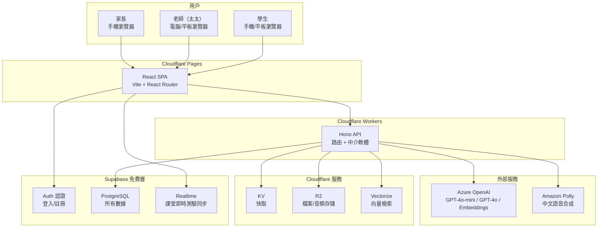
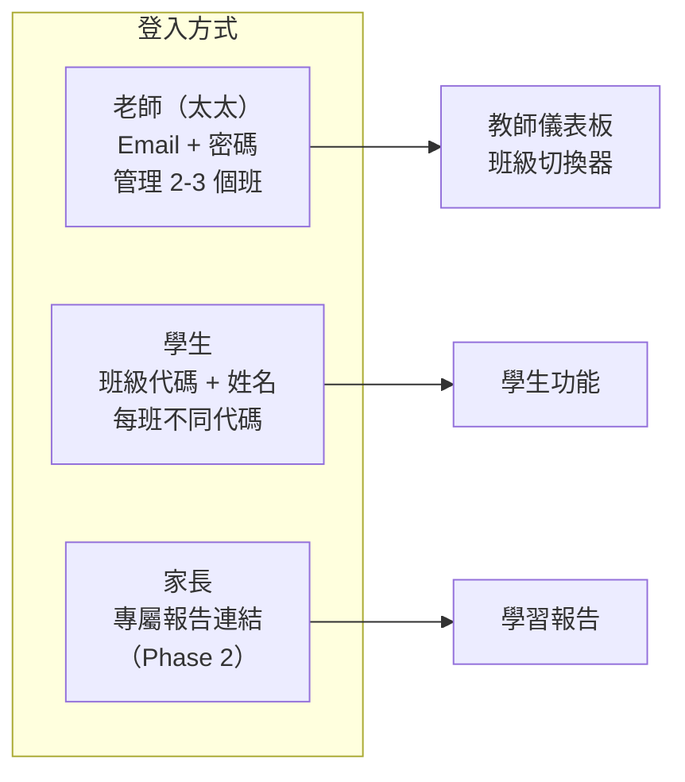
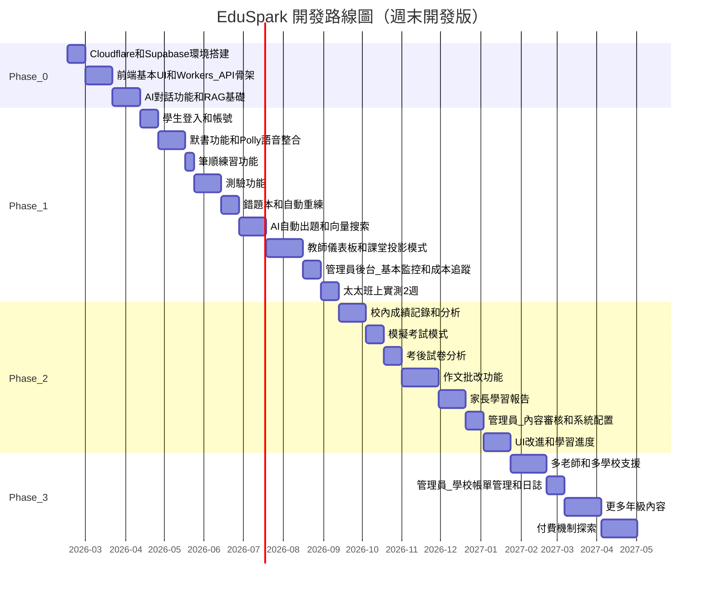

# EduSpark AI — 智能中文學伴平台架構文件

**版本：** 5.3（Cloudflare 架構版 + 全功能 AI 角色標註）
**日期：** 2026 年 2 月 8 日
**作者：** 一人開發者（Cursor AI 輔助）
**狀態：** 可執行的開發指南

---

## Part 1：產品定位與技術基礎

### 1.1 一句話定義

一個讓太太班上的澳門小學生可以隨時跟 AI 練習中文的 Web 應用——包括對話問答、默書練習和作文批改。

### 1.2 約束條件（誠實面對）

這些約束不是缺點，而是設計的出發點。每個技術決策都必須在這些約束下成立：

- **開發者：** 一人，非專業開發者，主要靠 Cursor AI 生成和修改程式碼
- **時間：** 每週 5-10 小時（週末為主）
- **預算：** < HKD 500/月（盡量用免費層）
- **核心優勢：** 太太是澳門在職小學中文老師——她提供教學專業、課程內容、第一批學生、和持續的使用回饋
- **首批用戶：** 太太教的 2-3 個班，跨年級（如同時教小三和小四），合共約 60-90 名小學生。同年級的班大部分教學內容相同但會微調
- **設備：** 學生主要用手機或平板，少數用電腦
- **語言環境：** 學生日常講粵語，學校教漢語拼音（普通話拼音），但學生拼音未必很熟練。平台的介面和內容用繁體中文，拼音作為輔助提示（非主要提示方式）

### 1.3 核心價值主張

**唯一重要的成功指標：學生的校內紙本考試分數有沒有提升。**

家長看的是成績表上的分數，學校看的是考試排名，太太的 KPI 是全班平均分。平台裡的練習分數只是過程，學校發回來的考試卷上的分數才是結果。如果學生在平台上練了 100 題，但期末考沒有進步，家長會說「這個 App 沒用」。

所以產品的設計必須圍繞一個閉環：

```
平台練習 → 學校紙本考試 → 考試成績輸入平台 → 分析失分點
→ 針對失分點生成練習 → 下次考試進步 → 用實際分數證明有效
```

這個產品同時解決兩個問題：

**對太太（老師）：減輕工作量。** 備課出題從 2-3 小時變成 25 分鐘，默書批改從 1 小時變成 5 分鐘，作文批改從 5-8 小時變成 1-2 小時。加上考後試卷分析自動化，每週省 10+ 小時。

**對學生和家長：提升校內考試分數。** 不是「平台上的分數」，而是學校發回來的成績表上的分數。產品用校內真實成績作為衡量標準，每次考試後對比進步幅度。

### 1.4 做什麼（Phase 1 範圍）

小學中文科不只是默書。產品必須覆蓋考試的六大範疇，否則對成績的提升有限：

| 範疇 | 佔考試比重 | 平台功能 | 階段 |
|------|----------|---------|------|
| 閱讀理解 | ~25-30% | AI 根據課文/短文出理解題，自動評分 | Phase 1 |
| 作文/寫作 | ~25-30% | AI 批改 + 太太審核 | Phase 2 |
| 語文基礎知識 | ~20-25% | 標點、改錯字、句式改寫、修辭辨識練習 | Phase 1 |
| 詞語運用 | ~10-15% | 選詞填充、近反義詞、成語運用 | Phase 1 |
| 默書（聽寫） | ~10-15% | 自動評分 + 聽寫/解釋/漢語拼音多種提示模式 + 筆順動畫與寫字練習 | Phase 1 |
| 排句成段 | ~5-10% | 打亂句子重組為通順段落 | Phase 1 |

除了默書和作文需要特殊處理外，其他四個範疇都可以用**統一的練習框架**實現——AI 出題、學生作答、自動評分、錯題記錄。

**三個機制貫穿所有範疇：**

1. **AI 自動出題** — 太太輸入課文或知識點，AI 根據六大範疇自動生成不同題型的練習（不只是默書詞表），太太審核後發佈
2. **錯題自動重練** — 所有範疇的錯題都進入同一個錯題本，下次練習優先出現，答對 3 次才移出
3. **校內考試成績追蹤（Phase 2）** — 記錄真實校內考試分數，追蹤班級趨勢，用真實成績證明平台有效

**加上 AI 的獨特價值：**

4. **AI 主動引導練習** — AI 根據學生跨範疇的錯題記錄主動出題：不只是「你默書寫錯了」，還有「你上次閱讀理解的主旨題答錯了，我們來練習一下怎麼找文章的中心思想」
5. **AI 作文批改** — 學生提交作文，AI 按評分標準批改，太太審核微調（Phase 2）
6. **模擬考試 + 考後分析（Phase 2）** — 限時模擬紙本考試格式，考後自動分析失分點並生成針對性複習

### 1.5 不做什麼（明確的邊界）

以下功能在可見的未來不做，每條都有理由：

- **不做數學或英文** — 先把中文做好做深，太太的專業就是中文
- **不做即時語音互動** — 技術複雜度太高，兒童語音識別率低，投入產出比不合理
- **不做社交功能** — 學生之間的互動需要內容審核，一人無法管理
- **不做手機原生 App** — Web App 足夠，不需要上架 App Store 的審核成本
- **不做自動化知識圖譜** — 太太手動管理課程內容比任何演算法都準確
- **不做複雜的認知追蹤模型** — 60-90 個學生不需要 BKT/IRT，簡單的成績記錄 + 太太的專業判斷就夠了
- **不做多語言** — 只做繁體中文介面，學習內容也只有中文科
- **不做付費功能** — Phase 0-2 全免費，先驗證產品有沒有用

### 1.6 技術棧選型與理由

每個選擇都基於三個標準：(1) 有免費層或極低成本、(2) Cursor AI 能很好地生成相關程式碼、(3) 社群資源豐富，遇到問題容易找到答案。

**前端框架：React SPA（Vite + React Router）→ 部署到 Cloudflare Pages**

選擇理由：Cursor AI 對 React 的程式碼生成品質最好（訓練數據最多）。用 Vite 建立純前端 SPA（Single Page Application），所有 API 呼叫打到 Cloudflare Workers。Cloudflare Pages 提供**無限頻寬**的免費部署。

不選 Next.js 的原因：Next.js 在 Cloudflare Pages 上需要 `@cloudflare/next-on-pages` 適配層，有些功能不完全相容（Image Optimization、部分 Middleware）。這個產品是私人教育工具，不需要 SEO，SPA 完全夠用且更簡單。
不選 Vue/Nuxt 的原因：雖然 Vue 對新手更友好，但 Cursor AI 對 React 生態的支援明顯更好。

**UI 組件：Tailwind CSS + shadcn/ui**

選擇理由：shadcn/ui 提供預建的美觀組件（按鈕、對話框、表單、表格），直接複製到項目中使用，不需要從零設計 UI。Tailwind 的 utility class 讓 Cursor AI 能直接在 JSX 中寫樣式，不需要管理 CSS 檔案。shadcn/ui 官方支援 Vite + React 項目。

**API 層：Cloudflare Workers + Hono 框架**

選擇理由：Cloudflare Workers 是邊緣運算平台，所有 API 邏輯（業務邏輯、AI 調用、語音合成、向量搜索）都在 Workers 中執行。免費層極為慷慨——每天 100,000 次請求（約 300 萬/月），60-90 個學生完全免費。

Hono 是專為 Cloudflare Workers 設計的輕量 Web 框架，提供類似 Express 的路由和中介軟體 API，Cursor AI 能輕鬆生成程式碼。內建 CORS、JWT 驗證、Logger 等常用中介軟體。TypeScript first，與 Workers 的 bindings（KV、R2、Vectorize）完美整合。

不選 Supabase Edge Functions 的原因：Cloudflare Workers 的免費額度更大（100K/天 vs 500K/月），且能直接存取 Cloudflare 的 KV、R2、Vectorize 等服務，不需要額外的網路跳轉。

**認證：Supabase Auth**

選擇理由：繼續使用 Supabase Auth 處理老師的 Email + 密碼登入。前端直接呼叫 Supabase Auth SDK 取得 JWT，後續所有 API 請求帶上 JWT，由 Workers 驗證。免費層 50,000 月活用戶，綽綽有餘。

**資料庫：Supabase PostgreSQL**

選擇理由：關聯式資料庫對結構化的學習數據（成績、進度、錯題）查詢最方便。500MB 免費層對 60-90 個學生綽綽有餘。Power BI 可以直連 PostgreSQL 做報表。Supabase Realtime 用於課堂即時測驗的 WebSocket 同步（200 個同時連線，免費）。

不選 Cloudflare D1 的原因：D1 是 SQLite，功能不如 PostgreSQL 完整（如 JSONB、複雜聚合查詢）；且已有完整的 PostgreSQL Schema，不需要遷移。

**AI：Azure OpenAI**

選擇理由：與 OpenAI 直接 API 提供相同的模型（GPT-4o-mini、GPT-4o），但有以下優勢：
- 可選**東亞區域**部署，從澳門存取延遲更低
- 內建**內容安全過濾**，對兒童場景多一層保護
- Enterprise-grade SLA，服務穩定性更高
- 支援 `text-embedding-3-small` 模型，用於生成向量嵌入（配合 Vectorize 做 RAG）

定價與 OpenAI 直接 API 相同（GPT-4o-mini 約 USD 0.15/百萬 input tokens）。成本估算：60-90 個學生，月均 API 成本約 HKD 100-300。

**向量搜索：Cloudflare Vectorize**

選擇理由：用於兩個核心場景——
1. **RAG（檢索增強生成）**：將課文、詞彙表、語法規則嵌入為向量，學生提問時搜索相關教材注入 AI prompt，讓 AI 回答有教材依據
2. **相似題搜索**：根據學生的錯題，從題庫中找出相似的練習題進行針對性重練

向量由 Azure OpenAI 的 `text-embedding-3-small` 模型生成（1536 維）。Vectorize 包含在 Workers 免費層中（5M queried vector dimensions/月）。

**語音合成：Amazon Polly**

選擇理由：用於兩個核心場景——
1. **默書朗讀**：用 Neural Chinese 語音（Zhiyu）朗讀詞語，取代不穩定的瀏覽器 Web Speech API。語音品質遠好於瀏覽器內建 TTS，發音標準、語速可控
2. **課文朗讀**：讓學生邊看課文邊聽標準普通話朗讀，幫助粵語學生理解普通話發音

生成的音頻快取到 R2，避免重複生成。Standard 語音 $4/百萬字元，Neural 語音 $16/百萬字元。60-90 個學生月均約 HKD 15-40。首 12 個月有免費額度（5M 字元/月）。

**檔案存儲：Cloudflare R2**

選擇理由：存儲 Polly 生成的音頻檔案、學生作文拍照上傳（Phase 2）、老師上傳的教材。R2 最大的優勢是**零 egress 費用**——學生存取音頻不產生流量費。免費層 10GB 存儲 + 10M 讀取/月，對本項目綽綽有餘。

**快取：Cloudflare KV**

選擇理由：Key-Value 存儲，用於快取頻繁讀取的數據——班級配置、科目配置、AI 審核通過的題目、即時測驗的 join code 映射。讀取極快（邊緣節點），減少重複查詢 Supabase。免費層 100K reads/天。

**筆順動畫與練習：HanziWriter（開源免費）**

選擇理由：MIT 授權的 JavaScript 庫，支援 9000+ 繁體字的筆順動畫展示和互動練習測驗。只有 35KB（gzip 後 10KB），手機上流暢運行。內建 quiz 模式讓學生用手指描畫漢字，逐筆判斷筆順對錯。不需要外部 API，沒有額外成本。npm 安裝 `hanzi-writer` 即可使用。

**版本控制：GitHub（免費）**

選擇理由：Cursor 內建 Git 支援。GitHub 是 Cursor AI 的訓練數據來源之一，對 GitHub 上的常見模式理解最好。

### 1.7 系統架構總覽

前後端分離架構：React SPA 部署到 Cloudflare Pages，所有 API 邏輯在 Cloudflare Workers 執行，數據存在 Supabase PostgreSQL：



**數據流說明：**

1. 用戶打開網頁 → Cloudflare Pages 傳送靜態 React SPA
2. 學生/老師登入 → 前端直接呼叫 Supabase Auth → 取得 JWT
3. 所有 API 呼叫 → 前端帶 JWT 打 Cloudflare Workers (Hono) → Workers 驗證 JWT → 處理業務邏輯
4. AI 對話 → Workers 查 Vectorize 取相關教材 → 注入 prompt → 呼叫 Azure OpenAI → 串流回前端
5. 默書/朗讀 → Workers 檢查 R2 有無快取音頻 → 沒有則呼叫 Amazon Polly 生成 → 存 R2 → 回傳音頻 URL
6. 對話/練習記錄 → Workers 存入 Supabase PostgreSQL
7. 即時課堂測驗 → 前端直接用 Supabase Realtime（不經 Workers，降低延遲）
8. 太太查看儀表板 → 前端呼叫 Workers API 讀取 PostgreSQL 數據 → 渲染圖表

### 1.8 月度成本估算

| 服務 | 免費層額度 | 60-90 學生（太太的 2-3 個班）預估用量 | 月費 |
|------|-----------|--------------------------------------|------|
| Cloudflare Pages | 無限頻寬、500 builds/月 | ~20 builds/月 | HKD 0 |
| Cloudflare Workers | 免費：100K req/天（~3M/月） | ~30K req/月 | HKD 0 |
| Cloudflare KV | 含在 Workers 免費層 | ~50K reads/天 | HKD 0 |
| Cloudflare R2 | 10GB 存儲、10M reads/月 | ~2GB（音頻+檔案） | HKD 0 |
| Cloudflare Vectorize | 免費：5M queried dimensions/月 | ~3M dimensions/月 | HKD 0 |
| Supabase | 500MB DB、50K MAU、200 Realtime 連線 | ~150MB DB、~95 MAU | HKD 0 |
| Azure OpenAI | 按量付費（定價同 OpenAI） | ~5M input + 1.5M output tokens/月 | HKD 100-300 |
| Amazon Polly | 首 12 月免費 5M 字元/月；之後 Standard $4/1M | ~500K 字元/月 | HKD 0-40 |
| GitHub | 無限公開/私有倉庫 | 1 個私有倉庫 | HKD 0 |
| Cursor | Pro 方案 | 開發用 | HKD 160 |
| **合計** | | | **HKD 260-500** |

**Cloudflare 的成本優勢：**
- Pages 頻寬**無上限**（Vercel 免費層只有 100GB）→ 推廣到更多學生時不用擔心流量費
- R2 **零 egress 費用** → 學生存取音頻檔案完全免費
- Workers 免費層每天 100K 請求（~3M/月）→ 60-90 學生遠遠用不完

**擴展成本：** 推廣到太太學校的更多班級（~300 人），Azure OpenAI 費用升到 HKD 300-800，Polly 約 HKD 80-160，其他 Cloudflare 和 Supabase 服務仍在免費層。如果 Vectorize 查詢量超出免費層，可升級到 Workers Paid（$5/月 ≈ HKD 39），解鎖 30M queried dimensions/月。

### 1.9 項目結構

前後端分離的 monorepo 結構——`web/` 是 React SPA（部署到 Cloudflare Pages），`api/` 是 Cloudflare Worker（用 Wrangler 部署）：

```
eduspark/
├── web/                              # React SPA → 部署到 Cloudflare Pages
│   ├── src/
│   │   ├── App.tsx                   # 根組件
│   │   ├── router.tsx                # React Router 路由配置
│   │   ├── main.tsx                  # Vite 入口
│   │   ├── pages/                    # 頁面組件
│   │   │   ├── Home.tsx              # 首頁/登入頁
│   │   │   ├── auth/                 # 認證相關頁面
│   │   │   │   ├── Login.tsx
│   │   │   │   └── Register.tsx
│   │   │   ├── student/              # 學生功能頁面
│   │   │   │   ├── Chat.tsx          # AI 對話
│   │   │   │   ├── Practice.tsx      # 練習入口（根據科目顯示對應範疇）
│   │   │   │   ├── PracticeSession.tsx # 具體練習頁面
│   │   │   │   ├── ErrorBook.tsx     # 錯題本/錯題複習
│   │   │   │   ├── Stroke.tsx        # 筆順練習（中文科專屬）
│   │   │   │   └── Writing.tsx       # 作文提交（Phase 2）
│   │   │   ├── teacher/              # 教師功能頁面
│   │   │   │   ├── Dashboard.tsx     # 班級總覽
│   │   │   │   ├── Students.tsx      # 學生列表
│   │   │   │   ├── Content.tsx       # 內容管理（默書詞表、測驗題）
│   │   │   │   ├── Exams.tsx         # 校內成績記錄 + 分析（Phase 2）
│   │   │   │   ├── ExamDetail.tsx    # 單次考試詳細分析
│   │   │   │   ├── ExamAnalysis.tsx  # 考後試卷分析（Phase 2）
│   │   │   │   └── Reports.tsx       # 報告
│   │   │   ├── classroom/            # 課堂模式（太太隨堂用）
│   │   │   │   ├── Quiz.tsx          # 投影隨堂測驗（口答/舉手）
│   │   │   │   ├── Live.tsx          # 即時作答教師端
│   │   │   │   ├── StrokeTeach.tsx   # 筆順教學（大螢幕動畫）
│   │   │   │   └── ErrorReview.tsx   # 錯題討論
│   │   │   ├── live/                 # 學生即時作答端
│   │   │   │   └── Join.tsx          # 學生輸入課堂代碼加入即時測驗
│   │   │   ├── parent/               # 家長功能頁面（Phase 2）
│   │   │   │   └── Report.tsx        # 學習報告
│   │   │   └── admin/                # 超級管理員後台（漸進式建設）
│   │   │       ├── Dashboard.tsx     # 系統總覽 + AI 每日摘要（Phase 1）
│   │   │       ├── CostMonitor.tsx   # 即時成本監控 + AI 優化建議（Phase 1+2）
│   │   │       ├── Conversations.tsx # AI 智慧對話審核（Phase 1）
│   │   │       ├── Content.tsx       # AI 內容預審 + Prompt 改進（Phase 2）
│   │   │       ├── Alerts.tsx        # 學生風險預警（Phase 2）
│   │   │       ├── Config.tsx        # 系統配置（Phase 2）
│   │   │       ├── Schools.tsx       # 學校管理（Phase 3）
│   │   │       ├── Teachers.tsx      # 老師管理（Phase 3）
│   │   │       ├── Billing.tsx       # 帳單管理（Phase 3）
│   │   │       ├── PromptABTest.tsx  # Prompt A/B 測試（Phase 3）
│   │   │       ├── TeachingGaps.tsx  # 教學盲區分析（Phase 3）
│   │   │       └── Logs.tsx          # 系統日誌（Phase 2+）
│   │   ├── components/               # 共用組件
│   │   │   ├── ui/                   # shadcn/ui 組件
│   │   │   ├── ChatBubble.tsx        # 對話氣泡
│   │   │   ├── QuizCard.tsx          # 測驗卡片
│   │   │   ├── StrokeAnimator.tsx    # 筆順動畫展示（封裝 HanziWriter）
│   │   │   ├── StrokeQuiz.tsx        # 筆順練習測驗（封裝 HanziWriter quiz 模式）
│   │   │   ├── ClassroomPresenter.tsx # 課堂投影模式外框
│   │   │   ├── AudioPlayer.tsx       # Polly 音頻播放器（默書/朗讀用）
│   │   │   └── NavBar.tsx            # 導航欄
│   │   ├── lib/                      # 工具函數
│   │   │   ├── supabase.ts           # Supabase 客戶端（Auth + Realtime）
│   │   │   ├── api.ts                # Workers API 呼叫封裝（帶 JWT）
│   │   │   └── subjects/             # 科目前端配置（範疇名稱、圖標等）
│   │   │       └── index.ts
│   │   └── hooks/                    # 自定義 React Hooks
│   │       ├── useAuth.ts            # 認證狀態 Hook
│   │       └── useApi.ts             # API 呼叫 Hook
│   ├── index.html                    # Vite 入口 HTML
│   ├── vite.config.ts
│   ├── tailwind.config.ts
│   ├── tsconfig.json
│   └── package.json
│
├── api/                              # Cloudflare Worker → 用 wrangler 部署
│   ├── src/
│   │   ├── index.ts                  # Hono 入口（建立 app、掛載路由和中介軟體）
│   │   ├── routes/                   # API 路由
│   │   │   ├── chat.ts               # AI 對話 API（含 RAG 增強）
│   │   │   ├── exercise.ts           # 練習相關 API（統一處理六大範疇）
│   │   │   ├── score.ts              # AI 輔助評分（簡答題）
│   │   │   ├── generate.ts           # AI 自動出題 API
│   │   │   ├── tts.ts                # 語音合成 API（Polly + R2 快取）
│   │   │   ├── search.ts             # 向量搜索 API（Vectorize）
│   │   │   ├── exam.ts               # 校內成績記錄 API（Phase 2）
│   │   │   ├── exam-analyze.ts       # 考後分析 + 生成複習 API（Phase 2）
│   │   │   ├── writing.ts            # 作文批改 API（Phase 2）
│   │   │   └── admin.ts             # 管理員 API（系統監控/配置/學校管理）
│   │   ├── services/                 # 外部服務封裝
│   │   │   ├── azure-openai.ts       # Azure OpenAI（Chat + Embeddings）
│   │   │   ├── vectorize.ts          # Cloudflare Vectorize 封裝
│   │   │   ├── polly.ts              # Amazon Polly 語音合成封裝
│   │   │   ├── r2.ts                 # Cloudflare R2 檔案存取封裝
│   │   │   ├── kv.ts                 # Cloudflare KV 快取封裝
│   │   │   └── cost-tracker.ts       # API 成本追蹤（記錄每次 AI/Polly 呼叫的費用）
│   │   ├── middleware/               # 中介軟體
│   │   │   ├── auth.ts               # 驗證 Supabase JWT
│   │   │   ├── admin.ts              # 驗證管理員角色
│   │   │   ├── cors.ts               # CORS 設定
│   │   │   └── rate-limit.ts         # 簡易速率限制（用 KV 計數）
│   │   ├── scheduled/               # Cron Trigger 定時任務（管理員 AI 自動化）
│   │   │   ├── conversation-scan.ts  # 每晚 AI 對話掃描（Phase 1）
│   │   │   ├── student-risk-scan.ts  # 每週學生風險預警（Phase 2）
│   │   │   ├── content-quality.ts    # 每週內容品質分析 + Prompt 改進（Phase 2）
│   │   │   └── teaching-gap.ts       # 每月教學盲區分析（Phase 3）
│   │   └── subjects/                 # Prompt 模板（按科目組織）
│   │       ├── index.ts              # 科目註冊表
│   │       ├── chinese/              # 中文科（Phase 1 實現）
│   │       │   ├── config.ts         # 中文科配置：範疇定義、評分規則、年級差異
│   │       │   ├── prompts/          # 中文科的所有 Prompt 模板
│   │       │   │   ├── chat-system.ts
│   │       │   │   ├── generate-exercise.ts
│   │       │   │   ├── reading-scoring.ts
│   │       │   │   ├── dictation-hint.ts
│   │       │   │   └── writing-system.ts
│   │       │   └── categories.ts     # 中文科六大範疇定義與題型映射
│   │       ├── math/                 # 數學科（未來擴展，先建空目錄佔位）
│   │       └── english/              # 英文科（未來擴展，先建空目錄佔位）
│   ├── wrangler.toml                 # Workers 配置 + bindings（KV、R2、Vectorize）
│   ├── tsconfig.json
│   └── package.json
│
├── supabase/
│   └── migrations/                   # 資料庫遷移檔案
├── .env                              # 共用環境變數（本地開發用，不提交到 Git）
├── .gitignore
└── README.md
```

### 1.10 環境變數

前端和 API 有各自的環境變數：

**前端 `web/.env`（Vite 用 `VITE_` 前綴）：**

```
# Supabase（前端只需要公開的 URL 和 Anon Key）
VITE_SUPABASE_URL=https://xxxxx.supabase.co
VITE_SUPABASE_ANON_KEY=eyJxxxxxx

# Workers API 地址
VITE_API_URL=https://eduspark-api.your-subdomain.workers.dev
```

**API `api/wrangler.toml`（Workers 的 secrets 和 bindings）：**

```toml
name = "eduspark-api"
main = "src/index.ts"
compatibility_date = "2026-02-01"

[vars]
SUPABASE_URL = "https://xxxxx.supabase.co"

# Secrets（用 wrangler secret put 設定，不寫在檔案中）
# wrangler secret put SUPABASE_SERVICE_ROLE_KEY
# wrangler secret put AZURE_OPENAI_API_KEY
# wrangler secret put AZURE_OPENAI_ENDPOINT
# wrangler secret put AWS_ACCESS_KEY_ID
# wrangler secret put AWS_SECRET_ACCESS_KEY

# Bindings
[[kv_namespaces]]
binding = "CACHE"
id = "xxxxxxxx"

[[r2_buckets]]
binding = "STORAGE"
bucket_name = "eduspark-files"

[[vectorize]]
binding = "VECTORIZE"
index_name = "eduspark-embeddings"

# Cron Triggers（管理員 AI 自動化任務）
[triggers]
crons = [
  "0 23 * * *",   # 每晚 23:00 — AI 對話自動掃描（Phase 1）
  "0 8 * * 1",    # 每週一 08:00 — 學生風險預警掃描（Phase 2）
  "0 9 * * 5",    # 每週五 09:00 — AI 內容品質分析 + Prompt 改進建議（Phase 2）
  "0 9 1 * *",    # 每月 1 日 09:00 — 教學盲區分析（Phase 3）
]
```

### 1.11 部署流程

前端和 API 分開部署，各自推送到 GitHub 後自動上線：

**一次性設置：**

1. 在 GitHub 建立私有倉庫 `eduspark`
2. **前端部署（Cloudflare Pages）：**
   - 登入 Cloudflare Dashboard → Pages → 連結 GitHub 倉庫
   - Build 設定：Root directory = `web/`、Build command = `npm run build`、Output directory = `dist`
   - 在 Pages 設定中加入環境變數（`VITE_SUPABASE_URL` 等）
3. **API 部署（Cloudflare Workers）：**
   - 在 `api/` 目錄執行 `npx wrangler deploy`
   - 用 `wrangler secret put` 設定所有 secrets
   - 在 Cloudflare Dashboard 建立 KV namespace、R2 bucket、Vectorize index，把 ID 填入 `wrangler.toml`
4. 取得前端網址 `https://eduspark.pages.dev` 和 API 網址 `https://eduspark-api.xxx.workers.dev`

**日常開發流程：**

- 推送到 `main` 分支 → Cloudflare Pages 自動建構前端
- API 變更 → 在 `api/` 目錄執行 `npx wrangler deploy`（或設定 GitHub Actions 自動部署）
- 如果之後要用自訂域名（如 `eduspark.app`），在 Cloudflare DNS 設定即可

---

## Part 2：核心功能設計

**AI 在各功能中的角色總覽：**

以下表格一覽整個平台如何用 AI 達成「提升校內考試成績 + 減輕老師工作量」的核心目標。每項功能都標明所使用的 AI 模型和具體用途，確保 AI 不只是噱頭，而是每個環節的生產力引擎。

| 功能 | AI 模型/技術 | AI 的具體角色 | 對應目標 |
|------|-------------|-------------|---------|
| AI 對話學伴（2.4） | GPT-4o-mini + Vectorize RAG | 根據學生年級和課程內容進行個人化中文教學對話 | 學生成績提升 |
| 閱讀理解出題（2.5） | GPT-4o-mini | 根據課文自動生成主旨/細節/推斷/詞語理解題 | 老師省時 |
| 簡答題評分（2.5） | GPT-4o-mini | 自動評分開放式回答（閱讀推斷題、詞語造句） | 老師省時 |
| 默書語音（2.6） | Amazon Polly Neural | 高品質普通話朗讀詞語，取代瀏覽器 TTS | 學生體驗 |
| 默書解釋提示（2.5） | GPT-4o-mini | 為每個默書詞語生成適合小學生的解釋 | 學生成績提升 |
| RAG 知識注入（2.7） | text-embedding-3-small + Vectorize | 將教材嵌入向量庫，對話時檢索相關內容注入 prompt | 回答準確性 |
| 作文批改（2.7） | GPT-4o | 按澳門小學評分標準批改作文，生成分項評分和建議 | 老師省時 |
| 錯題分析（2.8） | GPT-4o-mini | 分析錯誤類型（形近字/同音字/筆劃），生成針對性提示 | 學生成績提升 |
| AI 自動出題（2.9） | GPT-4o-mini | 根據課文一鍵生成六大範疇練習題 + 根據錯題出複習題 | 老師省時 |
| 校內成績解讀（2.10） | GPT-4o-mini | 根據班級分數生成自然語言解讀和下週教學建議 | 數據驅動教學 |
| 考後弱項診斷（2.12） | GPT-4o-mini | 為每位學生生成個人化弱項分析和練習建議 | 學生成績提升 |
| 前後測解讀（2.13） | GPT-4o-mini | 生成班級/個人前後測進步解讀與下一步建議 | 數據驅動教學 |
| 課堂決策支援（2.14） | GPT-4o-mini | 根據即時答對率建議是否需要再講解（Phase 2+） | 教學品質 |
| 主動引導練習（3.6） | GPT-4o-mini + Vectorize | 根據錯題記錄把複習包裝為遊戲/挑戰，跨範疇引導 | 學生成績提升 |
| 班級弱項建議（4.2.4） | GPT-4o-mini | 根據錯誤數據生成 1-2 句教學重點建議 | 數據驅動教學 |
| 班級對話趨勢（4.2.1） | GPT-4o-mini | 生成本班近期對話主題/趨勢摘要 | 教學洞察 |
| 家長報告建議（4.3） | GPT-4o-mini | 根據個人考試分項和錯題生成個人化下一步建議 | 家校溝通 |
| 內容安全（3.6） | Azure Content Safety | 自動攔截不當內容，保護兒童安全 | 安全 |
| 管理員 AI（4.6） | GPT-4o-mini + Vectorize | 每日摘要、對話掃描、內容預審、風險預警、教學盲區 | 營運效率 |

### 2.1 用戶角色與認證

系統有三種角色，認證方式盡量簡單（小學生不一定有電子郵件）：

**老師（太太）：** 用電子郵件 + 密碼登入。太太管理自己教的 2-3 個班，每個班有獨立的班級代碼和學生名單。儀表板頂部有班級切換器。

**學生：** 用「班級代碼 + 學生姓名」登入（不需要密碼，小學生記不住密碼）。每個班有不同的班級代碼（如小三A班 `3A2026`、小四B班 `4B2026`），太太在每個班中手動建立學生名單。同一個班級代碼下的學生姓名不能重複。登入後用 Supabase 的匿名認證 + 自訂的學生 ID 關聯。

**家長：**（Phase 2）太太生成一個唯一的「報告連結」給每位學生的家長，家長點連結直接看報告，不需要帳號。



### 2.2 資料庫 Schema

共 22 張表（Phase 0-2 用到其中 19 張，另外 3 張為未來擴展預留）。用 Supabase 的 SQL Editor 直接建立：

```sql
-- 1. 學校（Phase 3 多校支援，Phase 0-2 只有一筆記錄）
CREATE TABLE schools (
  id UUID PRIMARY KEY DEFAULT gen_random_uuid(),
  name TEXT NOT NULL,              -- 如 '聖若瑟教區中學（第一校）'
  region TEXT DEFAULT 'macau',     -- 'macau' | 'hongkong'（未來港澳擴展）
  created_at TIMESTAMPTZ DEFAULT now()
);

-- 2. 班級
CREATE TABLE classes (
  id UUID PRIMARY KEY DEFAULT gen_random_uuid(),
  school_id UUID REFERENCES schools(id),  -- 所屬學校
  name TEXT NOT NULL,              -- 如 '小三A班'
  subject TEXT NOT NULL DEFAULT 'chinese',  -- 科目：'chinese' | 'math' | 'english'（未來擴展）
  join_code TEXT UNIQUE NOT NULL,  -- 如 '3A2026'
  teacher_id UUID REFERENCES auth.users(id),
  created_at TIMESTAMPTZ DEFAULT now()
);

-- 3. 學生
CREATE TABLE students (
  id UUID PRIMARY KEY DEFAULT gen_random_uuid(),
  name TEXT NOT NULL,              -- 學生姓名
  class_id UUID REFERENCES classes(id),
  school_id UUID REFERENCES schools(id),  -- 所屬學校（冗餘但方便跨班查詢）
  display_name TEXT,               -- 暱稱（可選）
  grade_level INT,                 -- 年級 1-6
  created_at TIMESTAMPTZ DEFAULT now(),
  UNIQUE(class_id, name)           -- 同班不能同名
);

-- 4. 對話記錄
CREATE TABLE conversations (
  id UUID PRIMARY KEY DEFAULT gen_random_uuid(),
  student_id UUID REFERENCES students(id),
  subject TEXT DEFAULT 'chinese',  -- 對話所屬科目
  title TEXT,                      -- 對話主題（自動生成）
  mode TEXT DEFAULT 'chat',        -- 'chat' | 'dictation' | 'writing'
  created_at TIMESTAMPTZ DEFAULT now(),
  updated_at TIMESTAMPTZ DEFAULT now()
);

-- 5. 對話訊息
CREATE TABLE messages (
  id UUID PRIMARY KEY DEFAULT gen_random_uuid(),
  conversation_id UUID REFERENCES conversations(id),
  role TEXT NOT NULL,               -- 'user' | 'assistant' | 'system'
  content TEXT NOT NULL,
  created_at TIMESTAMPTZ DEFAULT now()
);

-- 6. 練習集（統一模型，覆蓋所有範疇）
CREATE TABLE exercises (
  id UUID PRIMARY KEY DEFAULT gen_random_uuid(),
  class_id UUID REFERENCES classes(id),
  subject TEXT NOT NULL DEFAULT 'chinese',  -- 科目
  title TEXT NOT NULL,               -- 如 '第五課閱讀理解'
  category TEXT NOT NULL,            -- 中文：'reading'|'grammar'|'vocabulary'|'dictation'|'reorder'|'writing'
                                     -- 數學（未來）：'arithmetic'|'geometry'|'word_problem'|'measurement'
                                     -- 英文（未來）：'reading'|'grammar'|'vocabulary'|'listening'|'writing'
  questions JSONB NOT NULL,          -- 題目陣列（格式見下方）
  source_text TEXT,                  -- 原始課文/短文（閱讀理解用）
  grade_level INT,
  is_pretest BOOLEAN DEFAULT false,  -- 是否為前測
  is_active BOOLEAN DEFAULT true,
  created_at TIMESTAMPTZ DEFAULT now()
);

-- 7. 練習作答記錄
CREATE TABLE exercise_attempts (
  id UUID PRIMARY KEY DEFAULT gen_random_uuid(),
  student_id UUID REFERENCES students(id),
  exercise_id UUID REFERENCES exercises(id),
  answers JSONB NOT NULL,            -- 學生的答案
  score INT,                         -- 分數 0-100
  time_spent_seconds INT,
  completed_at TIMESTAMPTZ DEFAULT now()
);

-- 8. 錯題本（學習閉環核心，跨所有範疇和科目）
CREATE TABLE error_book (
  id UUID PRIMARY KEY DEFAULT gen_random_uuid(),
  student_id UUID REFERENCES students(id),
  exercise_id UUID REFERENCES exercises(id),
  subject TEXT NOT NULL DEFAULT 'chinese',  -- 科目（冗餘但方便按科目查詢）
  category TEXT NOT NULL,            -- 與 exercises.category 對應
  question_index INT,                -- 在該練習中的題目索引
  error_content JSONB NOT NULL,      -- 錯題內容（含題目、正確答案、學生答案、AI 分析）
  correct_count INT DEFAULT 0,       -- 重練答對次數（答對 3 次移出）
  is_resolved BOOLEAN DEFAULT false,
  created_at TIMESTAMPTZ DEFAULT now(),
  last_practiced_at TIMESTAMPTZ
);

-- 9. AI 自動生成的內容草稿
CREATE TABLE ai_generated_content (
  id UUID PRIMARY KEY DEFAULT gen_random_uuid(),
  class_id UUID REFERENCES classes(id),
  subject TEXT NOT NULL DEFAULT 'chinese',  -- 科目
  category TEXT NOT NULL,            -- 對應該科目的範疇
  source_text TEXT,                  -- 太太輸入的課文/知識點
  generated_content JSONB NOT NULL,  -- AI 生成的題目
  status TEXT DEFAULT 'draft',       -- 'draft' | 'approved' | 'rejected'
  approved_content JSONB,
  teacher_id UUID REFERENCES auth.users(id),
  created_at TIMESTAMPTZ DEFAULT now(),
  approved_at TIMESTAMPTZ
);

-- 10. 校內考試記錄（真正的成效指標）
CREATE TABLE school_exams (
  id UUID PRIMARY KEY DEFAULT gen_random_uuid(),
  class_id UUID REFERENCES classes(id),
  subject TEXT NOT NULL DEFAULT 'chinese',  -- 科目
  title TEXT NOT NULL,               -- 如 '期中考'、'第三單元測驗'
  exam_type TEXT NOT NULL,           -- 'unit_test' | 'midterm' | 'final'
  exam_date DATE NOT NULL,
  total_score INT DEFAULT 100,       -- 滿分
  sections JSONB,                    -- 試卷分項結構，如 [{"name":"閱讀理解","max_score":25,"category":"reading"}, ...]
  created_at TIMESTAMPTZ DEFAULT now()
);

-- 11. 學生校內考試成績
CREATE TABLE school_exam_scores (
  id UUID PRIMARY KEY DEFAULT gen_random_uuid(),
  exam_id UUID REFERENCES school_exams(id),
  student_id UUID REFERENCES students(id),
  total_score NUMERIC(5,1),          -- 總分（允許小數，如 78.5）
  section_scores JSONB,              -- 分項得分，如 {"reading":18,"grammar":20,"vocabulary":15}
  created_at TIMESTAMPTZ DEFAULT now(),
  UNIQUE(exam_id, student_id)        -- 每個學生每場考試只有一筆成績
);

-- 12. 科目配置（定義每個科目有哪些範疇，方便未來擴展）
CREATE TABLE subject_configs (
  id UUID PRIMARY KEY DEFAULT gen_random_uuid(),
  subject TEXT UNIQUE NOT NULL,      -- 'chinese' | 'math' | 'english'
  display_name TEXT NOT NULL,        -- '中文' | '數學' | '英文'
  categories JSONB NOT NULL,         -- 該科目的範疇列表（見下方範例）
  prompt_config JSONB,               -- 該科目的 AI prompt 配置參數
  is_active BOOLEAN DEFAULT true,
  created_at TIMESTAMPTZ DEFAULT now()
);

-- 預設插入中文科配置
INSERT INTO subject_configs (subject, display_name, categories, prompt_config) VALUES (
  'chinese',
  '中文',
  '[
    {"key":"reading","name":"閱讀理解","exam_weight":"25-30%"},
    {"key":"writing","name":"作文/寫作","exam_weight":"25-30%"},
    {"key":"grammar","name":"語文基礎知識","exam_weight":"20-25%"},
    {"key":"vocabulary","name":"詞語運用","exam_weight":"10-15%"},
    {"key":"dictation","name":"默書（聽寫）","exam_weight":"10-15%"},
    {"key":"reorder","name":"排句成段","exam_weight":"5-10%"}
  ]',
  '{"ai_role":"中文老師助手","locale":"zh-TW","region":"macau"}'
);

-- 13. 學期/課程進度（Phase 3 多年級支援）
CREATE TABLE curriculum_terms (
  id UUID PRIMARY KEY DEFAULT gen_random_uuid(),
  school_id UUID REFERENCES schools(id),
  subject TEXT NOT NULL DEFAULT 'chinese',
  grade_level INT NOT NULL,          -- 年級
  term TEXT NOT NULL,                -- 'term1' | 'term2'（上學期/下學期）
  academic_year TEXT NOT NULL,       -- '2025-2026'
  syllabus JSONB,                    -- 教學大綱/進度表（JSONB 靈活結構）
  created_at TIMESTAMPTZ DEFAULT now()
);

-- 14. 模擬考試設定（擴展 exercises 表）
-- 模擬考試用 exercises 表，加上以下欄位區分日常練習 vs 模擬考試
ALTER TABLE exercises
  ADD COLUMN is_mock_exam BOOLEAN DEFAULT false,  -- 是否為模擬考試
  ADD COLUMN time_limit_minutes INT,               -- 限時（分鐘），NULL 表示不限時
  ADD COLUMN available_from TIMESTAMPTZ,           -- 開放時間（可選）
  ADD COLUMN available_until TIMESTAMPTZ;          -- 截止時間（可選）

-- 15. 即時課堂測驗 Session（學生用平板同步作答）
CREATE TABLE live_quiz_sessions (
  id UUID PRIMARY KEY DEFAULT gen_random_uuid(),
  class_id UUID REFERENCES classes(id),
  exercise_id UUID REFERENCES exercises(id),  -- 使用的練習
  join_code TEXT UNIQUE NOT NULL,             -- 6 位數課堂代碼，如 '832541'
  status TEXT DEFAULT 'waiting',              -- 'waiting' | 'active' | 'finished'
  current_question_index INT DEFAULT 0,       -- 目前進行到第幾題
  time_limit_per_question INT,                -- 每題限時（秒），NULL=由太太手動控制
  created_at TIMESTAMPTZ DEFAULT now(),
  finished_at TIMESTAMPTZ
);

-- 16. 即時測驗學生作答記錄（每題即時寫入）
CREATE TABLE live_quiz_answers (
  id UUID PRIMARY KEY DEFAULT gen_random_uuid(),
  session_id UUID REFERENCES live_quiz_sessions(id) ON DELETE CASCADE,
  student_id UUID REFERENCES students(id),
  question_index INT NOT NULL,
  answer JSONB NOT NULL,                      -- 學生的答案
  is_correct BOOLEAN,                         -- 是否正確（選擇題即時判斷）
  answered_at TIMESTAMPTZ DEFAULT now(),
  UNIQUE(session_id, student_id, question_index)  -- 每個學生每題只能答一次
);
```

**questions JSONB 格式範例（覆蓋所有題型）：**

```json
[
  {
    "type": "multiple_choice",
    "category": "reading",
    "question": "這篇文章主要講什麼？",
    "options": ["春天的花", "作者的學校", "一次旅行", "媽媽的生日"],
    "correct": 0
  },
  {
    "type": "fill_blank",
    "category": "grammar",
    "question": "媽媽說____你今天乖不乖____",
    "correct": "：「」",
    "hint": "注意標點符號的用法"
  },
  {
    "type": "fill_blank",
    "category": "vocabulary",
    "question": "春天來了，花兒都____了。（從以下詞語中選擇：開、關、走、來）",
    "correct": "開"
  },
  {
    "type": "true_false",
    "category": "grammar",
    "question": "「一條馬」這個量詞用法是否正確？",
    "correct": false,
    "explanation": "應該用「一匹馬」"
  },
  {
    "type": "reorder",
    "category": "reorder",
    "sentences": [
      "我們一起去放風箏",
      "今天天氣很好",
      "我和小明約好了",
      "風箏飛得很高很高"
    ],
    "correct_order": [1, 2, 0, 3]
  },
  {
    "type": "matching",
    "category": "vocabulary",
    "question": "把近義詞配對起來",
    "left": ["高興", "美麗", "迅速"],
    "right": ["快樂", "漂亮", "快速"],
    "correct_pairs": [[0,0], [1,1], [2,2]]
  },
  {
    "type": "dictation",
    "category": "dictation",
    "word": "春天",
    "pinyin": "chūn tiān",           // 漢語拼音（普通話），輔助提示
    "hint": "萬物復甦的季節"          // 詞義解釋，主要提示
  },
  {
    "type": "short_answer",
    "category": "reading",
    "question": "作者為什麼感到開心？用自己的話說一說。",
    "reference_answer": "因為作者和朋友一起玩，度過了快樂的一天。",
    "scoring_guide": "言之有理即可，需提及文中的具體事件"
  }
]
```

**錯題本 error_content JSONB 範例（跨範疇）：**

```json
// 閱讀理解錯題
{
  "question": "這篇文章主要講什麼？",
  "correct_answer": "春天的花",
  "student_answer": "一次旅行",
  "error_type": "主旨理解偏差",
  "ai_hint": "找文章中心思想時，看看哪個選項能概括全文的內容"
}

// 語文基礎錯題
{
  "question": "「一條馬」這個量詞用法是否正確？",
  "correct_answer": false,
  "student_answer": true,
  "error_type": "量詞誤用",
  "ai_hint": "馬是大動物，量詞要用「匹」；「條」通常用在細長的東西上"
}

// 排句成段錯題
{
  "sentences": ["今天天氣很好", "我和小明約好了", ...],
  "correct_order": [1, 2, 0, 3],
  "student_order": [0, 1, 2, 3],
  "error_type": "邏輯順序錯誤",
  "ai_hint": "寫事情要先講原因再講經過最後講結果，想一想哪件事先發生？"
}

// 默書錯題
{
  "word": "春天",
  "student_wrote": "春大",
  "error_type": "形近字混淆",
  "ai_hint": "「天」的下面是一橫，不是一點。天空很寬廣，所以用一橫。"
}
```
```

### 2.3 學生登入流程（極簡設計）

小學生的登入必須簡單到不需要教就會用：

1. 打開網頁，看到一個大輸入框：「輸入班級代碼」
2. 輸入太太給的代碼（如 `3A2026`）→ 進入班級
3. 看到班級所有學生的姓名按鈕（大按鈕、大字體）
4. 點自己的名字 → 直接進入
5. 不需要密碼（小學低年級記不住密碼，安全風險可接受——60-90 個已知學生，不對外公開）

技術實現：學生端不使用 Supabase Auth 的正式認證，而是用班級代碼查詢 `classes` 表（每個班有不同的代碼，如小三A用 `3A2026`、小四B用 `4B2026`），再用學生 ID 存入瀏覽器的 `localStorage`。API 請求帶上 student_id 參數。這不是安全最佳實踐，但對太太的 2-3 個班共 60-90 個小學生的封閉測試完全夠用。Phase 3 推廣時再加入正式認證。

### 2.4 AI 中文學伴對話（核心功能）

**用戶體驗：**

學生進入對話頁面，看到一個類似 ChatGPT 的介面。頂部顯示學生名字和年級。下方是對話區域，最底下是輸入框。

AI 的角色是「小明老師」——一個有耐心、鼓勵式的中文學習助手。AI 會根據學生的年級調整用詞難度和解釋深度。

**對話串流：**

AI 回應使用串流（streaming）逐字顯示，不需要等整個回答生成完畢。技術上由 Cloudflare Workers (Hono) 呼叫 Azure OpenAI 的 `stream: true` 參數，Workers 用 `TransformStream` 將串流回應轉發給前端，前端用 `ReadableStream` 消費。

**對話記錄：**

每段對話保存到 `conversations` 和 `messages` 表。學生下次登入可以看到歷史對話。對話記錄也讓太太在儀表板上看到學生在問什麼、AI 在教什麼。

**觸發分流邏輯：**

用戶輸入會先經過簡單的分類（在 Workers 路由中判斷），決定用哪個 prompt 模板：

- 普通中文問題 → 使用 `chat-system` prompt + GPT-4o-mini
- 要求批改作文 → 使用 `writing-system` prompt + GPT-4o
- 默書相關 → 導向默書練習頁面

### 2.5 統一練習框架（覆蓋六大範疇）

六大範疇雖然內容不同，但學生的練習體驗可以統一：進入練習 → 逐題作答 → 即時評分 → 錯題進入錯題本。用一套練習框架支撐所有範疇，開發效率最高。

**支援的題型與對應範疇：**

| 題型 | 操作方式 | 自動評分 | 覆蓋範疇 |
|------|---------|---------|---------|
| 選擇題 | 四選一 | 精確匹配 | 閱讀理解、語文基礎、詞語運用 |
| 填空題 | 輸入文字 | 精確匹配（含正規化） | 語文基礎、詞語運用、默書 |
| 排序題 | 拖動排列順序 | 順序匹配 | 排句成段 |
| 配對題 | 左右配對連線 | 配對匹配 | 詞語運用（近反義詞） |
| 判斷題 | 對/錯 | 精確匹配 | 語文基礎（標點、錯別字） |
| 簡答題 | 自由輸入 | AI 輔助評分 + 太太確認 | 閱讀理解（深層題）、詞語造句 |
| 聽寫題 | 聽語音寫漢字 | 精確匹配 | 默書 |

**各範疇的具體練習設計：**

**閱讀理解（佔考試 ~25-30%，最重要）：**

太太輸入一篇短文（或直接用課文），AI 自動生成 4-6 道理解題，覆蓋：
- 主旨題（「這篇文章主要講什麼？」）→ 選擇題
- 細節題（「作者去了什麼地方？」）→ 選擇題或填空題
- 詞語理解題（「文中的『欣欣向榮』是什麼意思？」）→ 選擇題
- 推斷題（「作者為什麼感到開心？」）→ 簡答題（AI 輔助評分）
- 感受題（「如果你是主角，你會怎麼做？」）→ 簡答題

這是 AI 最能發揮價值的範疇——傳統方式下太太要自己想問題、寫答案，非常耗時。AI 可以在 10 秒內根據任何短文生成一套完整的理解題。

**語文基礎知識（佔考試 ~20-25%）：**

練習題型包括：
- 標點符號填充（「媽媽說____你今天乖不乖____」→ 填入正確標點）→ 填空題
- 改正錯別字（「今天天氣很清朗」→ 找出並改正錯字）→ 填空題
- 句式改寫（「小明被老師稱讚了」→ 改寫為「把」字句）→ 簡答題
- 修辭辨識（「時間像流水一樣」→ 這是什麼修辭手法？）→ 選擇題（小五以上）
- 量詞/助詞選擇（「一____馬」→ 填入正確量詞）→ 選擇題

**詞語運用（佔考試 ~10-15%）：**

- 選詞填充（「春天來了，花兒都____了」→ 從選項中選正確的詞）→ 選擇題
- 近義詞/反義詞配對 → 配對題
- 成語運用（選出正確使用成語的句子）→ 選擇題
- 詞語造句 → 簡答題（AI 評分）

**排句成段（佔考試 ~5-10%）：**

把打亂順序的 4-6 個句子排成通順的段落。前端實現為拖放排序，學生拖動句子卡片到正確位置。

**默書（佔考試 ~10-15%）：**

保留專門的默書模式，因為操作方式不同。提示方式有多種，因為澳門學生日常講粵語，漢語拼音未必很熟練，所以拼音不是唯一或預設的提示方式：

- 聽寫模式（預設）：系統用 **Amazon Polly** 的 Neural Chinese 語音（Zhiyu）朗讀詞語（普通話發音），學生在輸入框打字。音頻由 Workers 呼叫 Polly 生成後快取到 R2，下次直接播放，不重複生成。語音品質遠好於瀏覽器內建的 Web Speech API——發音標準、語速可控（慢速朗讀一次 → 正常語速朗讀一次）
- 解釋寫詞語：顯示 AI 生成的詞語解釋，學生寫出對應詞語（不依賴拼音能力，適合拼音較弱的學生）
- 看拼音寫漢字：顯示漢語拼音（普通話拼音），學生寫漢字（適合拼音較熟練的學生，也幫助鞏固拼音）
- 太太可以在發佈默書時選擇預設提示模式，學生也可以自行切換
- 評分用精確匹配（去除空格、統一全半形），默書就是要精確

**筆順動畫與寫字練習：**

使用開源的 **HanziWriter** 庫（MIT 授權、35KB、支援 9000+ 繁體字），為學生提供筆順學習和寫字練習功能。這對低年級（小一至小三）尤其重要——筆順是紙本考試的考點。

功能一：**筆順動畫展示（Phase 1）**
- 在默書練習和對話中，學生點擊任何漢字都可以看到一筆一筆的筆順動畫
- AI 學伴在對話中教到新字時，可以觸發筆順動畫：「『溫』這個字的筆順比較複雜，我們來看一下怎麼寫」
- 錯題本中答錯的字也會附帶筆順動畫按鈕

功能二：**筆順練習測驗（Phase 1）**
- 使用 HanziWriter 內建的 quiz 模式——學生用手指/觸控筆在螢幕上描畫漢字
- 系統逐筆判斷筆順是否正確，即時回饋（正確的筆畫變成綠色，錯誤的會提示正確位置）
- 太太可以在默書詞表中標記「需要練筆順」的字，這些字會進入筆順練習模式
- 筆順練習的結果也記入錯題本——「小明同學寫『溫』字時第 7 筆順序寫錯了」

**HanziWriter 整合方式：**

```typescript
// 安裝：npm install hanzi-writer
// 在 React 元件中使用：

import HanziWriter from 'hanzi-writer';

// 筆順動畫展示
const writer = HanziWriter.create('character-target', '溫', {
  width: 150,
  height: 150,
  padding: 5,
  showOutline: true,    // 顯示字的輪廓
  strokeAnimationSpeed: 1,
  delayBetweenStrokes: 300,
});
writer.animateCharacter();  // 播放筆順動畫

// 筆順練習測驗
writer.quiz({
  onComplete: (summaryData) => {
    // summaryData.totalMistakes — 總錯誤次數
    // 記錄到錯題本或練習成績
  }
});
```

**為什麼用 HanziWriter 而不是其他方案：**
- 免費開源（MIT 授權），沒有 API 費用
- 支援 9000+ 繁體字，覆蓋小學所有生字
- 只有 35KB，手機上流暢運行
- 內建 quiz 模式，不需要自己開發筆順判斷邏輯
- Cursor AI 對這個庫有良好的程式碼生成支援（React 整合範例很多）

### 2.6 語音合成架構（Amazon Polly + R2 快取）

默書朗讀和課文朗讀都依賴高品質的中文語音合成。架構設計以**快取優先**為原則——同一個詞語/段落只生成一次音頻，之後所有學生直接從 R2 讀取。

**語音合成流程：**

```
前端請求音頻 → Workers 檢查 R2 是否已有快取
├── 有快取 → 直接回傳 R2 的音頻 URL（<50ms）
└── 無快取 → 呼叫 Amazon Polly → 存入 R2 → 回傳 URL（~500ms，僅首次）
```

**技術實現：**

```typescript
// api/src/routes/tts.ts（Hono 路由）
import { Hono } from 'hono';

const tts = new Hono();

tts.post('/synthesize', async (c) => {
  const { text, voiceId = 'Zhiyu', speed = 'medium' } = await c.req.json();

  // 1. 根據文字生成唯一的快取 key
  const cacheKey = `tts/${voiceId}/${speed}/${encodeURIComponent(text)}.mp3`;

  // 2. 檢查 R2 是否已有快取
  const cached = await c.env.STORAGE.get(cacheKey);
  if (cached) {
    return c.json({ url: `${c.env.R2_PUBLIC_URL}/${cacheKey}` });
  }

  // 3. 呼叫 Amazon Polly 生成音頻
  const audioBuffer = await synthesizeWithPolly(text, {
    voiceId,  // 'Zhiyu'（中文普通話 Neural 語音）
    engine: 'neural',
    outputFormat: 'mp3',
    sampleRate: '24000',
    speechRate: speed === 'slow' ? '80%' : '100%',
  });

  // 4. 存入 R2
  await c.env.STORAGE.put(cacheKey, audioBuffer, {
    httpMetadata: { contentType: 'audio/mpeg' },
  });

  return c.json({ url: `${c.env.R2_PUBLIC_URL}/${cacheKey}` });
});
```

**默書朗讀的特殊處理：**

太太發佈默書詞表後，系統自動在背景為所有詞語**預生成**兩種速度的音頻（慢速 + 正常速），存入 R2。學生開始默書時，音頻已經就緒，不需要等待。

**課文朗讀（Phase 1+）：**

太太上傳或貼上課文後，可以點「生成朗讀音頻」。Polly 支援 SSML 標記，可以在標點處自動加停頓。生成的音頻存入 R2，學生打開閱讀理解練習時可以邊看邊聽。

### 2.7 向量搜索架構（Cloudflare Vectorize + RAG）

向量搜索讓 AI 學伴在回答學生問題時，能引用真實的課文內容和教材，而不是「純靠 AI 自己的知識」。這對教育場景非常重要——AI 的回答要對應太太教的內容。

**嵌入和搜索流程：**

```
太太上傳教材/課文 → Workers 呼叫 Azure OpenAI Embeddings API → 向量存入 Vectorize
                                                                      ↓
學生提問 → Workers 將問題轉為向量 → 在 Vectorize 中搜索最相關的 3-5 段教材
                                                                      ↓
                    將搜索結果注入 AI prompt → 呼叫 Azure OpenAI Chat → 回答引用教材內容
```

**技術實現：**

```typescript
// api/src/services/vectorize.ts
export async function searchRelevantContent(
  env: Env,
  query: string,
  classId: string,
  topK: number = 5
) {
  // 1. 將查詢文字轉為向量
  const embeddingResponse = await fetch(`${env.AZURE_OPENAI_ENDPOINT}/embeddings`, {
    method: 'POST',
    headers: { 'api-key': env.AZURE_OPENAI_API_KEY },
    body: JSON.stringify({
      input: query,
      model: 'text-embedding-3-small',
    }),
  });
  const { data } = await embeddingResponse.json();
  const queryVector = data[0].embedding;  // 1536 維向量

  // 2. 在 Vectorize 中搜索
  const results = await env.VECTORIZE.query(queryVector, {
    topK,
    filter: { classId },  // 只搜索該班級的教材
    returnMetadata: true,
  });

  // 3. 回傳相關內容
  return results.matches.map(match => ({
    content: match.metadata.content,     // 原始文字
    source: match.metadata.source,       // 來源（課文名稱）
    score: match.score,                  // 相似度分數
  }));
}
```

**哪些內容會被嵌入：**

- 太太上傳的課文（按段落拆分）
- 默書詞表（每個詞語 + 解釋 + 例句）
- AI 生成並審核通過的練習題
- 太太手動添加的語法規則和教學筆記

**RAG 增強的 AI 對話範例：**

學生問：「老師，『溫暖』是什麼意思？」

不使用 RAG → AI 用自己的知識回答（可能不完全對應太太教的內容）
使用 RAG → 搜索到第五課課文中有「春天帶來溫暖的陽光」→ AI 回答：「在我們第五課的課文裡，有一句『春天帶來溫暖的陽光』。溫暖就是讓人感覺舒服、不冷的意思。你能用『溫暖』造一個句子嗎？」

**嵌入時機和成本：**

- 太太發佈新內容時，Workers 自動呼叫 Azure OpenAI Embeddings API 生成向量
- `text-embedding-3-small` 成本極低（$0.02/百萬 tokens），每學期的教材嵌入成本 < HKD 1
- 學生查詢時的 embedding 成本也極低（每次查詢 ~100 tokens = $0.000002）

**學生的統一練習入口：**

學生進入「練習」頁面後看到：

```
┌─────────────────────────────────┐
│  📚 今日練習                      │
│                                  │
│  ⚠️ 你有 8 個錯題待複習 [開始複習]  │
│                                  │
│  老師指派的練習：                   │
│  ├─ 📖 第五課閱讀理解（5 題）       │
│  ├─ ✍️ 第五課語文基礎（8 題）       │
│  └─ 📝 第五課默書（12 個詞語）      │
│                                  │
│  自主練習：                        │
│  ├─ 📖 AI 閱讀小測驗               │
│  └─ 🎯 錯題大挑戰                  │
└─────────────────────────────────┘
```

錯題複習永遠在最頂部、最醒目。老師指派的練習按範疇分類。自主練習是學生可以自由選擇的額外內容。

### 2.7 作文批改功能（Phase 2 核心功能）

這是太太最耗時間的工作之一——批改一篇作文要 10-15 分鐘，2-3 個班共 60-90 個學生就是 10-22 小時。AI 可以把這個時間縮短到每篇 2 分鐘（看 AI 批改結果 + 微調），全部班級約 2-3 小時。

**學生的操作：**

1. 進入「作文」頁面
2. 看到太太發佈的題目（如「我的週末」、「春天來了」）
3. 在文字框中寫作文（或拍照手寫作文上傳——Phase 2+）
4. 提交
5. 等待 30-60 秒後收到 AI 的批改結果

**AI 批改的輸出結構：**

```json
{
  "overall_score": 78,
  "overall_comment": "文章結構清楚，開頭能點題。用詞方面可以更豐富...",
  "dimensions": {
    "content": { "score": 80, "comment": "內容切題，能描述具體的事例..." },
    "language": { "score": 70, "comment": "用詞比較簡單，可以嘗試用四字詞語..." },
    "structure": { "score": 85, "comment": "段落分明，有開頭、經過、結尾..." }
  },
  "annotations": [
    { "paragraph": 1, "original": "今天天氣好好", "suggestion": "今天天氣非常好", "reason": "口語化表達，建議改為書面語" },
    { "paragraph": 2, "original": "我去了公園玩", "suggestion": "我到公園裏遊玩", "reason": "可以用更豐富的動詞" }
  ],
  "encouragement": "你寫得越來越好了！特別是結尾寫得很有感情。繼續加油！"
}
```

**太太的審核流程：**

1. 在教師儀表板看到所有待審核的作文和 AI 批改結果
2. 可以修改分數、編輯評語、增刪批註
3. 確認後，學生端顯示最終版批改結果
4. 太太的修改會作為 AI 改進的參考（長期積累）

### 2.8 錯題自動重練（學習閉環核心）

這是整個產品最重要的成績提升機制。邏輯簡單但效果顯著——反覆練習錯過的東西，直到真正掌握。

**運作機制：**

1. 學生做默書或測驗時，每答錯一題，系統自動寫入 `error_book` 表
2. 錯題記錄包含：錯了什麼、學生寫了什麼、正確答案是什麼
3. 下次學生進入默書或測驗頁面時，頁面頂部顯示一個醒目的提示：「你有 X 個詞語/題目需要複習」
4. 學生點擊進入「錯題複習」模式——系統從 `error_book` 中抽取 `is_resolved = false` 的記錄出題
5. 每次答對，`correct_count + 1`；答錯，`correct_count` 歸零重新計數
6. 連續答對 3 次，`is_resolved = true`，該錯題從複習列表中移出
7. 已解決的錯題仍保留在資料庫中，供太太查看學生的錯誤歷史

**為什麼是 3 次而不是 1 次？**

答對 1 次可能是運氣。連續答對 3 次才能初步確認掌握。這是間隔重複（Spaced Repetition）的極簡版——不需要複雜的 SM-2 或 BKT 演算法，只需要一個計數器。

**錯題複習的出題順序：**

1. 先出最早加入但仍未解決的錯題（先進先出）
2. 每次複習最多 10 題（小學生注意力有限）
3. 複習完成後顯示「今天的複習做完了，你把 X 個詞語重新學會了！」

**默書場景的特殊處理：**

默書錯題不只是「這個詞寫錯了」，系統還會用 AI 分析錯誤類型並提供針對性提示：
- 形近字混淆（如「天」寫成「大」）→ 提示字形差異
- 同音字混淆（如「在」和「再」）→ 提示用法區別
- 筆劃遺漏（如「春」少一橫）→ 提示筆順和結構

這些分析在學生答錯時由 Azure OpenAI GPT-4o-mini 即時生成，存入 `error_book` 的 `error_content` 欄位，下次複習時直接顯示提示，不需要再次調用 AI。

### 2.9 AI 自動出題（省太太備課時間）

太太目前的備課流程：翻教科書 → 手動選默書詞語 → 手動出測驗題。一週的備課約 2-3 小時。AI 可以將這個時間縮短到 30 分鐘（審核 + 微調）。

**操作流程：**

1. 太太在「內容管理」頁面點擊「AI 出題」
2. 選擇出題類型：「默書詞表」或「測驗題」
3. 輸入原始材料：
   - 貼上課文全文，或
   - 輸入本週教學的知識點（如「第五課：春天來了，重點詞語和修辭」），或
   - 選擇「根據上週的錯題出複習題」（系統自動從全班的錯題本中提取高頻錯誤）
4. AI 生成內容，顯示在頁面上供太太審核
5. 太太可以直接編輯（刪除不合適的、修改措辭、調整難度）
6. 確認後一鍵發佈，學生端立刻可見

**AI 出題的 Prompt 策略（在 Workers 中調用 Azure OpenAI）：**

太太選擇要出哪個範疇的練習，系統使用對應的 prompt：

```typescript
// 根據課文生成多範疇練習
export function generateExercisePrompt(params: {
  lessonText: string;
  gradeLevel: number;
  category: 'reading' | 'grammar' | 'vocabulary' | 'dictation' | 'reorder';
  questionCount: number;
}) {
  const categoryInstructions = {
    reading: `請根據以下課文出 ${params.questionCount} 道閱讀理解題：
- 至少 1 道主旨題（選擇題）
- 至少 1 道細節題（選擇題或填空題）
- 至少 1 道詞語理解題（選擇題）
- 如果題數允許，加 1 道推斷題（簡答題）
每道選擇題 4 個選項，標明正確答案。`,

    grammar: `請根據以下課文出 ${params.questionCount} 道語文基礎練習題，題型混合搭配：
- 標點符號填充題（給出句子，讓學生填標點）
- 改正錯別字題（句子中藏一個錯別字）
- 量詞選擇題
${params.gradeLevel >= 4 ? '- 修辭手法辨識題（從課文中找例子）' : ''}
${params.gradeLevel >= 3 ? '- 句式改寫題（「把」字句和「被」字句互換）' : ''}`,

    vocabulary: `請根據以下課文出 ${params.questionCount} 道詞語運用題：
- 選詞填充題（從課文中挑重要詞語）
- 近義詞或反義詞配對題
${params.gradeLevel >= 3 ? '- 成語運用選擇題' : ''}
- 詞語造句題（選 2 個課文中的重點詞語）`,

    dictation: `請從以下課文中選出 ${params.questionCount} 個最重要的詞語作為默書內容。
選詞標準：新詞優先、容易寫錯的字優先、日常常用的優先。
每個詞語附帶：
1. 漢語拼音（普通話拼音，含聲調）
2. 簡短的詞義解釋（用繁體中文，適合小學生理解的語言）
注意：學生日常講粵語，拼音只是輔助提示，詞義解釋才是主要提示方式。`,

    reorder: `請根據以下課文的內容，設計 ${params.questionCount} 道排句成段題：
每題 4-5 個句子，打亂順序，讓學生排出正確順序。
句子內容可以是課文原句的改寫，也可以是相關主題的新句子。`
  };

  return `你是一位澳門小學${params.gradeLevel}年級的中文老師，正在為學生出練習題。

以下是本課的課文：
${params.lessonText}

${categoryInstructions[params.category]}

難度要求：適合小學${params.gradeLevel}年級。
輸出格式：嚴格按 JSON 陣列格式，每道題包含 type、question、correct 等欄位。
只輸出 JSON，不要其他內容。`;
}
```

**「一鍵生成全範疇練習」功能：**

太太貼上一篇課文後，可以點「一鍵生成全部」，系統同時調用 5 個範疇的 prompt，一次性生成閱讀理解 5 題 + 語文基礎 5 題 + 詞語運用 5 題 + 默書 12 個詞 + 排句成段 2 題。太太審核一遍，全週的練習就準備好了。

**「根據錯題出複習題」的邏輯：**

系統查詢全班 `error_book` 中 `is_resolved = false` 的記錄，按 `category` 分組統計高頻錯誤。例如：閱讀理解的主旨題全班錯了 12 人、語文基礎的標點題全班錯了 18 人、默書「春天」錯了 15 人。系統自動生成一份跨範疇的複習練習，每個範疇按錯誤頻率挑出最需要重練的題目。太太審核時看到「全班 18/30 人標點題答錯」的標註，幫助她決定複習重點。

### 2.10 校內成績記錄（真正的成效指標）

平台內部的練習分數只是過程。學校的紙本測驗和期中/期末考試分數才是家長和學校看的結果。平台必須追蹤真實的校內成績，才能證明自己有用。

**太太輸入校內成績的流程：**

1. 學校考完試、改完卷後，太太打開「成績記錄」頁面
2. 選擇考試類型（單元測驗 / 期中考 / 期末考）和日期
3. 輸入每個學生的分數（支援逐個輸入或貼上整欄 Excel 數據）
4. 可選：輸入各範疇的小分（如閱讀理解得 X 分、語文基礎得 Y 分）——如果試卷有分項計分的話
5. 儲存

**系統自動分析：**

成績輸入後，系統自動生成以下分析：

```
期中考 中文科 — 班級分析
├─ 班級平均：72.5 分
├─ 最高分：95 分（小美）/ 最低分：38 分（小強）
├─ 及格率：83%（25/30 人）
│
├─ 與上次考試對比：
│   ├─ 班級平均：上次 68 分 → 這次 72.5 分（+4.5 分）
│   ├─ 進步最多的 5 人：小明 +15、小紅 +12...
│   └─ 退步最多的 5 人：小華 -8...
│
├─ 平台使用量 vs 考試成績的關聯：
│   ├─ 每週使用 3 次以上的學生：平均 79 分
│   ├─ 每週使用 1-2 次的學生：平均 71 分
│   └─ 很少使用的學生：平均 64 分
│
└─ 如果有分項成績：
    ├─ 閱讀理解：班級平均 68%（最弱範疇）
    ├─ 語文基礎：班級平均 75%
    ├─ 詞語運用：班級平均 80%
    └─ 作文：班級平均 70%
```

**「平台使用量 vs 考試成績」是最有說服力的數據。** 如果數據顯示「經常使用平台的學生比不使用的平均高 15 分」，這就是向其他老師、校長、家長推廣時最強的證據。

**AI 班級成績解讀與教學建議：**

上述統計數據（平均分、及格率、範疇得分率）由資料庫 SQL 聚合計算。但太太不一定能從一堆數字中快速抓到重點，所以成績頁頂部會顯示一段 **GPT-4o-mini 生成的自然語言解讀**：

> 「本次期中考班級平均 72.5 分，較上次進步 4.5 分。閱讀理解是全班最弱的範疇（68%），尤其推斷題失分嚴重——建議下週課堂加強『根據文章推斷原因』的練習。經常使用平台的學生平均高出不使用的 15 分，平台使用效果明顯。小強退步 8 分，建議個別關注。」

技術實現：成績輸入儲存後，Workers 把聚合後的 JSON 數據送給 GPT-4o-mini，要求生成 3-5 句班級解讀 + 1-2 句下週教學建議，快取到 KV（成績不會頻繁變動）。成本極低：每次考試約 500 tokens，一學期約 6-8 次考試。

### 2.11 模擬紙本考試模式

學校考試是紙本的、限時的、沒有任何提示的。但平台的日常練習有即時回饋、有 AI 提示、沒有時間壓力。如果學生只習慣有提示的環境，到了真正考試時反而會不適應。

**模擬考試與日常練習的差異：**

| | 日常練習 | 模擬考試 |
|---|---------|---------|
| 時間 | 不限時 | 限時（太太設定，如 40 分鐘） |
| 回饋 | 每題即時顯示對錯 | 全部做完才顯示結果 |
| AI 提示 | 答錯後 AI 解釋 | 完全沒有提示 |
| 錯題本 | 即時加入 | 交卷後才加入 |
| 順序 | 可跳題 | 可跳題（模擬真實考試） |
| 呈現方式 | 互動式（拖放、點選） | 盡量接近紙本格式 |

**紙本格式對齊：**

排句成段在紙本上不是拖放，而是在句子旁邊寫數字編號。模擬考試模式中，排句成段改為讓學生輸入數字順序（如「2, 3, 1, 4」），而不是拖放。日常練習仍然用拖放（體驗更好），但模擬考試要像紙本。

配對題在紙本上是畫線。模擬考試中用下拉選單代替（最接近紙本的數位形式）。

**太太的操作：**

1. 在「內容管理」頁面建立一份練習，勾選「設為模擬考試」
2. 設定限時（如 40 分鐘）
3. 可選：設定開放時間段（如「週六 9:00-10:00」，模擬統一考試時間）
4. 發佈後學生端顯示「模擬考試」標籤，介面不同於日常練習

**考前衝刺流程：**

考試前 1-2 週，太太可以用以下流程幫學生準備：
1. 用 AI 生成一份模擬考試（覆蓋本學期所有範疇）
2. 學生在限時條件下完成
3. 太太看到全班在模擬考中的表現 → 找出最弱的範疇
4. 最後一週針對最弱範疇做密集練習
5. 正式考試

### 2.12 考後試卷分析

考試考完了，試卷發回來了——這是最有價值的數據時刻。太太可以把真實試卷的數據輸入平台，系統自動分析失分點並生成針對性的考後複習。

**操作流程：**

1. 太太拿到改完的試卷
2. 在平台上建立「考後分析」，輸入試卷結構：
   - 試卷總分和各大題分值
   - 每大題對應的範疇（閱讀理解 / 語文基礎 / 詞語 / 作文）
3. 輸入每個學生在每大題的得分（或批量貼上）
4. 系統自動生成分析：

```
期中考考後分析
├─ 全班失分最多的大題：
│   ├─ 第二大題（標點符號）：班級平均得分率 45%
│   ├─ 第四大題（閱讀理解 - 推斷題）：班級平均得分率 52%
│   └─ 第六大題（排句成段）：班級平均得分率 58%
│
├─ 每個學生的弱項診斷：
│   ├─ 小明：閱讀理解強（90%），但語文基礎弱（50%）→ 建議加強標點和改錯字
│   └─ 小紅：語文基礎強（85%），但閱讀理解弱（45%）→ 建議加強理解類題目
│
└─ [一鍵生成考後複習練習] → AI 根據全班失分點自動出題
```

5. 太太點「一鍵生成考後複習練習」→ AI 根據失分最多的範疇和題型自動生成一套複習練習
6. 太太審核後發佈，學生做的每一題都是針對考試暴露的弱點

**每個學生的弱項診斷由 AI 個人化生成：** 上面的「小明：閱讀理解強，但語文基礎弱 → 建議加強標點和改錯字」不是固定模板，而是 **GPT-4o-mini** 根據該生各大題得分率與班級平均的對比，生成的個人化一句建議。這讓太太不需要逐個學生分析——AI 把 30 個學生的弱項診斷全部寫好，太太掃一眼就知道誰需要什麼。

**這比平時的練習更有價值，因為：**
- 平時的練習是 AI 猜學生可能不會什麼
- 考後分析是根據學生在真實考試中實際不會什麼
- 從「失分點」到「針對性練習」的路徑最短、最精準

### 2.13 前測/後測效果衡量

除了校內成績追蹤，平台內部也可以做前後測對比，作為更頻繁的進步衡量。

**機制設計：**

1. 太太在建立練習時，可以勾選「設為前測」
2. 學生完成前測，成績記錄到 `exercise_attempts`，`is_pretest = true`
3. 太太完成教學後（可能是一週後），發佈「後測」——內容相同或相似
4. 系統自動對比前後測分數，按範疇分別顯示進步幅度

前後測是平台內部的衡量，校內成績是外部驗證。兩者結合才能完整說明效果。

**AI 前後測進步解讀：** 前後測對比完成後，由 **GPT-4o-mini** 根據班級和個人的前後測數據生成簡短解讀，例如：「小三A班在本單元的後測平均提升 12 分，其中語文基礎進步最明顯（+18 分），但閱讀理解推斷題仍然偏弱（僅 +3 分）——建議下個單元加強推斷類練習。小紅進步最多（+22 分），小強進步最少（+2 分），建議個別關注小強的學習狀態。」太太不需要自己算進步幅度和找弱項——AI 直接把結論寫好。

### 2.14 課堂模式（太太隨堂使用）

課堂模式有兩種情境：(1) 只有太太有設備，學生看投影大螢幕；(2) 學生也有學校發的平板。兩種情境共用同一個介面框架，太太在開始時選擇模式。

**設計原則：**

- 字體超大（最小 32px），投影到教室後排也看得清
- 介面極簡——只顯示當前內容，沒有導航欄、沒有側邊欄
- 太太用鍵盤/滑鼠控制，支援簡單快捷鍵（空白鍵=下一題、R=重播）
- 全螢幕模式（F11），最大化投影面積
- 深色或高對比度背景，適應投影環境

太太進入教師儀表板後，點擊「課堂模式」按鈕，選擇情境：

```
課堂模式
├── 📺 投影模式（學生沒有設備，看大螢幕）
│    ├── 隨堂測驗（口答/舉手）
│    ├── 筆順教學
│    └── 錯題討論
│
└── 📱 全班即時作答（學生有平板）
     └── 即時隨堂測驗（類似 Kahoot）
```

---

**情境一：投影模式（學生沒有設備）**

**模式一：隨堂測驗（太太顯示題目，學生口答/舉手）**

```
┌──────────────────────────────────────┐
│                                      │
│   第 3 題 / 共 10 題                  │
│                                      │
│   「春天」的近義詞是：                  │
│                                      │
│   A. 秋天    B. 春季                  │
│   C. 冬天    D. 夏天                  │
│                                      │
│          [ 顯示答案 ]                 │
│                                      │
│   ← 上一題        下一題 →            │
└──────────────────────────────────────┘
```

操作流程：
1. 太太在「內容管理」選擇一份已建立的練習，點「課堂模式開啟」→「投影模式」
2. 螢幕進入全螢幕，逐題顯示
3. 太太讀出題目（或讓學生自己看大螢幕），學生舉手或口答
4. 太太按「顯示答案」→ 正確答案高亮 + 顯示簡短解釋
5. 點「下一題」繼續
6. 結束後顯示全部題目和正確答案的摘要

**可選的即時統計：** 太太可以在每題口頭詢問「答 A 的舉手？答 B 的舉手？」然後快速點擊按鈕記錄人數，結束後有一份「全班在每題的答對率」報告。不用精確到每個學生——太太在課堂上不可能逐個記錄。

**模式二：筆順教學（大螢幕播放 HanziWriter 動畫）**

```
┌──────────────────────────────────────┐
│                                      │
│         溫                           │
│    ┌──────────┐                      │
│    │          │                      │
│    │  (動畫)   │    筆劃：第 7 / 13 筆  │
│    │          │                      │
│    └──────────┘    部首：氵（三點水）   │
│                                      │
│   [ ◀ 上一筆 ] [ ▶ 播放 ] [ 重播 ]    │
│                                      │
│   詞語列表：春天  溫暖  花朵  美麗      │
└──────────────────────────────────────┘
```

操作流程：
1. 太太選擇這週的默書詞表
2. 螢幕顯示第一個字，HanziWriter 放大到投影尺寸
3. 太太按「播放」→ 字的筆順一筆一筆動畫播出
4. 太太可以暫停在某一筆，講解「注意這一撇要從上往下」
5. 按「重播」再看一次
6. 學生跟著在紙上/空中比劃
7. 點下一個字繼續

**這取代了太太在黑板上手寫示範筆順的環節**——動畫比手寫更清晰、更準確，而且可以重複播放。

**模式三：錯題討論（展示全班常見錯誤，帶領複習）**

```
┌──────────────────────────────────────┐
│                                      │
│   全班常見錯誤 TOP 5                  │
│                                      │
│   ❶ 標點符號：句號和逗號混用          │
│      全班 22/30 人答錯                │
│      ─────────────────────           │
│      例：他說我很喜歡吃蘋果。          │
│      正確：他說：「我很喜歡吃蘋果。」   │
│                                      │
│          [ 下一個錯誤 → ]             │
└──────────────────────────────────────┘
```

操作流程：
1. 太太點「課堂模式」→「錯題討論」
2. 選擇班級（如小三A班）和範疇（全部或特定範疇）
3. 系統自動從 `error_book` 中提取「最多人答錯」的題目，排序顯示
4. 太太逐個帶領全班討論：「這題有 22 個人答錯了。有誰知道為什麼要用冒號加引號？」
5. 討論完按「下一個錯誤」
6. 結束後太太可以一鍵把這些錯題發佈為課後練習

---

**情境二：全班即時作答（學生有學校發的平板）**

**模式四：即時隨堂測驗（類似 Kahoot，但數據進入錯題本）**

當學校發平板給學生上課使用時，太太可以發起一場即時隨堂測驗——全班同時在平板上作答，太太即時看到每個學生的答題情況。

**太太的螢幕（投影到大螢幕）：**

```
┌──────────────────────────────────────────┐
│  即時測驗：第五課默書詞語    第 3 題 / 10   │
│                                          │
│  「春天」的近義詞是：                       │
│  A. 秋天  B. 春季  C. 冬天  D. 夏天       │
│                                          │
│  ┌─ 即時統計 ──────────────────────┐       │
│  │ 已作答：25 / 30 人               │       │
│  │ ████████████████░░░░  83%       │       │
│  │                                  │       │
│  │ 答案分佈（學生提交後才顯示）：     │       │
│  │ A: ██ 3人   B: ████████████ 22人 │       │
│  │ C: █ 2人    D: █ 3人             │       │
│  └──────────────────────────────────┘       │
│                                          │
│  [ 倒計時：15 秒 ]    [ 結束本題 ]        │
└──────────────────────────────────────────┘
```

**學生的平板螢幕：**

```
┌──────────────────────┐
│                      │
│  第 3 題              │
│                      │
│  「春天」的近義詞是：   │
│                      │
│  ┌──────┐ ┌──────┐  │
│  │ A.秋天 │ │ B.春季 │  │
│  └──────┘ └──────┘  │
│  ┌──────┐ ┌──────┐  │
│  │ C.冬天 │ │ D.夏天 │  │
│  └──────┘ └──────┘  │
│                      │
│    ⏱ 還剩 12 秒       │
└──────────────────────┘
```

**操作流程：**

1. 太太選擇一份練習，點「課堂模式」→「全班即時作答」
2. 系統生成一個 6 位數的課堂代碼（如 `832541`）
3. 太太投影代碼到大螢幕，學生在平板上打開平台 → 輸入代碼加入
4. 太太的螢幕顯示「已加入：28/30 人」，等全班就緒
5. 太太按「開始」→ 第一題同時出現在所有平板上
6. 學生在自己的平板上點選答案
7. 太太的螢幕即時顯示：已作答人數、答案分佈（可選擇作答完成前隱藏分佈，防止跟風）
8. 太太可以設定每題倒計時（如 30 秒），或手動按「結束本題」
9. 結束本題後，大螢幕顯示正確答案 + 答案分佈 + 簡短解釋
10. 繼續下一題，直到全部完成

**結束後的報告：**

```
即時測驗結果 — 小三A班
├─ 全班平均正確率：72%
├─ 最難的題目：第 5 題（標點符號），只有 35% 答對
├─ 最簡單的題目：第 1 題（近義詞），95% 答對
│
├─ 每個學生的成績：
│   小明：80%  小紅：90%  小華：50%  ...
│
└─ 答錯的題目已自動加入每個學生的錯題本 ✓
```

**關鍵設計：答題數據自動進入錯題本。** 這是跟 Kahoot 最大的區別——Kahoot 玩完就完了，數據留在 Kahoot 裡。這裡學生在課堂上答錯的題，晚上回家打開平台就會在「待複習錯題」裡看到，形成閉環。

**技術實現：Supabase Realtime**

即時同步用 Supabase 內建的 Realtime 功能，不需要額外的 WebSocket 伺服器：

```typescript
// 太太端：監聽學生提交的答案
const channel = supabase.channel(`live-quiz:${sessionId}`)
  .on('broadcast', { event: 'answer' }, (payload) => {
    // 即時更新答案統計
    updateAnswerStats(payload.studentId, payload.answer);
  })
  .subscribe();

// 學生端：提交答案
await supabase.channel(`live-quiz:${sessionId}`)
  .send({
    type: 'broadcast',
    event: 'answer',
    payload: { studentId, questionIndex, answer: 'B' }
  });

// 太太端：推進到下一題
await supabase.channel(`live-quiz:${sessionId}`)
  .send({
    type: 'broadcast',
    event: 'next_question',
    payload: { questionIndex: 4 }
  });
```

Supabase Realtime 包含在免費層中（200 個同時連線），60-90 個學生同時連線完全在範圍內。

**填空題和簡答題的處理：**

即時模式主要支援選擇題和判斷題（可以即時統計）。填空題也可以支援（學生打字提交，系統精確匹配），但簡答題不適合即時模式（需要人工評分）。太太選擇練習時，系統會提示「此練習包含簡答題，即時模式下會自動跳過」。

**為什麼課堂模式很有價值：**

- **銜接課內和課外：** 學生在家用平台做練習 → 產生錯題數據 → 太太在課堂上投影討論或即時測驗 → 答錯的題自動進錯題本 → 學生回家複習。形成「課外練習 → 課內互動 → 課外鞏固」的完整循環
- **投影模式不需要學生有設備：** 只需太太的一台電腦 + 投影機
- **即時作答模式取代紙本隨堂測驗：** 不需要印卷、不需要收卷、不需要批改、數據自動記錄
- **提升平台使用價值：** 學生在課堂上就開始使用平台，回家繼續的動力更強
- **太太即時了解全班掌握程度：** 每題的答對率即時可見，太太可以當場決定是否需要再講解

**AI 課堂決策支援（Phase 2+ 可選）：** 即時測驗模式中，當全班完成某題後，系統可由 **GPT-4o-mini** 根據該題答對率和錯誤分佈，即時生成一句教學建議顯示在太太的螢幕上（學生看不到）。例如：「本題答對率 42%，最多人選 C（正確答案是 B）——學生可能混淆了『的』和『得』的用法，建議花 2 分鐘講解區別後再出一題類似的。」太太可以選擇採納或忽略。這個功能不改變「課堂節奏由太太主導」的原則——AI 只是在旁邊小聲提建議，決定權完全在太太。

### 2.15 冷啟動：新學生的第一次體驗

學生第一次進入 App 時，系統對他一無所知（錯題本是空的、沒有歷史成績）。第一次體驗決定了他會不會再來。

**第一次登入流程：**

1. 學生點自己的名字進入
2. 看到歡迎畫面：「你好，[名字]！我是小明老師，你的中文學習助手。」
3. AI 先問一個簡單的問題引導對話開始：「你最近在中文課上學了什麼？」或「你覺得中文最難的是什麼？」
4. 根據學生的回答，AI 自然地進入教學模式
5. 不做任何「入學測驗」——小學生會覺得壓力太大。系統通過前幾次互動自然地了解學生的程度

**年級信息：**

太太在建立學生帳號時已經設定了年級，AI 的 prompt 會根據年級調整。如果學生的表現明顯偏離年級水平（太高或太低），AI 會自動微調難度，但不會跨年級——那是太太的決定。

### 2.16 手機適配設計

學生主要用手機或平板，UI 設計以手機螢幕為優先：

**設計原則：**

- 最小可點擊區域 44x44px（Apple 的 Human Interface Guidelines 建議）
- 字體最小 16px（小學生視力保護 + 防止手機瀏覽器自動縮放）
- 對話輸入框固定在螢幕底部（模仿 WhatsApp 的體驗）
- 導航用底部 Tab Bar（不用漢堡選單——小學生不會用）
- 色彩明亮但不刺眼，主色調用溫暖的橙色或綠色（親和力）
- 所有操作最多 2 步到達（首頁 → 功能頁面）

**底部導航結構：**

```
[ 💬 對話 ]  [ 📚 練習 ]  [ ✍️ 作文 ]  [ 👤 我的 ]
```

「練習」Tab 統一入口，進去後按範疇分類（閱讀理解、語文基礎、詞語運用、默書、排句成段）。頂部永遠顯示待複習的錯題提醒。

每個 Tab 用大圖標 + 文字標籤，點擊範圍覆蓋整個 Tab 區域。

---

## Part 3：AI Prompt 工程

Prompt 工程是這個產品最重要的技術環節。不需要寫複雜的演算法，但需要寫好 prompt——它決定了 AI 是一個「隨便聊天的機器人」還是一個「專業的中文老師」。

### 3.1 Prompt 管理策略

所有 prompt 模板存放在 `api/src/subjects/chinese/prompts/` 目錄下的 TypeScript 檔案中，用函數形式封裝，接受動態參數（學生姓名、年級、當前課題等）。

為什麼不存在資料庫裡？Phase 0-1 的 prompt 變更頻率很低（太太提回饋 → 你改 prompt → 用 `wrangler deploy` 推送部署），存在程式碼裡更簡單。Phase 3 如果需要太太自己調整 prompt，再遷移到資料庫。

### 3.2 對話模式 System Prompt

```typescript
// api/src/subjects/chinese/prompts/chat-system.ts

export function getChatSystemPrompt(params: {
  studentName: string;
  gradeLevel: number;  // 1-6
  currentTopic?: string;
  errorBookSummary?: string;  // 從錯題本生成的摘要，如「『春天』寫錯2次、『溫暖』寫錯1次」
}) {
  return `你是「小明老師」，一位親切有耐心的澳門小學中文老師助手。

## 你的身份
- 你是學生 ${params.studentName} 的中文學習助手
- 學生目前讀小學${params.gradeLevel}年級，就讀澳門小學
- 學生日常講粵語，學校有教漢語拼音（普通話拼音）但拼音未必很熟練
- 你用繁體中文回答，語氣親切溫暖，像一位鄰家大哥哥/大姐姐
- 提及拼音時用漢語拼音（普通話拼音），但不要過度依賴拼音教學，優先用詞義解釋和語境
${params.currentTopic ? `- 目前正在學習的課題：${params.currentTopic}` : ''}

## 教學原則
1. 用引導式教學，不直接給答案。先問學生的想法，再逐步引導
2. 根據年級調整用詞和解釋的深度：
   - 小一至小二：用最簡單的字詞，多用例子和比喻，每次只講一個重點
   - 小三至小四：可以用稍微複雜的詞彙，開始講解語法規則
   - 小五至小六：可以用較正式的語言，講解修辭手法和文章結構
3. 每次回答不要太長——小學生的注意力有限：
   - 小一至小二：最多 80 字
   - 小三至小四：最多 120 字
   - 小五至小六：最多 200 字
4. 多用鼓勵的語氣，例如「你想得很好！」「答對了，真棒！」
5. 學生犯錯時不說「錯了」，改說「差一點點」「讓我們再想想」

## 知識範圍
你只回答與中文學習相關的問題，包括：
- 字詞解釋、造句
- 語法和句式
- 閱讀理解的思路引導
- 作文構思和寫作技巧
- 成語和四字詞語
- 中文文化知識（與課文相關的）

## 主動引導練習
當對話開始或學生說「不知道學什麼」時，你要根據以下資訊主動建議練習：
${params.errorBookSummary ? `
學生的錯題記錄（按範疇分類）：
${params.errorBookSummary}
請根據這些錯題，主動設計 1-2 個小練習。注意：
- 優先針對佔考試比重最大的範疇（閱讀理解 > 語文基礎 > 詞語 > 默書）
- 把練習包裝成遊戲或有趣的挑戰，絕對不說「你上次錯了」
- 閱讀理解錯題：找一個相關話題讓學生口述中心思想
- 語文基礎錯題：出一個簡單的標點/量詞/句式小遊戲
- 詞語運用錯題：玩近義詞接龍或造句遊戲
- 默書錯題：聊聊這個字的故事或有趣的記憶方法
- 排句成段錯題：講一個小故事讓學生排順序
` : '這是新同學，先用輕鬆的對話了解他的中文水平。'}

## 安全規則（嚴格遵守）
- 不回答任何與中文學習無關的問題。如果學生問無關的問題，溫和地引導回中文學習：「這個問題很有趣，不過我最擅長的是中文，要不要一起來學一些有趣的中文知識？」
- 不討論政治、宗教、暴力、色情等敏感話題
- 不提供任何個人建議（健康、心理、家庭問題等），如果學生傾訴困擾，回應「我理解你的感受。你可以跟老師或爸爸媽媽說說，他們一定會幫助你的。」
- 不編造不確定的知識，如果不確定就說「這個我不太確定，你可以問問老師」
- 不在回答中包含任何外部連結`;
}
```

### 3.3 默書練習 System Prompt

```typescript
// api/src/subjects/chinese/prompts/dictation-hint.ts

export function getDictationHintPrompt(params: {
  word: string;
  gradeLevel: number;
}) {
  return `你是澳門小學${params.gradeLevel}年級的中文默書練習助手。

學生正在練習默書，需要寫出詞語「${params.word}」。
學生日常講粵語，漢語拼音（普通話拼音）未必很熟練，所以提示以詞義和語境為主。

請提供以下提示（全部用繁體中文）：
1. 這個詞語的意思（用${params.gradeLevel <= 2 ? '最簡單的話' : '簡潔的語言'}解釋）
2. 用這個詞語造一個簡單的句子
3. 如果這個詞語有易錯字，提醒一下容易寫錯的地方（如偏旁、筆劃）

注意：不要直接寫出這個詞語本身！只提供提示讓學生回憶。
回答控制在 60 字以內。`;
}
```

### 3.4 作文批改 System Prompt

```typescript
// api/src/subjects/chinese/prompts/writing-system.ts

export function getWritingFeedbackPrompt(params: {
  studentName: string;
  gradeLevel: number;
  topic: string;
  essay: string;
  wordCountTarget?: number;
}) {
  return `你是一位經驗豐富的澳門小學中文老師，正在批改小學${params.gradeLevel}年級學生 ${params.studentName} 的作文。

## 作文題目
${params.topic}

## 學生的作文
${params.essay}

${params.wordCountTarget ? `## 字數要求：${params.wordCountTarget} 字` : ''}

## 批改標準（根據澳門小學中文寫作評分準則）

### 內容（40%）
- 是否切題
- 內容是否充實，有具體的事例或描述
- 是否有真情實感

### 語言（30%）
- 用詞是否準確、豐富
- 句子是否通順
- 有沒有錯別字
- 標點符號是否正確
- ${params.gradeLevel >= 4 ? '是否有使用修辭手法（比喻、擬人、排比等）' : '語句是否完整'}

### 結構（30%）
- 是否有清晰的開頭、經過、結尾
- 段落劃分是否合理
- 段落之間是否有連貫性

## 輸出格式要求

請嚴格按以下 JSON 格式輸出（不要輸出其他內容）：

{
  "overall_score": <0-100的整數>,
  "overall_comment": "<50字以內的整體評語，用鼓勵的語氣>",
  "dimensions": {
    "content": { "score": <0-100>, "comment": "<30字以內>" },
    "language": { "score": <0-100>, "comment": "<30字以內>" },
    "structure": { "score": <0-100>, "comment": "<30字以內>" }
  },
  "annotations": [
    {
      "paragraph": <段落編號，從1開始>,
      "original": "<原文片段>",
      "suggestion": "<修改建議>",
      "reason": "<簡短說明原因>"
    }
  ],
  "good_points": ["<做得好的地方1>", "<做得好的地方2>"],
  "improvement_tips": ["<改進建議1>", "<改進建議2>"],
  "encouragement": "<一句鼓勵的話，針對這個學生的進步>"
}

## 批改原則
1. 先肯定優點，再指出需要改進的地方
2. 每篇作文至少找出 2 個做得好的地方
3. 改進建議不超過 3 個（小學生一次改太多記不住）
4. 語氣溫和、具體，避免「寫得不好」這類籠統的負面評語
5. 根據年級調整期望值——小一和小六的標準不同
6. 批註不超過 5 個（挑最重要的問題）`;
}
```

### 3.5 閱讀理解 AI 評分 Prompt（簡答題用）

閱讀理解的選擇題和填空題可以自動評分，但簡答題（推斷題、感受題）需要 AI 輔助評分：

```typescript
// api/src/subjects/chinese/prompts/reading-scoring.ts

export function getReadingScoringPrompt(params: {
  passage: string;        // 原文
  question: string;       // 題目
  referenceAnswer: string; // 參考答案
  studentAnswer: string;   // 學生的回答
  gradeLevel: number;
}) {
  return `你是一位小學${params.gradeLevel}年級的中文老師，正在批改閱讀理解的簡答題。

原文（節錄）：${params.passage}

題目：${params.question}
參考答案：${params.referenceAnswer}
學生的回答：${params.studentAnswer}

請評分並給回饋，JSON 格式：
{
  "score": <0-100>,
  "is_correct": <true/false>,
  "feedback": "<20字以內的簡短回饋，鼓勵為主>",
  "key_points_hit": ["<學生答到的要點>"],
  "key_points_missed": ["<學生遺漏的要點>"]
}

評分標準：
- 不要求跟參考答案一模一樣，言之有理即可
- ${params.gradeLevel <= 2 ? '低年級標準寬鬆，能表達大概意思就給分' : '高年級要求能結合原文具體內容回答'}
- 只輸出 JSON，不要其他內容。`;
}
```

### 3.6 AI 主動引導練習的 Prompt 策略

AI 對話模式不只是被動回答問題，還要根據學生的錯題記錄主動設計練習。這是對話功能和學習閉環的連接點。

**實現方式：**

每次學生開啟新對話時，Workers 路由先查詢該學生的 `error_book`，取出 `is_resolved = false` 的前 5 條錯題，生成一段摘要文字注入到 system prompt 的 `errorBookSummary` 參數中。同時，透過 Vectorize 搜索與這些錯題相關的教材內容，作為 RAG 上下文注入 prompt，讓 AI 的引導練習更貼合太太教的課程。

```typescript
// 在 Workers 路由中，對話開始前查詢錯題
async function getErrorBookSummary(studentId: string): Promise<string | undefined> {
  const { data } = await supabase
    .from('error_book')
    .select('error_content, source_type')
    .eq('student_id', studentId)
    .eq('is_resolved', false)
    .order('created_at', { ascending: false })
    .limit(5);

  if (!data || data.length === 0) return undefined;

  return data.map(item => {
    const content = item.error_content;
    if (item.source_type === 'dictation') {
      return `默書錯題：「${content.word}」（學生寫成「${content.student_wrote}」，${content.error_type}）`;
    } else {
      return `測驗錯題：${content.question}（學生答「${content.student_answer}」，正確答案「${content.correct_answer}」）`;
    }
  }).join('\n');
}
```

**關鍵設計：AI 不說「你上次錯了」**

小學生的自尊心脆弱。Prompt 中明確指示 AI 把錯題包裝成「有趣的遊戲」或「小挑戰」，不要讓學生覺得自己在被糾正。每個範疇有不同的包裝方式：

| 範疇 | 不好的做法 | 好的做法 |
|------|----------|---------|
| 默書 | 「你上次把『春天』寫錯了」 | 「我們來玩詞語接龍！跟『春』有關的詞語你能想到幾個？」 |
| 閱讀理解 | 「你上次主旨題答錯了」 | 「我找了一篇有趣的短文，你能用一句話告訴我它在講什麼嗎？」 |
| 語文基礎 | 「你不會用標點符號」 | 「我說一句話，你幫我加上標點好不好？這就像給句子穿衣服！」 |
| 詞語運用 | 「你上次量詞用錯了」 | 「來玩個遊戲——一____馬？一____魚？看你能答對幾個！」 |
| 排句成段 | 「你排列順序不對」 | 「有幾個句子被風吹亂了，你能幫它們排好隊嗎？」 |

### 3.6 內容安全策略

多層安全防護，從成本最低到最高：

**第一層：Prompt 指令（零成本）**

如上面的 system prompt 所示，明確告訴 AI 不回答無關問題、不討論敏感話題。這能擋住 90% 的問題。

**第二層：Azure OpenAI 內建內容安全過濾（免費，自動啟用）**

Azure OpenAI 自帶 Content Safety 過濾，會自動攔截涉及暴力、色情、自殘、仇恨言論的輸入和輸出。這是選 Azure OpenAI 而非直接 OpenAI API 的一個重要原因——對兒童場景多一層保護，且不需要額外的 API 呼叫。

**第三層：Azure Content Safety API（可選，進階）**

如果需要更精細的控制，可以額外呼叫 Azure Content Safety API 檢查用戶輸入。但 Phase 0-1 不需要——內建過濾已經足夠。

```typescript
// 在 Workers 路由中（第二層已自動生效，以下為可選的第三層）
// Azure OpenAI 的 content_filter_results 會在回應中返回過濾狀態
// 如果觸發過濾，回應會包含 finish_reason: 'content_filter'
if (choice.finish_reason === 'content_filter') {
  return c.json({ message: "我們來聊中文學習的話題吧！你最近有什麼想學的嗎？" });
}
```

**第四層：太太的人工抽查**

太太在儀表板上可以看到所有對話記錄。初期每天花 10 分鐘掃一遍，看看有沒有異常對話。如果發現 AI 回答了不該回答的東西，告訴你 → 你改 prompt → 用 `wrangler deploy` 推送部署。

### 3.7 Prompt 優化的迭代循環

這是一個持續改進的過程，不是一次寫完就不動：

1. 太太在課堂或家裡觀察學生使用
2. 發現問題（例如「AI 對小一學生用的詞太難」「AI 造的句子不像澳門的用語習慣」）
3. 太太告訴你具體的例子
4. 你在 Cursor 中修改 prompt 模板（在 `api/src/subjects/chinese/prompts/` 中）
5. 在 `api/` 目錄執行 `npx wrangler deploy` → Workers 立即更新
6. 第二天學生用的就是新版

這個循環的速度是產品的核心競爭力——因為太太每天都在第一線觀察，回饋到改進的時間可以短到 24 小時。大公司做不到這個速度。

---

## Part 4：教師儀表板

教師儀表板是為太太設計的。她不是「一般教師用戶」，她是產品的共同創造者。儀表板的設計完全基於她的真實工作流——**同時管理 2-3 個班、跨年級**。

### 4.1 太太的日常工作流與平台對應

**備課（每天晚上或週末）——多班級情境：**

太太教 2-3 個班，傳統方式下每個班要分別備課。平台的跨班共享功能讓她只需備一次課，然後一鍵發佈到多個班：

| 傳統做法 | 平台上的做法 | 節省時間 |
|---------|------------|---------|
| 翻教科書選下週的默書詞語 × 2-3 個班（1 小時） | AI 從課文自動生成詞表，審核後一鍵發佈到同年級的所有班（5-8 分鐘） | **50 分鐘** |
| 手寫或影印測驗卷 × 2-3 個班（2-3 小時） | AI 自動出題，審核後多班發佈，個別班可微調（15 分鐘） | **2+ 小時** |
| 根據上週情況決定每個班的複習重點（40 分鐘） | 切換班級看弱項分析，跨班對比一目了然（10 分鐘） | **30 分鐘** |
| 準備作文題目 × 2-3 個班（20 分鐘） | 在「內容管理」頁面發佈，可同時發到多班（3 分鐘） | **17 分鐘** |
| **每週備課合計：~4-6 小時**（多班累加） | **每週備課合計：~35 分鐘** | **~4-5 小時** |

**批改（每天下午或晚上）——多班級累加：**

| 傳統做法 | 平台上的做法 | 節省時間 |
|---------|------------|---------|
| 批改 60-90 本默書簿（~2-3 小時） | 系統自動評分，太太按班級查看報告（~10 分鐘） | **2-3 小時** |
| 批改 60-90 篇作文（~10-22 小時） | AI 先批改，太太審核微調（~2-3 小時） | **8-19 小時** |
| 登記成績到紙本或 Excel × 2-3 個班（1 小時） | 成績自動記錄，可按班匯出 Excel（0 分鐘） | **1 小時** |
| **每週批改合計：~16-30 小時**（多班累加） | **每週批改合計：~2.5-3.5 小時** | **~14-27 小時** |

**教學決策：**

| 傳統做法 | 平台上的做法 | 效果 |
|---------|------------|------|
| 憑經驗猜學生的弱項 | 看班級弱項 TOP 10，數據驅動 | **精準度大幅提升** |
| 不知道教學效果如何 | 校內考試成績趨勢 + 平台使用量相關性 | **用真實分數證明成效** |
| 不知道哪些學生需要關注 | 錯題本數量排名 + 校內成績退步提醒 | **及早介入** |

**課堂隨堂使用（投影模式）：**

| 傳統做法 | 平台上的做法 | 效果 |
|---------|------------|------|
| 在黑板上手寫筆順示範（每個字 2-3 分鐘） | 投影 HanziWriter 動畫，可重播、暫停（30 秒/字） | **更清晰、可重播** |
| 口頭問全班問題，無法追蹤誰答對 | 投影測驗題目，可選擇快速記錄答對人數 | **有數據可追蹤** |
| 考前複習憑記憶出題寫黑板 | 投影全班錯題 TOP 10，針對性討論 | **精準命中弱項** |

**考試相關（Phase 2）：**

| 傳統做法 | 平台上的做法 | 節省時間 |
|---------|------------|---------|
| 考完試在 Excel 登記分數、手動算平均（30 分鐘） | 輸入分數後系統自動分析（10 分鐘） | **20 分鐘** |
| 憑印象回顧全班在哪些大題失分最多 | 系統自動按題型分析失分率 | **精準** |
| 考後手動出複習題（1 小時） | 一鍵根據失分點自動生成考後複習 | **50 分鐘** |
| 考前自己出模擬卷（2 小時） | AI 生成模擬考試 + 自動限時設定（15 分鐘） | **1.75 小時** |

**與家長溝通：**

| 傳統做法 | 平台上的做法 | 節省時間 |
|---------|------------|---------|
| 在微信群逐個回覆家長（~1 小時/週） | 生成學習報告連結發給家長（5 分鐘）（Phase 2） | **55 分鐘** |
| 家長日逐個口頭報告 | 有數據支撐的報告：校內成績趨勢 + 平台使用量 + 弱項分析 | **更專業** |
| 家長問「我孩子進步了嗎」無法量化回答 | 報告直接顯示：上次考 68 → 這次考 78，進步 10 分 | **有據可查** |

**太太每週總節省時間估算（2-3 個班合計）：備課 4-5 小時 + 批改 14-27 小時 + 考試分析 3 小時（考試週） + 溝通 1 小時 = 約 20-35 小時/週**

多班級的節省效果比單班更顯著——因為跨班共享讓備課只做一次，而批改的 AI 自動化對每個額外的班都是直接省時。

### 4.2 儀表板頁面設計

**4.2.1 班級總覽（Dashboard 首頁）**

太太教 2-3 個班，儀表板頂部有**班級切換器**（下拉選單或 Tab）：

```
[ 全部班級 ] [ 小三A班 ] [ 小四B班 ] [ 小四C班 ]
```

- 選「全部班級」：看所有班的聚合數據（總覽模式）
- 選某個班：看單班的詳細數據

太太打開儀表板第一眼看到的（單班或全部班級均適用）：

- **校內考試成績趨勢（Phase 2，最醒目位置）：** 最近幾次校內考試的班級平均分折線圖 + 與上次對比。全部班級模式下，各班折線並列對比
- **今日活躍：** 今天有多少學生使用了 App（全部班級模式下顯示各班使用人數）
- **本週總覽：** 本週每天的使用人數折線圖
- **默書成績：** 最近一次默書的班級平均分和分佈
- **需要關注的學生：** 連續 3 天沒有使用的學生列表 + 校內考試退步的學生（標註所屬班級）
- **班級弱項 TOP 5：** 全班錯誤率最高的 5 個範疇/題型（見下方 4.2.5 詳細設計）
- **跨班對比（全部班級模式下）：** 同年級的不同班之間的成績對比，幫助太太發現哪個班需要更多關注
- **平台使用 vs 校內成績（Phase 2）：** 經常使用平台的學生 vs 不使用的學生，校內考試平均分對比
- **本班對話趨勢摘要：** 由 **GPT-4o-mini** 根據近 7 天的對話記錄生成 1-2 句趨勢摘要（例如：「本週學生最常問詞義和筆順，3 位學生反覆練習『的/得/地』的區別」），幫太太快速掌握學生在課外都在練什麼。下方附最近 10 條對話標題供展開查看。

**4.2.2 學生詳情頁**

點擊某個學生的名字，看到：

- **校內考試成績（Phase 2，最醒目位置）：** 每次校內考試的分數折線圖、進退步趨勢、各範疇分項得分
- 使用統計：累計對話次數、默書練習次數、測驗次數
- 默書成績趨勢：折線圖，每次默書的分數
- 測驗成績趨勢
- 錯題本狀態：目前有多少未解決的錯題、已掌握多少
- **平台使用量 vs 校內成績相關性（Phase 2）：** 該學生使用平台的頻率和校內成績的對比
- 最近的對話記錄（可展開看完整內容）
- 作文批改歷史和分數趨勢（Phase 2）

**4.2.3 內容管理頁**

太太管理教學內容的地方。因為太太教多個班，內容管理必須支援**跨班共享和微調**：

**跨班內容共享機制：**

太太建立一份練習時，可以選擇發佈到哪些班級：

```
發佈到：
☑ 小三A班
☑ 小三B班（同年級，內容相同）
☐ 小四C班（不同年級，不適用）
```

- 同年級的班通常用相同的內容——太太建立一次，勾選多個班，一鍵發佈
- 發佈後各班的練習是獨立副本——太太可以針對某個班微調（如 A 班多加 2 題、B 班刪掉一題太難的）
- 修改某個班的副本不會影響其他班

**也可以反過來：** 太太從某個班的錯題數據出發出題——「小三 A 班標點題特別弱，給 A 班出一套標點專項練習」（不需要發給 B 班）

**內容管理功能列表：**

- **默書管理：** 新增/編輯/刪除默書詞表。支援手動輸入、批量貼上、和 **AI 自動生成**（見 2.9 節）。
- **測驗管理：** 新增/編輯/刪除測驗。支援選擇題、填空題、簡答題。建立測驗用表單介面，不需要寫 JSON。支援 **AI 自動出題**。
- **AI 出題入口：** 點擊「AI 幫我出題」→ 貼上課文或輸入知識點 → AI 生成 → 太太審核修改 → 選擇發佈到哪些班。也可以選擇「根據某個班的錯題出複習題」或「根據上次考試失分點出複習題」。
- **模擬考試管理（Phase 2）：** 建立模擬考試（勾選「模擬考試」→ 設限時 → 設開放時間段）。可同時發佈到多個班。
- **前測/後測管理：** 建立測驗時可勾選「前測」或「後測」，關聯到同一個教學單元。
- **作文題目管理：** 發佈和管理作文題目。（Phase 2）

**4.2.4 班級弱項分析頁**

這是太太做教學決策的核心數據來源——不只是看分數，而是知道「全班到底在哪裡卡住」。

數據來源：從全班的 `error_book` 表中按 `category` 分組聚合分析。

**頁面頂部：範疇健康度總覽**

一眼看到六大範疇中哪些最弱：

```
閱讀理解  ████████░░  78%（全班平均正確率）
語文基礎  █████░░░░░  52% ⚠️ 需要加強
詞語運用  ███████░░░  72%
默書      █████████░  88%
排句成段  ██████░░░░  63% ⚠️ 需要加強
作文      ███████░░░  71%（Phase 2）
```

太太一看就知道：語文基礎和排句成段是全班最弱的兩個範疇，需要在課堂上重點加強。

**按範疇展開的詳細分析：**

點擊任何範疇可展開看到：

- **閱讀理解：** 哪種題型最弱（主旨題 vs 細節題 vs 推斷題）、全班最常犯的錯誤模式
- **語文基礎：** 標點錯誤率、錯別字高頻排行、量詞誤用排行、句式改寫正確率
- **詞語運用：** 哪些詞語全班都不會用、近反義詞配對正確率
- **默書：** 高頻錯字 TOP 10、錯誤類型分佈（形近字 / 同音字 / 筆劃遺漏）
- **排句成段：** 全班最常犯的順序錯誤模式

**每個範疇下都有：**

- 高頻錯題 TOP 5（最多人答錯的題目）
- 個別學生在該範疇的錯題數量排名
- AI 建議教學重點（GPT-4o-mini 根據錯誤數據生成 1-2 句建議）

**太太的使用場景（全範疇版）：**

1. 每週一早上打開弱項分析頁，花 5 分鐘看範疇健康度
2. 發現「語文基礎只有 52%，其中標點符號錯誤率最高」
3. 在當天的課堂上花 10 分鐘做標點符號專項練習
4. 同時發現「閱讀理解的推斷題全班很弱」→ 下次閱讀課加強「為什麼」類問題的思考方法
5. 點「根據弱項出複習題」→ 系統自動生成跨範疇的複習練習 → 太太審核後發佈
6. 下週再看數據，確認是否改善

這就是完整的「數據驅動教學」閉環——平台按範疇收集數據 → 太太看到各範疇的弱項洞察 → 太太調整課堂教學重點 → 學生在對應範疇的成績提升 → 數據驗證效果。

**4.2.5 校內成績頁（Phase 2 核心頁面）**

這是整個平台最重要的數據頁面——用真實的校內考試分數證明平台有效。

- **成績輸入入口：** 新增校內考試記錄 → 輸入考試類型/日期/分數 → 系統自動分析
- **班級成績趨勢圖：** 每次校內考試的班級平均分折線圖（最有說服力的一張圖）
- **成績分佈直方圖：** 每次考試的分數分佈、及格率
- **平台使用 vs 考試成績：** 按使用頻率分組對比校內考試平均分（核心證據）
- **個別學生成績追蹤：** 每個學生歷次校內考試的分數折線
- **考後分析入口：** 考完試後，輸入試卷結構和各題得分 → 系統找出失分最多的範疇 → 一鍵生成考後複習
- **前後測對比報告：** 平台內部的前後測對比（補充數據）
- **錯題解決率：** 每週新增了多少錯題、解決了多少、解決率趨勢圖
- **所有數據可匯出 CSV/Excel**

### 4.3 家長學習報告（Phase 2）

太太為每個學生生成一個唯一的報告連結（如 `eduspark.app/report/abc123`），通過微信發給家長。

**報告的核心：校內考試成績。** 家長打開報告，第一眼看到的必須是校內考試分數和進退步趨勢——這是家長唯一真正關心的。平台內部的練習數據只是輔助說明。

報告內容（一頁式，手機友好）：

**第一區：校內成績（最醒目）**
- 最近一次校內考試分數：78 分（班級排名 12/30）
- 成績趨勢：上次 68 分 → 這次 78 分（**+10 分**）
- 各範疇得分率（如果有分項計分）：閱讀 70%、語文基礎 85%、作文 75%

**第二區：平台使用情況（支撐成績進步的原因）**
- 本週使用了幾次、練了多少題
- 錯題掌握情況：本月 15 個錯題中已掌握 11 個
- AI 學伴的觀察：根據對話記錄自動生成的 2-3 句摘要

**第三區：下一步建議（AI 個人化生成）**
- 由 **GPT-4o-mini** 根據該生的校內考試分項得分和平台錯題範疇分佈，生成 1-2 句個人化建議（例如：「小明閱讀理解的推斷題是主要弱項，建議多練習『根據文章推斷原因』類型的題目」）。不是固定模板——每位學生的建議都不同，因為數據不同。
- 太太的話：太太可以為每個學生寫一句個人化的評語（手動，疊加在 AI 建議之後）

**設計原則：家長看完報告後，應該能回答三個問題：**
1. 我的孩子成績有沒有進步？（校內考試分數趨勢）
2. 這個平台有沒有在幫忙？（使用量和成績的關聯）
3. 下一步孩子需要做什麼？（針對性建議）

報告連結不需要登入即可查看，但只有太太能生成和管理連結。連結帶有不可猜測的隨機 ID（UUID），安全性足夠。

### 4.4 太太作為內容共創者

除了使用儀表板，太太在產品中的角色更重要——她是內容的品質守門人：

**Prompt 品質回饋：** 太太每天看學生的對話，如果發現 AI 回答不夠好，直接告訴你具體案例。你在 Cursor 中改 prompt。

**默書和測驗內容：** 太太根據教學進度，每週在平台上建立新的默書詞表和測驗題。這些內容是平台最有價值的資產。

**作文批改標準校準：** AI 的作文批改結果，太太每次都審核。她的修改和評語就是最好的訓練數據——長期積累後，AI 的批改風格會越來越接近太太的標準。

### 4.5 Power BI 數據分析（給學校的正式報告）

平台的內建儀表板夠太太日常使用，但給校長和學校的正式年度報告需要更專業的呈現。太太會用 Power BI，所以平台的數據需要能無縫接入 Power BI。

**連接方式：直連 PostgreSQL（零額外開發）**

Supabase 底層就是 PostgreSQL，提供標準的 PostgreSQL 連線字串。Power BI Desktop 原生支援 PostgreSQL connector，太太直接在 Power BI 裡填入連線資訊就能讀取所有數據。

```
Power BI 連線設定：
├── 伺服器：db.xxxxx.supabase.co
├── 資料庫：postgres
├── 用戶名：postgres
├── 密碼：[Supabase 項目密碼]
└── 連接埠：5432（Supabase 預設，或用 6543 走連線池）
```

**不需要在平台上開發任何 API——Power BI 直接查資料庫。**

**為 Power BI 預建的資料庫 View（簡化查詢）：**

太太不需要寫複雜的 SQL。在 Supabase 中建立幾個 View，Power BI 直接讀取 View 就像讀取一張表：

```sql
-- View 1：學生成績總覽（Power BI 直接讀取）
CREATE VIEW v_student_scores AS
SELECT
  s.name AS student_name,
  c.name AS class_name,
  s.grade_level,
  se.title AS exam_title,
  se.exam_type,
  se.exam_date,
  ses.total_score,
  ses.section_scores
FROM school_exam_scores ses
JOIN students s ON ses.student_id = s.id
JOIN school_exams se ON ses.exam_id = se.id
JOIN classes c ON se.class_id = c.id;

-- View 2：班級成績趨勢（每次考試的班級平均分）
CREATE VIEW v_class_exam_trends AS
SELECT
  c.name AS class_name,
  se.title AS exam_title,
  se.exam_type,
  se.exam_date,
  COUNT(ses.id) AS student_count,
  ROUND(AVG(ses.total_score), 1) AS avg_score,
  MIN(ses.total_score) AS min_score,
  MAX(ses.total_score) AS max_score
FROM school_exam_scores ses
JOIN school_exams se ON ses.exam_id = se.id
JOIN classes c ON se.class_id = c.id
GROUP BY c.name, se.title, se.exam_type, se.exam_date;

-- View 3：平台使用量統計（每週/每月活躍度）
CREATE VIEW v_platform_usage AS
SELECT
  s.name AS student_name,
  c.name AS class_name,
  DATE_TRUNC('week', ea.completed_at) AS week,
  COUNT(ea.id) AS exercises_completed,
  ROUND(AVG(ea.score), 1) AS avg_score
FROM exercise_attempts ea
JOIN students s ON ea.student_id = s.id
JOIN classes c ON s.class_id = c.id
GROUP BY s.name, c.name, DATE_TRUNC('week', ea.completed_at);

-- View 4：平台使用量 vs 校內成績（核心證據）
CREATE VIEW v_usage_vs_exam AS
SELECT
  s.name AS student_name,
  c.name AS class_name,
  se.title AS exam_title,
  ses.total_score AS exam_score,
  (SELECT COUNT(*) FROM exercise_attempts ea2
   WHERE ea2.student_id = s.id
   AND ea2.completed_at BETWEEN se.exam_date - INTERVAL '30 days' AND se.exam_date
  ) AS exercises_before_exam
FROM school_exam_scores ses
JOIN students s ON ses.student_id = s.id
JOIN school_exams se ON ses.exam_id = se.id
JOIN classes c ON se.class_id = c.id;

-- View 5：錯題統計（按範疇和班級）
CREATE VIEW v_error_stats AS
SELECT
  c.name AS class_name,
  eb.subject,
  eb.category,
  COUNT(*) AS total_errors,
  SUM(CASE WHEN eb.is_resolved THEN 1 ELSE 0 END) AS resolved_errors,
  ROUND(100.0 * SUM(CASE WHEN eb.is_resolved THEN 1 ELSE 0 END) / COUNT(*), 1) AS resolve_rate
FROM error_book eb
JOIN students s ON eb.student_id = s.id
JOIN classes c ON s.class_id = c.id
GROUP BY c.name, eb.subject, eb.category;
```

**太太用 Power BI 可以做的報告範例：**

**報告一：學年成效報告（給校長）**
- 各班歷次考試平均分趨勢折線圖
- 使用平台的學生 vs 不使用的學生成績對比（散點圖）
- 各範疇的錯題解決率進步趨勢
- 全年級的成績分佈變化

**報告二：班級對比報告**
- 太太教的 2-3 個班的成績橫向對比
- 每個班的弱項範疇雷達圖
- 平台使用頻率和考試成績的相關性分析

**報告三：個別學生進步報告（家長日用）**
- 比平台內建的家長報告更詳細和專業
- 校內成績逐次對比 + 各範疇細分 + 與班級平均的對比

**Power BI 的優勢（平台儀表板做不到的）：**
- 跨學年的長期趨勢分析（平台儀表板通常只看最近數據）
- 自訂圖表和排版，符合學校的報告格式要求
- PDF 匯出，可以印成紙本提交
- 多維度交叉分析（如按性別、按入學年份分組對比）

**安全注意事項：**
- Power BI 連線使用 Supabase 的唯讀連線字串（在 Supabase Dashboard → Settings → Database 中取得）
- 不要使用 service_role key——只用 database password
- Power BI 的報告檔案（.pbix）不要放在公開位置，因為裡面含有連線資訊
- Phase 3 多校推廣時，需要用 RLS 確保每位老師只能查到自己班級的數據

**同時保留平台內建的 CSV/Excel 匯出：**

不是所有數據都需要走 Power BI。平台儀表板的每個報告頁面都有「匯出 CSV」按鈕，太太可以快速匯出簡單的數據表格。Power BI 用於需要更專業呈現的場景。

**Power BI 與平台 AI 的分工：** Power BI 只負責圖表和數據報表，不包含 AI 生成的文字（Power BI 不會呼叫 GPT）。如果太太在給學校的報告中需要「學期成效一句話摘要」或「全班弱項分析文字」，可以從平台的教師儀表板（2.10 的 AI 班級解讀）或管理員後台（4.6 的 AI 每日/週報摘要）複製文字，貼到 Power BI 報告中。兩者互補：Power BI 出圖表，平台 AI 出文字解讀。

### 4.6 超級管理員後台（開發者專用，漸進式建設）

管理員後台是你（開發者）管理整個平台的工具——管理所有學校、老師、系統配置、API 成本監控。太太和其他老師看不到這個後台，只有你用一個特殊的管理員帳號登入才能存取。

**設計原則：**

- 獨立的 URL 路徑（`/admin/...`），與教師和學生介面完全分離
- 需要管理員 JWT 才能存取（Workers middleware 驗證角色）
- 漸進式建設——Phase 1 只做基本監控，Phase 2 加內容審核，Phase 3 加學校/帳單管理
- UI 簡潔功能優先，不需要太美——用 shadcn/ui 的 Table、Card、Chart 快速搭建

**管理員角色驗證：**

```typescript
// api/src/middleware/admin.ts
export async function adminMiddleware(c: Context, next: Next) {
  const userId = c.get('userId');  // 從 JWT 中取得

  // 從 KV 快取檢查是否為管理員
  const isAdmin = await c.env.CACHE.get(`admin:${userId}`);
  if (!isAdmin) {
    // Fallback: 查 Supabase 的 admin_users 表
    const { data } = await supabase
      .from('admin_users')
      .select('role')
      .eq('user_id', userId)
      .single();

    if (!data) return c.json({ error: 'Unauthorized' }, 403);

    // 快取管理員狀態（1 小時）
    await c.env.CACHE.put(`admin:${userId}`, data.role, { expirationTtl: 3600 });
  }

  await next();
}
```

#### Phase 1 管理員功能：基本監控 + AI 智慧洞察

Phase 1 的管理員後台有 3 個頁面——但不只是看數字，而是讓 AI 幫你讀數據、找問題、給建議。你是週末開發者，沒時間逐條翻對話記錄，AI 替你做初篩和摘要。

**頁面一：系統總覽 Dashboard（`/admin/`）**

```
┌──────────────────────────────────────────────┐
│  EduSpark 管理員後台                          │
│                                              │
│  ┌─────────┐ ┌─────────┐ ┌─────────┐        │
│  │ 學校數   │ │ 老師數   │ │ 學生數   │        │
│  │    1     │ │    1     │ │   68    │        │
│  └─────────┘ └─────────┘ └─────────┘        │
│                                              │
│  ┌─────────┐ ┌─────────┐ ┌─────────────┐    │
│  │ 今日活躍 │ │ 本月對話 │ │ 本月 API 成本 │    │
│  │   42    │ │  1,280  │ │  HKD 156   │    │
│  └─────────┘ └─────────┘ └─────────────┘    │
│                                              │
│  ── AI 每日摘要 ──────────────────────────    │
│  「今天 42 位學生活躍（較上週同日 +8%）。       │
│   小三A班的默書練習量明顯增加，可能在準備下      │
│   週測驗。2 則對話被 AI 標記需要你查看——       │
│   1 則疑似知識錯誤（筆順相關），1 則學生表達      │
│   了挫折情緒。本月 API 成本 HKD 156，按目前      │
│   速率月底約 HKD 290，在預算範圍內。」          │
│  ─────────────────────────────────────────    │
│                                              │
│  本月 API 成本明細：                           │
│  Azure OpenAI  ████████████░░  HKD 128       │
│  Amazon Polly  ██░░░░░░░░░░░░  HKD 22        │
│  Embeddings    ░░░░░░░░░░░░░░  HKD 6         │
│                                              │
│  每日成本趨勢折線圖（最近 30 天）               │
│  ────────────────────────────                │
└──────────────────────────────────────────────┘
```

**AI 每日摘要的技術實現：**

Dashboard 頁面載入時，呼叫 `/api/admin/daily-summary` → Workers 從資料庫聚合當天數據（JSON 格式）→ 餵給 GPT-4o-mini 生成自然語言摘要 → 快取到 KV（1 小時 TTL）。成本極低：每次摘要約 500 tokens，每天最多被你查看幾次，月成本 < HKD 0.5。

```typescript
// api/src/routes/admin.ts — AI 每日摘要
app.get('/admin/daily-summary', adminMiddleware, async (c) => {
  // 1. 先查 KV 快取
  const cacheKey = `admin:summary:${today()}`;
  const cached = await c.env.CACHE.get(cacheKey);
  if (cached) return c.json({ summary: cached });

  // 2. 聚合今日數據
  const stats = await getDailyStats(c.env);  // 活躍學生數、對話數、成本、標記數...

  // 3. 讓 GPT-4o-mini 生成摘要
  const summary = await azureOpenAI.chat([
    { role: 'system', content: `你是 EduSpark 教育平台的管理助手。
根據以下今日平台數據，用繁體中文寫一段 3-5 句的摘要。
重點：活躍度變化趨勢、被標記的對話、成本狀況、值得注意的異常。
語氣簡潔直接，像在跟開發者匯報。不要廢話。` },
    { role: 'user', content: JSON.stringify(stats) }
  ]);

  // 4. 快取 1 小時
  await c.env.CACHE.put(cacheKey, summary, { expirationTtl: 3600 });
  return c.json({ summary });
});
```

**頁面二：即時成本監控（`/admin/costs`）**

這是你最需要的頁面——即時追蹤 API 費用，避免意外超支。

```
┌──────────────────────────────────────────────┐
│  API 成本監控                                 │
│                                              │
│  ⚠️ 預算提醒：本月已用 HKD 156 / 預算 HKD 500  │
│  ████████████████████░░░░░░░░░  31.2%        │
│                                              │
│  ── Azure OpenAI 明細 ──                      │
│  GPT-4o-mini  │ 2.1M tokens │ HKD 98        │
│  GPT-4o       │ 180K tokens │ HKD 24        │
│  Embeddings   │ 320K tokens │ HKD 6         │
│                                              │
│  ── Amazon Polly 明細 ──                      │
│  Neural 語音   │ 380K 字元  │ HKD 22         │
│                                              │
│  ── 按學校分攤 ──                             │
│  太太的學校    │ HKD 156    │ 100%           │
│                                              │
│  ── 成本預測 ──                               │
│  本月預估總成本：HKD 290（按目前使用速率推算）    │
│  較上月：+12%                                 │
│                                              │
│  ── 告警設定 ──                               │
│  ☑ 單日成本超過 HKD 30 時通知                   │
│  ☑ 月累計超過 80% 預算時通知                    │
└──────────────────────────────────────────────┘
```

**頁面三：AI 智慧對話審核（`/admin/conversations`）**

關鍵設計：**你不需要逐條看對話。** AI 每晚自動掃描全部新對話，標記有問題的對話，你只需要查看被標記的少數對話。這是兒童教育平台的安全底線——靠人力不可能審核所有對話，AI 初篩是唯一可行的方案。

```
┌──────────────────────────────────────────────┐
│  AI 對話審核                                  │
│                                              │
│  今日掃描：86 則對話 │ 標記：3 則 │ 安全率 96.5% │
│                                              │
│  ── 🚩 需要你查看的對話（AI 自動標記）──        │
│                                              │
│  ┌─ 🔴 知識錯誤 ─ 小明（小三A班）14:32 ────┐   │
│  │ AI 回答「溫」字的第三筆是「橫」，但正確     │   │
│  │ 應該是「點」。                            │   │
│  │ AI 信心度：87% │ [展開對話] [✓ 確認問題]   │   │
│  │ [✗ 誤報] [📝 加入 Prompt 修正清單]        │   │
│  └──────────────────────────────────────┘   │
│                                              │
│  ┌─ 🟡 情緒關注 ─ 小紅（小三A班）15:10 ────┐   │
│  │ 學生連續 3 次說「我好笨」「我做不到」。     │   │
│  │ 建議：通知太太關注這位學生的學習狀態。       │   │
│  │ AI 信心度：72% │ [展開對話] [✓ 已處理]     │   │
│  │ [✗ 誤報] [📤 通知老師]                    │   │
│  └──────────────────────────────────────┘   │
│                                              │
│  ┌─ 🟠 離題偏離 ─ 小強（小三B班）16:45 ────┐   │
│  │ 學生持續問與課程無關的話題（遊戲相關），     │   │
│  │ AI 已嘗試引導回課程但未成功。               │   │
│  │ AI 信心度：91% │ [展開對話] [✓ 確認]       │   │
│  └──────────────────────────────────────┘   │
│                                              │
│  ── 📊 本週對話品質趨勢 ──                    │
│  知識準確率：97.2%（↑0.3%）                   │
│  引導成功率：89%（學生被引導回課程的比例）       │
│  安全攔截次數：0                              │
│                                              │
│  [查看所有對話] [匯出標記記錄]                  │
└──────────────────────────────────────────────┘
```

**AI 自動掃描的技術實現（Cloudflare Cron Trigger）：**

用 Workers 的 Cron Trigger 每晚 23:00 自動觸發，掃描當天所有新對話：

```typescript
// api/src/scheduled/conversation-scan.ts
// 在 wrangler.toml 中配置: [triggers] crons = ["0 23 * * *"]

export async function scanDailyConversations(env: Env) {
  // 1. 取得今天所有新對話（只取摘要，不需要全部 messages）
  const conversations = await supabase
    .from('conversations')
    .select('id, student_id, created_at, messages(role, content)')
    .gte('created_at', todayStart())
    .order('created_at', { ascending: false });

  // 2. 分批送給 GPT-4o-mini 分析（每批 10 則，節省 API 呼叫次數）
  for (const batch of chunk(conversations.data, 10)) {
    const analysis = await azureOpenAI.chat([
      { role: 'system', content: `你是教育平台的對話品質審核員。
分析以下學生與 AI 助教的對話，找出以下問題：
1. 知識錯誤（knowledge_error）：AI 回答了錯誤的中文知識（字音、字形、語法、筆順）
2. 情緒關注（emotional_concern）：學生表達負面情緒、挫折感、自我否定
3. 離題偏離（off_topic）：學生持續離題且 AI 未能成功引導回課程
4. 安全疑慮（safety_concern）：任何不適當的內容

對每則對話輸出 JSON：
{ "conversation_id": "...", "flags": [], "risk_score": 0-10, "summary": "一句話說明" }
沒有問題的對話不需要輸出。只輸出有問題的。` },
      { role: 'user', content: JSON.stringify(batch) }
    ], { response_format: { type: 'json_object' } });

    // 3. 將標記結果寫入 conversation_flags 表
    const flagged = JSON.parse(analysis);
    for (const flag of flagged.results || []) {
      if (flag.flags.length > 0) {
        await supabase.from('conversation_flags').insert({
          conversation_id: flag.conversation_id,
          flag_type: flag.flags[0],   // 主要問題類型
          all_flags: flag.flags,
          risk_score: flag.risk_score,
          ai_summary: flag.summary,
          status: 'pending',          // pending → reviewed → resolved
        });
      }
    }
  }

  // 4. 更新今日掃描統計到 KV（Dashboard 讀取用）
  const flagCount = /* count flagged */;
  await env.CACHE.put(`scan:${today()}`, JSON.stringify({
    total: conversations.data.length,
    flagged: flagCount,
    safety_rate: ((conversations.data.length - flagCount) / conversations.data.length * 100).toFixed(1),
  }), { expirationTtl: 86400 * 7 });
}
```

**成本估算：** 每天 100 則對話、分 10 批掃描 → 每天 10 次 GPT-4o-mini 呼叫 → 約 5,000 input tokens + 1,000 output tokens → 每月成本 < HKD 2，極其划算。

**成本追蹤的技術實現：**

每次 Workers 呼叫 Azure OpenAI 或 Polly 時，記錄 token 用量和估算費用到 `api_cost_log` 表：

```typescript
// api/src/services/cost-tracker.ts
export async function logApiCost(env: Env, params: {
  schoolId: string;
  service: 'azure_openai' | 'polly' | 'embeddings';
  model?: string;           // 'gpt-4o-mini' | 'gpt-4o' | 'text-embedding-3-small'
  inputTokens?: number;
  outputTokens?: number;
  pollyChars?: number;
  estimatedCostUsd: number;
}) {
  // 1. 寫入資料庫（非同步，不阻塞回應）
  await supabase.from('api_cost_log').insert({
    school_id: params.schoolId,
    service: params.service,
    model: params.model,
    input_tokens: params.inputTokens,
    output_tokens: params.outputTokens,
    polly_chars: params.pollyChars,
    estimated_cost_usd: params.estimatedCostUsd,
  });

  // 2. 遞增 KV 中的每日成本計數器（用於即時告警）
  const dailyKey = `cost:${today()}`;
  const current = parseFloat(await env.CACHE.get(dailyKey) || '0');
  const newTotal = current + params.estimatedCostUsd;
  await env.CACHE.put(dailyKey, String(newTotal), { expirationTtl: 86400 * 35 });

  // 3. 檢查告警閾值
  if (newTotal > DAILY_COST_ALERT_USD) {
    // 可以發送通知（Phase 2+ 整合 email/webhook 通知）
    console.warn(`[COST ALERT] Daily cost ${newTotal} USD exceeded threshold`);
  }
}

// 在 Azure OpenAI 呼叫後使用：
const completion = await azureOpenAI.chat(messages, { stream: true });
// Azure OpenAI 回應的 usage 欄位包含 token 數量
logApiCost(env, {
  schoolId,
  service: 'azure_openai',
  model: 'gpt-4o-mini',
  inputTokens: usage.prompt_tokens,
  outputTokens: usage.completion_tokens,
  estimatedCostUsd: usage.prompt_tokens * 0.00000015 + usage.completion_tokens * 0.0000006,
});
```

#### Phase 2 管理員功能：AI 深度分析 + 系統配置

Phase 2 的管理員後台從「看數字」升級為「AI 幫你分析問題、給你優化建議」。

**頁面四：AI 內容智慧審核（`/admin/content`）**

不再只是瀏覽列表和看通過率——AI 在太太審核之前先做預審，並從被拒絕的內容中學習改進 prompt。

```
┌──────────────────────────────────────────────┐
│  AI 內容審核                                  │
│                                              │
│  本月 AI 出題：248 題                         │
│  ├ AI 預審通過 → 太太審核通過：198（79.8%）    │
│  ├ AI 預審警告 → 太太確認有問題：32（12.9%）   │
│  ├ AI 預審通過但太太拒絕：12（4.8%）          │
│  └ AI 預審警告但太太通過：6（2.4%）           │
│                                              │
│  ── AI 預審準確率：91.1% ──                   │
│                                              │
│  ── 🤖 AI Prompt 改進建議 ──                  │
│  「分析最近 30 天被拒絕的 44 題後發現：         │
│   1. 語文基礎類的選項設計問題最多（18 題），     │
│      常見錯誤是干擾選項太明顯、缺乏鑑別度。     │
│      建議在 prompt 中加入：『干擾選項必須是      │
│      學生常見的真實錯誤，不能一眼看出是錯的。』   │
│   2. 閱讀理解的推斷題偏難（8 題被標記為超綱），   │
│      建議限制推斷題只用課文明確提到的資訊。」     │
│  [一鍵套用建議到 Prompt] [查看詳細分析]         │
│                                              │
│  ── 按範疇通過率 ──                            │
│  閱讀理解  ██████████████░░  85%              │
│  語文基礎  ██████████░░░░░░  72% ⚠️ 需優化    │
│  寫作表達  ████████████████  95%              │
│  默書詞語  █████████████░░░  82%              │
└──────────────────────────────────────────────┘
```

**AI 內容預審的實現：** 當 AI 自動出題完成後（寫入 `ai_generated_content` 表之前），先呼叫一次 GPT-4o-mini 做品質檢查：

```typescript
// api/src/services/content-reviewer.ts
export async function preReviewContent(env: Env, content: GeneratedContent): Promise<ReviewResult> {
  const review = await azureOpenAI.chat([
    { role: 'system', content: `你是小學中文教育的出題品質審核員。
檢查以下 AI 生成的練習題，評估：
1. 知識正確性：答案是否正確、解釋是否準確
2. 難度適切性：是否符合目標年級（小三/小四）程度
3. 選項品質：干擾選項是否有鑑別度、是否有歧義
4. 語言規範：是否使用繁體中文、澳門用語

輸出 JSON：{
  "pass": true/false,
  "score": 0-100,
  "issues": ["具體問題描述"],
  "suggestions": ["修改建議"]
}` },
    { role: 'user', content: JSON.stringify(content) }
  ], { response_format: { type: 'json_object' } });

  return JSON.parse(review);
}
```

**AI Prompt 改進建議的實現：** 每週 Cron Trigger 自動分析被拒絕的內容，用 GPT-4o 生成 prompt 修改建議，存入 `system_config` 供你在後台查看和一鍵套用。

**頁面五：AI 成本優化建議（`/admin/costs` 增強）**

Phase 2 的成本監控頁面增加 AI 智慧分析區塊：

```
┌──────────────────────────────────────────────┐
│  ── 🤖 AI 成本優化建議 ──                     │
│                                              │
│  「分析最近 30 天的 API 呼叫模式後，有 3 個     │
│   優化建議：                                  │
│   1. 有 12% 的簡單問答（如「X 是什麼意思」）     │
│      目前路由到 GPT-4o，切換到 GPT-4o-mini      │
│      後每月可省約 HKD 30，品質影響極小。         │
│   2. 默書音頻中有 35% 是重複詞語的不同組合，     │
│      如果改為按單詞快取再前端組合，Polly 費用     │
│      可降低約 HKD 8/月。                       │
│   3. 考前一週用量通常是平時的 2.5 倍，建議在     │
│      考前自動切換為更積極的 R2 快取策略。」       │
│                                              │
│  [查看完整分析報告]                            │
└──────────────────────────────────────────────┘
```

**頁面六：學生風險預警（`/admin/alerts`，Phase 2 新增）**

AI 每週分析全平台學生的學習數據，自動識別需要關注的學生——這不是給太太看的（太太在教師儀表板看班級數據），而是給你做全平台品質監控用的。

```
┌──────────────────────────────────────────────┐
│  學生風險預警                                  │
│                                              │
│  本週 AI 識別：5 位學生需要關注                 │
│                                              │
│  ┌─ 🔴 高風險 ─ 小紅（小三A班）──────────┐    │
│  │ 默書錯誤率連續 3 週超過 40%（班級平均 18%） │    │
│  │ 對話中 3 次表達「我好笨」「我做不到」       │    │
│  │ 建議：通知太太安排個別輔導，調整練習難度     │    │
│  │ [📤 通知老師] [查看學生詳情]               │    │
│  └──────────────────────────────────────┘    │
│                                              │
│  ┌─ 🟡 關注 ─ 小強（小三B班）──────────┐      │
│  │ 連續 5 天未登入（之前每天使用）              │
│  │ 最後一次登入的練習分數驟降（從 85 降到 52）   │
│  │ 建議：可能遇到學習瓶頸或外部因素            │
│  │ [📤 通知老師] [查看學生詳情]               │
│  └──────────────────────────────────────┘    │
│                                              │
│  ── 全平台健康指標 ──                         │
│  週活躍率：78%（↓2%）                        │
│  平均練習完成率：82%                          │
│  持續低參與學生（>2週未登入）：4 人             │
└──────────────────────────────────────────────┘
```

```typescript
// api/src/scheduled/student-risk-scan.ts
// Cron: 每週一 08:00 執行 — "0 8 * * 1"
export async function scanStudentRisks(env: Env) {
  // 1. 聚合每位學生最近 3 週的關鍵指標
  const metrics = await supabase.rpc('get_student_risk_metrics');
  // 指標包括：錯誤率趨勢、登入頻率變化、練習完成率、對話情緒標記數

  // 2. 送給 GPT-4o-mini 分析
  const analysis = await azureOpenAI.chat([
    { role: 'system', content: `你是教育數據分析師。分析以下學生的學習指標，找出需要關注的學生。
判斷標準：
- 高風險：錯誤率持續上升 + 情緒負面信號，或完全停止使用
- 關注：突然的指標變化（登入頻率驟降、成績大幅下滑）
- 正常：指標穩定或改善

對每位有風險的學生輸出 JSON：
{ "student_id": "...", "risk_level": "high/medium", "reasons": [...], "suggestion": "一句建議" }` },
    { role: 'user', content: JSON.stringify(metrics) }
  ], { response_format: { type: 'json_object' } });

  // 3. 寫入 student_risk_alerts 表
  // 4. 高風險的同時推送到你的 KV（下次打開 Dashboard 時置頂顯示）
}
```

**頁面七：系統配置（`/admin/config`）**

```
┌──────────────────────────────────────────────┐
│  系統配置                                     │
│                                              │
│  ── AI 模型設定 ──                            │
│  日常對話模型：[gpt-4o-mini ▼]               │
│  作文批改模型：[gpt-4o ▼]                    │
│  Embedding 模型：[text-embedding-3-small ▼]  │
│                                              │
│  ── 功能開關 ──                               │
│  ☑ AI 對話功能                               │
│  ☑ 默書練習                                  │
│  ☑ Polly 語音合成（關閉後降級為瀏覽器 TTS）    │
│  ☑ 向量搜索 RAG                              │
│  ☑ AI 對話自動掃描（Cron 每晚 23:00）         │
│  ☑ AI 內容預審                               │
│  ☐ 作文批改（Phase 2，尚未開發）              │
│  ☐ 即時課堂測驗（Phase 1 後期）              │
│                                              │
│  ── Prompt 版本管理 ──                        │
│  當前版本：v1.3（2026-04-15 部署）            │
│  [查看版本歷史] [回滾到上一版]                │
│  💡 AI 建議：語文基礎出題 prompt 需要優化       │
│     [查看建議] [一鍵套用]                     │
│                                              │
│  ── 安全設定 ──                               │
│  Azure Content Safety 等級：[Medium ▼]       │
│  每日每學生 AI 對話上限：[50 次]              │
│  ── 成本控制 ──                               │
│  月度預算上限 (USD)：[60]                     │
│  單日成本告警閾值 (USD)：[5]                  │
└──────────────────────────────────────────────┘
```

**系統配置存儲在 `system_config` 表 + KV 快取：** 你在後台改配置 → 寫入 `system_config` 表 + 更新 KV → Workers 下次讀 KV 時立即生效，不需要重新部署。

```typescript
// api/src/services/config.ts
export async function getSystemConfig(env: Env, key: string): Promise<string | null> {
  // 1. 先查 KV 快取
  const cached = await env.CACHE.get(`config:${key}`);
  if (cached) return cached;

  // 2. Fallback: 查資料庫
  const { data } = await supabase
    .from('system_config')
    .select('value')
    .eq('key', key)
    .single();

  if (data) {
    await env.CACHE.put(`config:${key}`, data.value, { expirationTtl: 300 });
  }
  return data?.value ?? null;
}

// 使用方式：
const chatModel = await getSystemConfig(env, 'chat_model') || 'gpt-4o-mini';
const pollyEnabled = await getSystemConfig(env, 'polly_enabled') !== 'false';
```

#### Phase 3 管理員功能：多校管理 + AI 自動化迭代

Phase 3 擴展到多校後，管理員後台加入學校/帳單管理，同時 AI 能力升級為「自動迭代 Prompt」和「主動發現教學盲區」。

**頁面八：學校管理（`/admin/schools`）**

- 所有學校列表：名稱、地區、方案、老師數、學生數、建立日期
- 新增學校（手動建立，或生成邀請連結讓校方自行註冊）
- 設定每所學校的方案和配額（免費/基礎/學校版）
- 啟用/停用學校（停用後該校所有用戶無法登入）

**頁面九：老師管理（`/admin/teachers`）**

- 全平台老師列表：姓名、學校、班級數、最近登入時間
- 重置老師密碼、停用帳號
- 查看老師管理的班級和學生數據

**頁面十：帳單管理（`/admin/billing`）**

- 各校訂閱狀態一覽：方案類型、開始日期、到期日、付款狀態
- 收入統計：月度/季度/年度收入匯總
- 逾期未付款的學校列表 + 自動降級提醒
- 手動調整方案（如給試用校延長免費期）

**頁面十一：系統日誌（`/admin/logs`）**

- Workers 的錯誤日誌（Cloudflare Dashboard 也有，但整合到管理後台更方便）
- 管理操作審計日誌（誰在什麼時候改了什麼配置）
- AI 安全過濾觸發記錄（哪些輸入被 Azure Content Safety 攔截）

**Phase 3 AI 增強一：Prompt A/B 測試與自動迭代**

多校使用後有足夠的數據量來做 Prompt 自動優化。系統同時運行兩個版本的 prompt，按比例分流，自動追蹤效果指標，AI 決定哪個版本更好。

```
┌──────────────────────────────────────────────┐
│  Prompt A/B 測試                              │
│                                              │
│  ── 正在進行的測試 ──                         │
│  測試：語文基礎出題 prompt v1.3 vs v1.4       │
│  分流比例：50% / 50%                          │
│  已運行：12 天 │ 樣本量：A=320 題, B=298 題    │
│                                              │
│  指標對比：                                   │
│            │ v1.3 (A) │ v1.4 (B) │ 差異      │
│  老師通過率 │ 72%      │ 81%      │ +9% ✓    │
│  學生正確率 │ 68%      │ 65%      │ -3%      │
│  平均作答時間│ 45s      │ 52s      │ +7s      │
│                                              │
│  🤖 AI 判斷：v1.4 出題品質顯著提升（老師通過率  │
│  +9%），但略偏難（學生正確率 -3%）。建議微調     │
│  v1.4 的難度描述後全量切換。                    │
│  [採用 v1.4] [繼續測試] [結束測試]             │
└──────────────────────────────────────────────┘
```

**Phase 3 AI 增強二：教學盲區自動發現**

利用 Vectorize 已有的教材向量庫，反向分析學生對話中的高頻問題，找出教材沒覆蓋但學生經常問的知識點。

```
┌──────────────────────────────────────────────┐
│  🤖 教學盲區分析（本月）                       │
│                                              │
│  AI 分析了 3,200 則對話，發現以下高頻問題       │
│  在目前的教材和 RAG 知識庫中沒有對應內容：       │
│                                              │
│  1.「的/得/地」用法區別（87 次提問）            │
│     → 課程未涵蓋，但學生普遍困惑               │
│     [一鍵生成教材] [加入 RAG 知識庫]           │
│                                              │
│  2. 量詞「隻/頭/匹/條」的使用場景（43 次提問）  │
│     → 課本有提但 RAG 沒有嵌入這部分             │
│     [加入 RAG 知識庫]                         │
│                                              │
│  3.「反義詞」練習需求（38 次在對話中出現）       │
│     → 目前的練習類型沒有「反義詞配對」           │
│     [建議：Phase 2+ 新增練習類型]              │
│                                              │
│  ── 知識庫覆蓋率 ──                           │
│  學生問題被 RAG 命中的比例：74%（↑3%）         │
│  未命中問題中，AI 自行回答正確率：89%           │
└──────────────────────────────────────────────┘
```

```typescript
// api/src/scheduled/teaching-gap-analysis.ts
// Cron: 每月 1 日 09:00 執行 — "0 9 1 * *"
export async function analyzeTeachingGaps(env: Env) {
  // 1. 取得本月所有對話中學生的提問
  const questions = await supabase
    .from('messages')
    .select('content, conversation_id')
    .eq('role', 'user')
    .gte('created_at', monthStart());

  // 2. 用 GPT-4o-mini 提取學生問題的知識點
  const knowledgePoints = await extractKnowledgePoints(env, questions);

  // 3. 用 Vectorize 檢查每個知識點是否在教材庫中有對應內容
  const gaps = [];
  for (const point of knowledgePoints) {
    const embedding = await getEmbedding(env, point.topic);
    const matches = await env.VECTORIZE.query(embedding, { topK: 3 });
    if (matches.matches[0]?.score < 0.75) {
      // 教材中沒有高度相關的內容 → 這是一個教學盲區
      gaps.push({ topic: point.topic, frequency: point.count, bestMatch: matches.matches[0]?.score });
    }
  }

  // 4. 讓 GPT-4o 生成分析報告
  const report = await azureOpenAI.chat([
    { role: 'system', content: '你是課程規劃顧問。根據以下教學盲區數據，按重要性排序並給出建議。' },
    { role: 'user', content: JSON.stringify(gaps) }
  ]);

  // 5. 存入 system_config，下次打開管理後台時顯示
  await supabase.from('system_config').upsert({
    key: 'teaching_gap_report',
    value: report,
    updated_at: new Date().toISOString(),
  });
}
```

#### 各 Phase 的管理員功能匯總

| 功能 | Phase 1 | Phase 2 | Phase 3 |
|------|---------|---------|---------|
| 系統總覽 Dashboard | ✓ 數據卡片 | 加強 | 加強 |
| **🤖 AI 每日摘要** | **✓ 自然語言總結 + 異常提醒** | 加週報 | 加跨校對比 |
| 即時成本監控 + 告警 | ✓ 基本追蹤 | **🤖 AI 成本優化建議** | 按校分攤 |
| **🤖 AI 對話自動掃描** | **✓ Cron 每晚掃描 + 自動標記** | 加標記搜索 + 趨勢 | 加自動化處理 |
| **🤖 AI 內容預審** | | **✓ 出題品質預審 + Prompt 改進建議** | 加品質評分 |
| **🤖 學生風險預警** | | **✓ 週報 + 情緒/脫離偵測** | 加跨校對比 |
| 系統配置（模型/功能開關） | | ✓ | 加 Prompt 版本管理 |
| **🤖 Prompt A/B 測試** | | | **✓ 自動分流 + AI 判斷勝出** |
| **🤖 教學盲區發現** | | | **✓ Vectorize 反向分析** |
| 學校管理 | | | ✓ |
| 老師管理 | | 基本（太太一人） | ✓（多校） |
| 帳單管理 | | | ✓ |
| 系統日誌 + 審計 | | 基本 | ✓ |

**AI 增強功能的額外成本估算：**

| AI 功能 | 呼叫頻率 | 每月估算成本 |
|---------|---------|------------|
| 每日摘要 | 每天 1-3 次 | < HKD 0.5 |
| 對話自動掃描 | 每晚 1 次 | < HKD 2 |
| 內容預審 | 每題 1 次 | < HKD 1 |
| 成本優化分析 | 每週 1 次 | < HKD 0.5 |
| 學生風險掃描 | 每週 1 次 | < HKD 1 |
| Prompt A/B 判斷 | 每週 1 次 | < HKD 0.5 |
| 教學盲區分析 | 每月 1 次 | < HKD 2 |
| **合計** | | **< HKD 8/月** |

所有管理員 AI 功能加起來每月不到 HKD 8——是整個平台 AI 成本的零頭，但能大幅減輕你作為唯一開發者兼管理者的負擔。

---

## Part 5：成長路徑與長期願景

### Phase 開發指南索引

每個 Phase 都有獨立的開發指南文件，包含完整的功能清單、週次分解、資料庫表、AI 功能、成本估算和驗收標準（場景描述 + Checklist）。開發時以 Phase 文件為主要參考，架構細節回本文件查閱：

| Phase | 文件 | 名稱 | 週數 | 核心目標 |
|-------|------|------|------|---------|
| 0 | [phase-0.md](phase-0.md) | 能對話 | 第 1-8 週 | 太太能跟 AI 用繁體中文對話，回答基本靠譜 |
| 1 | [phase-1.md](phase-1.md) | 能用 | 第 9-30 週 | 太太的 2-3 個班連續使用 2 週，覺得省時間 |
| 2 | [phase-2.md](phase-2.md) | 好用 + 校內考試 | 第 31-54 週 | 校內考試分數證明平台有效 |
| 3 | [phase-3.md](phase-3.md) | 能推廣 | 第 55-76 週 | 3+ 老師使用，有收費機制，校內考試數據佐證 |

### 5.1 分階段路線圖



### 5.2 各 Phase 的詳細目標

**Phase 0：能對話（第 1-8 週，約 65 小時）**

比原計劃多 2 週——Cloudflare + Supabase 的初始設置和前後端分離架構比單一 Next.js 項目複雜一些，但一旦搭好骨架，後續開發效率會很高。

週次分解：

- 第 1-2 週：環境搭建——建立 Cloudflare 帳號、Supabase 項目、Azure OpenAI 資源、AWS Polly 權限。用 Vite 建立 React 項目，用 Wrangler 建立 Workers 項目。在 Supabase SQL Editor 中執行建表 SQL。部署到 Cloudflare。
- 第 3-5 週：建立前端基本 UI（首頁、導航）和 Workers API 骨架（Hono 路由、JWT 認證中介軟體、Supabase 連線）。建立 AI 對話頁面——輸入框、對話氣泡、串流回應。接入 Azure OpenAI。
- 第 6-8 週：嵌入基礎教材到 Vectorize（RAG 基礎）。太太自己試用，提回饋。修改 prompt 和 UI。

Cursor 開發提示：在 Cursor 中輸入 "Create a React chat component with streaming responses from an API endpoint, displaying messages in chat bubbles with Tailwind CSS and shadcn/ui" 可以得到很好的起點程式碼。Workers 端輸入 "Create a Hono route that calls Azure OpenAI chat completions with streaming and forwards the stream to the client" 可以得到 API 端的程式碼。

驗收標準：太太打開網頁，能跟 AI 用中文對話，AI 的回答「基本靠譜」——不會說錯字、不會用簡體、語氣適合小學生。

**Phase 1：能用（第 9-28 週，約 165 小時）**

比原計劃多 2 週——Polly 語音整合和向量搜索功能需要額外時間，但這些功能會顯著提升默書體驗和 AI 對話品質。

週次分解：

- 第 9-10 週：學生登入系統（班級代碼 + 姓名選擇）
- 第 11-13 週：默書練習功能全流程（含 Amazon Polly 語音合成、R2 音頻快取、多種提示模式）
- 第 14 週：HanziWriter 筆順動畫展示和筆順練習測驗
- 第 15-17 週：測驗功能全流程
- 第 18-19 週：錯題本 + 錯題自動重練機制（含筆順錯誤記錄）
- 第 20-22 週：AI 自動出題功能（太太輸入課文 → AI 生成詞表/題目 → 審核發佈）+ 向量搜索整合（教材嵌入、RAG 增強對話）
- 第 23-26 週：教師儀表板（多班級切換、班級總覽、跨班對比、學生詳情、內容管理含跨班共享、班級弱項分析）+ 課堂投影模式（隨堂測驗、筆順教學、錯題討論）
- 第 27-28 週：管理員後台 Phase 1——系統總覽 Dashboard（含 AI 每日摘要）、即時成本監控（含告警閾值）、AI 智慧對話審核（Cron Trigger 每晚自動掃描 + 自動標記）。建立 `admin_users`、`api_cost_log`、`system_config`、`conversation_flags` 表，在所有 AI 呼叫點加入成本追蹤。
- 第 29-30 週：太太在她的 2-3 個班正式試用 2 週，收集學生和太太的回饋

驗收標準：太太在她的 2-3 個班連續使用 2 週，每班至少 2/3 的學生有使用記錄。太太覺得「省了我很多時間，學生的錯題也在減少」。**如果這個期間有校內測驗，記錄分數作為 baseline。**

**Phase 2：好用 + 對齊校內考試（第 29-52 週，約 180 小時）**

Phase 2 的核心目標從「好用」升級為「能用校內考試分數證明有效」。

核心功能（按開發順序）：

- 校內成績記錄與分析（太太可以輸入校內考試分數，系統自動追蹤班級趨勢、找出平台使用量和成績的關聯）
- 模擬考試模式（限時、無提示、紙本格式，考前衝刺用）
- 考後試卷分析（考完試後分析失分點 → 自動生成考後複習練習）
- 作文批改（太太最需要的省時功能）
- 家長學習報告（以校內考試成績為核心數據）
- 根據 Phase 1 回饋改進 UI/UX
- 管理員後台 Phase 2——AI 內容智慧預審（GPT-4o-mini 預評品質 + 自動建議 Prompt 改進）、AI 成本優化建議、學生風險預警（每週 AI 掃描識別高風險學生）、系統配置（AI 模型切換、功能開關、Prompt 版本管理、成本預算設定）、管理操作審計日誌
- 學習進度追蹤（每個學生的校內成績趨勢圖 + 錯題解決率趨勢）
- 安全加固（Azure Content Safety 精細化配置）

驗收標準（以校內成績為核心）：
1. 太太至少記錄了 2 次校內考試成績，系統能顯示班級成績趨勢
2. 經常使用平台的學生 vs 不使用的學生，在校內考試中的平均分有可觀察的差異
3. 考後分析功能能自動識別全班失分最多的題型，並生成針對性複習
4. 作文批改讓太太的批改時間減少 50% 以上
5. 太太願意把家長報告（含校內成績趨勢）發給家長

**Phase 3：能推廣（第 53-72 週，約 160 小時）**

注意：多班級支援已在 Phase 1 實現（因為太太本來就教 2-3 個班）。Phase 3 的「推廣」是指**多老師/多學校**。

核心功能：

- 多老師支援（太太學校的其他中文老師可以各自註冊帳號、管理自己的班級，互不干擾）
- 管理員後台 Phase 3——學校管理（新增/停用學校、設定方案配額）、老師管理（列表/重置密碼/停用）、帳單管理（訂閱狀態/收入報表/逾期處理）、系統日誌（錯誤日誌/審計日誌/AI 安全攔截記錄）、按學校分攤成本報表、AI 驅動 Prompt A/B 測試（自動分流 + 效果對比）、教學盲區自動發現（Vectorize 反向分析學生高頻問題）
- 更多年級的中文內容（太太協助制定不同年級的 prompt 調整策略）
- 訂閱制收費機制（Stripe 整合、方案管理、功能閘門——詳見 5.9 節）
- 正式的用戶認證（取代班級代碼的簡易登入）
- 啟用 RLS 確保不同老師之間的數據隔離

驗收標準：太太學校有 3 位以上的老師在使用，每位老師管理自己的 2-3 個班。**有校內考試數據（不只是平台內部前後測）證明使用平台的班級成績提升。** 這是向校長和其他學校推廣時最有說服力的數據。

### 5.3 成本模型（不同規模）

| 規模 | 學生數 | Azure OpenAI | Amazon Polly | Cloudflare | Supabase | 合計/月 |
|------|--------|-------------|-------------|------------|----------|--------|
| 太太的 2-3 個班 | 60-90 | HKD 100-300 | HKD 0-40 | 免費 | 免費 | HKD 100-340 |
| 太太的學校 | 300 | HKD 300-800 | HKD 80-160 | Workers Paid HKD 39 | 免費 | HKD 419-999 |
| 3 所學校 | 1,000 | HKD 1,000-2,500 | HKD 250-500 | HKD 39 | HKD 200（Pro） | HKD 1,489-3,239 |
| 10 所學校 | 3,000 | HKD 3,000-7,000 | HKD 750-1,500 | HKD 39 | HKD 200 | HKD 3,989-8,739 |

關鍵觀察：

- Cloudflare 的成本增長極為緩慢——即使到 3,000 學生，Workers Paid 仍然只需 HKD 39/月，Pages 和 R2 免費
- 在太太的 2-3 個班到太太的學校（60-90→300），主要增長是 Azure OpenAI 和 Polly，Cloudflare 和 Supabase 仍在免費層
- 超過 300 學生後，Supabase 免費層可能不夠（500MB 資料庫），需要升級到 Pro（USD 25/月 ≈ HKD 200）
- Polly 的 Standard 語音比 Neural 便宜 4 倍，大規模使用時可以降級
- 超過 1,000 學生後，Azure OpenAI 成本成為主要支出。這時候需要考慮是否收費
- 3,000 學生的月成本如果向每所學校收 HKD 1,000/月已經可以覆蓋

### 5.4 什麼時候需要什麼改變

| 觸發條件 | 需要的改變 |
|---------|----------|
| 超過 100 學生 | 加入正式的用戶認證（取代班級代碼簡易登入） |
| 超過 300 學生 | Supabase 升級到 Pro 方案；Cloudflare Workers 升級到 Paid（$5/月）；開始加入基本的 Row Level Security |
| 超過 1,000 學生 | 啟動訂閱制收費（見 5.9 節）；用管理員後台的成本監控追蹤各校分攤費用（見 4.6 節） |
| 超過 3 所學校 | 需要多租戶隔離（RLS）；管理員後台 Phase 3 學校管理功能（見 4.6 節） |
| 超過 10 所學校 | 需要找技術合夥人或外包部分開發；需要客戶支援流程 |
| 有學校願意付費 | 需要商業實體、合約、隱私政策、GPDP 合規；啟動 Stripe 整合（見 5.9 節） |
| 太太學校以外的澳門學校 | 需要 GPDP 登記（個人資料保護辦公室），預計 3-6 個月 |
| 要進入香港市場 | 需要 PDPO 合規、香港課程知識圖譜、繁體中文的港澳用語差異處理 |

### 5.5 風險與限制（誠實版）

**風險 1：你是唯一的開發者**

如果你生病、工作忙、或對項目失去興趣，開發就停了。太太的班級也不能一直依賴一個可能停更的工具。

緩解：Phase 1 完成後，即使完全停止開發，已有的功能（對話、默書、測驗）仍然可以穩定運行。Cloudflare 和 Supabase 的免費層不需要維護。唯一持續的成本是 Azure OpenAI 和 Amazon Polly，太太可以自行充值維持。

**風險 2：AI 回答不準確**

GPT-4o-mini 可能偶爾回答錯誤的中文知識（錯誤的字音、錯誤的語法解釋）。在教育場景中，這比一般場景更危險——學生會記住錯誤的知識。

緩解：太太每天抽查對話記錄是最有效的品質控制。System prompt 中加入「如果不確定就說不確定」的指令。長期可以考慮建立一個「錯誤案例庫」，在 prompt 中明確列出「不要犯的錯誤」。

**風險 3：學生不願意用**

60-90 個小學生不一定會自發地使用一個學習 App。如果太太不在課堂上引導，使用率可能很低。

緩解：太太可以把默書練習和測驗作為「課後作業」的一部分，確保基本的使用頻率。AI 對話功能則是自願使用的額外資源。

**風險 4：隱私問題**

學生的對話記錄、成績等都是個人資料。雖然初期是太太班上的封閉測試，但如果推廣到其他學校，需要正式的隱私保護措施。

緩解：Phase 0-2 是太太的 2-3 個班的封閉測試，所有學生的家長都知道（太太直接溝通）。Phase 3 推廣前，準備隱私政策、家長同意書。推廣到太太學校以外時，啟動 GPDP 登記。

**風險 5：Azure OpenAI 漲價或服務中斷**

如果 Azure 大幅漲價或停止服務，平台的核心功能就不能運作。

緩解：Azure OpenAI 的 API 格式與 OpenAI 直接 API 幾乎一致，遷移回 OpenAI 或切換到其他模型（如 Anthropic Claude、Google Gemini）只需改 endpoint 和 API key，工作量約 1-2 天。Workers 中的 AI 服務封裝在 `azure-openai.ts` 中，切換時只需改這一個檔案。

**風險 6：Cursor AI 生成的程式碼品質**

作為非專業開發者，你可能無法判斷 Cursor 生成的程式碼是否有安全漏洞或效能問題。

緩解：60-90 個用戶的規模幾乎不會遇到效能問題。安全方面，最關鍵的是不要在前端暴露 API key——所有 secrets 存在 Workers 的環境變數中（用 `wrangler secret put` 設定），前端只有 Supabase 的公開 Anon Key。Supabase 的認證和資料庫安全由 Supabase 管理。如果到了 Phase 3 推廣階段，考慮花 HKD 2,000-5,000 請一位專業開發者做一次安全審計。

### 5.6 用 Cursor 開發的實用建議

**開始一個新功能的步驟：**

1. 先在紙上或 Markdown 裡寫清楚功能需求（用中文寫，越具體越好）
2. 把需求貼給 Cursor，讓它生成初始程式碼
3. 在瀏覽器中預覽效果
4. 把具體的問題或修改需求告訴 Cursor（「按鈕太小了」「這個 API 報錯了」）
5. 測試 → 修改 → 測試，循環直到滿意
6. 推送到 GitHub

**有效的 Cursor 指令範例：**

- 不好的指令：「幫我做一個默書功能」（太籠統）
- 好的指令：「在 web/src/pages/student/Practice.tsx 中建立默書練習頁面。頁面從 Workers API（/api/exercises/:id）讀取詞語列表，提供三種提示模式讓學生選擇：聽寫（播放 Polly 音頻）、看解釋寫詞語（預設）、看漢語拼音寫漢字。學生在輸入框中輸入漢字，提交後比對答案顯示對錯。用 shadcn/ui 的 Card 和 Input 組件，用 lib/api.ts 中的封裝函數呼叫 API。」

**常見問題的應對：**

- Cursor 生成的程式碼報錯 → 把錯誤訊息完整複製給 Cursor，讓它修復
- 不知道怎麼開始 → 在 Cursor Chat 中問「我想做 [功能描述]，前端用 React + Vite，後端用 Cloudflare Workers + Hono + Supabase + Azure OpenAI，應該怎麼設計？先給我一個計劃」
- 程式碼越來越亂 → 每完成一個功能就推送到 GitHub，下次有問題可以回退
- 遇到完全不理解的技術概念 → 直接問 Cursor「用最簡單的話解釋 [概念] 是什麼」

### 5.7 長期願景（V3 精簡版）

如果產品驗證成功（太太的學校和其他幾所學校都在使用），以下是最終可能達到的形態。這是方向，不是承諾：

**認知引擎升級：** 從簡單的成績記錄升級到 BKT（貝葉斯知識追蹤）+ 間隔重複，自動追蹤每個學生在每個知識點上的掌握概率。需要至少 500+ 學生的數據才有意義。

**知識圖譜：** 從太太手動管理的課程內容升級到結構化的知識圖譜——知識點之間的依賴關係、難度級別、與課程綱要的對應。需要與教育專家合作建設。

**多科目擴展：** 從中文擴展到數學、英文、常識。每個科目需要專門的 prompt 設計和學科專家。資料庫和程式碼架構已預留多科目支援（見 5.8 節擴展架構設計）。

**港澳雙市場：** 港澳兩地的中文課程有差異（用語習慣、教材版本、考評方式）。進入香港需要額外的課程適配。

**正式的教師和家長 App：** 從簡單的儀表板和報告連結，升級到完整的教師工作台和家長 App。

**B2B 學校方案：** 向學校收費，提供多租戶隔離、校本內容、培訓和技術支援。

**這些「高級功能」的觸發條件不是時間，而是用戶規模和市場信號：**

| 功能 | 觸發條件 |
|------|---------|
| BKT 知識追蹤 | 500+ 學生 + 3 個月以上的作答數據（目前的錯題本 + 前後測已經是輕量版的知識追蹤） |
| 間隔重複演算法 | 錯題本數據積累 6 個月後，可以分析「答對 3 次後多久會再次遺忘」，引入真正的間隔排程 |
| 結構化知識圖譜 | 3+ 科目 + 專職教育內容人員加入 |
| 多科目 | 中文科驗證成功（有校內考試數據證明成效）+ 有對應學科的教師夥伴 |
| 香港市場 | 澳門 5+ 所學校穩定使用 + 有香港教育圈的合作關係 |
| B2B 收費 | 3+ 所學校願意付費的明確意向 + 校內考試成績提升數據作為銷售依據（「使用平台的班級平均提升 X 分」） |

### 5.8 擴展架構設計（多年級、多科目、多學校）

雖然 Phase 0-2 只做中文科、只服務太太的一個班，但資料庫和程式碼架構已經為未來擴展預留了空間。以下記錄擴展路徑，讓未來的開發不需要大規模重構。

**設計原則：「現在不做，但不堵死」**

- 資料庫表已加入 `subject`、`school_id` 等欄位，Phase 0-2 全部用預設值（`'chinese'`、太太的學校），不影響現有開發
- Prompt 目錄已按科目組織（`api/src/subjects/chinese/prompts/`），添加新科目只需新增目錄
- `subject_configs` 表儲存每個科目的範疇定義，前端從這裡讀取，不寫死在程式碼中

**擴展路徑一：新增年級（最先會發生）**

目前系統已經支援多年級——`students.grade_level`、`exercises.grade_level`、所有 Prompt 都接受 `gradeLevel` 參數。添加新年級不需要改程式碼，只需要：

1. 太太建立新班級時選擇年級
2. AI Prompt 根據年級自動調整難度和用詞（已內建在所有 Prompt 中）
3. 如果不同年級的考試範疇比重不同，在 `subject_configs.categories` 中可以按年級區分

**擴展路徑二：新增科目（如數學、英文）**

添加一個新科目需要做的事：

```
步驟 1：配置（~30 分鐘）
├── 在 subject_configs 表 INSERT 新科目的配置
│   ├── subject: 'math'
│   ├── display_name: '數學'
│   ├── categories: [{key:'arithmetic', name:'四則運算'}, ...]
│   └── prompt_config: {ai_role: '數學老師助手', ...}
│
步驟 2：Prompt 開發（~2-4 小時，核心工作）
├── 建立 api/src/subjects/math/config.ts
├── 建立 api/src/subjects/math/prompts/
│   ├── chat-system.ts      — 數學對話的 system prompt
│   ├── generate-exercise.ts — 數學出題 prompt
│   └── scoring.ts          — 數學評分 prompt
│
步驟 3：註冊（~10 分鐘）
├── 在 api/src/subjects/index.ts 中註冊 'math' 科目
│   └── 系統自動根據班級的 subject 載入對應 prompt
│
步驟 4：測試（~2-4 小時）
├── 太太（或對應科目的老師）試用並回饋 prompt 品質
└── 調整 prompt 直到滿意
```

**不需要做的事：**
- 不需要改資料庫 schema（`exercises`、`error_book` 等表已有 `subject` 欄位）
- 不需要改前端路由（練習框架是科目無關的，自動根據 `subject_configs` 顯示對應範疇）
- 不需要改評分邏輯（選擇題、填空題、配對題的自動評分與科目無關）

**需要注意的事：**
- 每個科目需要一位學科專家（像太太對中文科的角色）來校準 AI prompt 品質
- 數學科可能需要特殊的渲染（公式、幾何圖形）——Phase 3 再處理
- 英文科的聽力部分需要額外的音頻功能——Phase 3 再處理

**擴展路徑三：新增學校**

`schools` 表已預留。添加新學校需要：

1. 在 `schools` 表新增記錄
2. 該校的老師註冊帳號後，建立班級時關聯到自己的學校
3. 所有數據（學生、練習、成績）通過 `school_id` 隔離
4. Phase 3 啟用 RLS（Row Level Security）確保學校之間的數據不互通

**擴展路徑四：港澳差異處理**

`schools.region` 欄位區分 `'macau'` 和 `'hongkong'`。`subject_configs.prompt_config` 中的 `region` 參數讓 AI prompt 可以根據地區調整：

- 用語差異：澳門「巴士」→ 香港「巴士」（相同）/ 澳門「的士」→ 香港「的士」（相同）/ 但教材用語可能不同
- 考試格式差異：澳門和香港的中文科考試題型和比重可能不同
- 課程進度差異：`curriculum_terms` 表按學校記錄各年級的教學大綱

**「科目配置表」的設計哲學：**

`subject_configs` 是整個擴展架構的核心。它讓「添加新科目」變成一個數據配置問題，而不是程式碼重構問題：

```typescript
// api/src/subjects/index.ts — 科目註冊表
import { chineseConfig } from './chinese/config';
// import { mathConfig } from './math/config';     // 未來取消註解
// import { englishConfig } from './english/config'; // 未來取消註解

const subjectRegistry: Record<string, SubjectConfig> = {
  chinese: chineseConfig,
  // math: mathConfig,       // 未來取消註解
  // english: englishConfig,  // 未來取消註解
};

// 根據科目 key 取得配置
export function getSubjectConfig(subject: string): SubjectConfig {
  return subjectRegistry[subject] ?? subjectRegistry['chinese'];
}

// 根據科目取得對應的 chat prompt
export function getChatPrompt(subject: string, params: ChatPromptParams) {
  const config = getSubjectConfig(subject);
  return config.prompts.chatSystem(params);
}
```

```typescript
// api/src/subjects/chinese/config.ts — 中文科配置
import { getChatSystemPrompt } from './prompts/chat-system';
import { generateExercisePrompt } from './prompts/generate-exercise';
// ... 其他 prompt

export const chineseConfig: SubjectConfig = {
  subject: 'chinese',
  displayName: '中文',
  categories: [
    { key: 'reading', name: '閱讀理解', examWeight: '25-30%' },
    { key: 'writing', name: '作文/寫作', examWeight: '25-30%' },
    { key: 'grammar', name: '語文基礎知識', examWeight: '20-25%' },
    { key: 'vocabulary', name: '詞語運用', examWeight: '10-15%' },
    { key: 'dictation', name: '默書（聽寫）', examWeight: '10-15%' },
    { key: 'reorder', name: '排句成段', examWeight: '5-10%' },
  ],
  prompts: {
    chatSystem: getChatSystemPrompt,
    generateExercise: generateExercisePrompt,
    // ... 其他 prompt 函數
  },
  // 中文科專屬功能
  features: {
    strokeOrder: true,    // 筆順練習（HanziWriter）
    dictation: true,      // 默書功能
    composition: true,    // 作文批改
  },
};
```

### 5.9 訂閱制收費架構設計（Phase 3）

Phase 0-2 全免費——先驗證產品有沒有用。Phase 3 開始推廣到其他學校時，需要收費來覆蓋 AI 和語音合成的 API 成本。以下記錄收費架構的技術設計，確保到時候不需要大規模重構。

**設計原則：「現在預留欄位，Phase 3 才寫程式碼」**

#### 已具備的基礎（不需要改動）

目前的架構已經為收費做好了以下準備：

- **多租戶隔離：** `school_id` 貫穿所有核心表，每所學校的數據天然隔離
- **使用量追蹤：** `exercise_attempts`、`conversations`、`messages` 等表已記錄所有使用數據，可精確計算每所學校的用量
- **中介軟體架構：** Workers (Hono) 的 middleware 機制可以在每個 API 請求前做權限和配額檢查
- **快取層：** KV 可以快取訂閱狀態，每次 API 請求不需要查資料庫

#### 收費方案設計

**推薦起步方案：按學校訂閱（最簡單）**

| 方案 | 月費 | 包含內容 | 目標用戶 |
|------|------|---------|---------|
| 免費試用 | HKD 0 | 1 個班、30 個學生、每月 500 次 AI 對話、基本練習功能 | 想試用的老師 |
| 基礎版 | HKD 300-500 | 3 個班、90 個學生、無限 AI 對話、語音合成、全部練習功能 | 單個老師 |
| 學校版 | HKD 1,000-2,000 | 無限班級、無限學生、Power BI 整合、考試分析、優先支援 | 學校集體採購 |

**定價依據：**
- 基礎版月費 HKD 300-500，對應的 API 成本約 HKD 100-200（90 學生），毛利 50-60%
- 學校版月費 HKD 1,000-2,000，對應的 API 成本約 HKD 400-800（300 學生），毛利 60%
- 免費試用的 500 次 AI 對話上限 ≈ HKD 5-10 的 API 成本，可接受

#### 需要新增的資料庫欄位（Phase 3 執行）

```sql
-- 擴展 schools 表，加入訂閱相關欄位
ALTER TABLE schools
  ADD COLUMN plan TEXT DEFAULT 'free' CHECK (plan IN ('free', 'basic', 'school', 'custom')),
  ADD COLUMN stripe_customer_id TEXT,          -- Stripe 客戶 ID
  ADD COLUMN stripe_subscription_id TEXT,      -- Stripe 訂閱 ID
  ADD COLUMN plan_started_at TIMESTAMPTZ,
  ADD COLUMN plan_expires_at TIMESTAMPTZ,      -- 到期時間（寬限期用）
  ADD COLUMN max_classes INT DEFAULT 1,        -- 方案允許的最大班級數
  ADD COLUMN max_students INT DEFAULT 30,      -- 方案允許的最大學生數
  ADD COLUMN monthly_ai_quota INT DEFAULT 500; -- 每月 AI 對話配額（-1 = 無限）

-- 使用量統計表（每月一筆記錄）
CREATE TABLE IF NOT EXISTS usage_stats (
  id UUID PRIMARY KEY DEFAULT gen_random_uuid(),
  school_id UUID REFERENCES schools(id),
  month TEXT NOT NULL,                         -- '2026-09'
  ai_chat_count INT DEFAULT 0,                 -- AI 對話次數
  tts_char_count INT DEFAULT 0,                -- Polly 語音字元數
  exercise_count INT DEFAULT 0,                -- 練習作答次數
  storage_bytes BIGINT DEFAULT 0,              -- R2 存儲用量
  created_at TIMESTAMPTZ DEFAULT now(),
  UNIQUE(school_id, month)
);
```

#### 功能閘門的技術實現

**Workers 中介軟體（Phase 3 新增 `api/src/middleware/billing.ts`）：**

```typescript
// api/src/middleware/billing.ts
import { Context, Next } from 'hono';

export async function billingMiddleware(c: Context, next: Next) {
  const schoolId = c.get('schoolId');
  if (!schoolId) return next();  // 學生端不走這個邏輯

  // 1. 從 KV 快取讀取訂閱狀態（<1ms，不影響效能）
  const planData = await c.env.CACHE.get(`plan:${schoolId}`, 'json');

  if (!planData || planData.plan === 'free') {
    // 2. 檢查免費版的月度配額
    const usageKey = `usage:${schoolId}:${currentMonth()}`;
    const usage = parseInt(await c.env.CACHE.get(usageKey) || '0');

    if (usage >= (planData?.monthly_ai_quota || 500)) {
      return c.json({
        error: 'quota_exceeded',
        message: '本月免費額度已用完，請聯絡老師升級方案',
        upgrade_url: '/teacher/billing',
      }, 403);
    }

    // 3. 遞增用量計數器
    await c.env.CACHE.put(usageKey, String(usage + 1), {
      expirationTtl: 60 * 60 * 24 * 35,  // 35 天後自動過期
    });
  }

  await next();
}
```

**功能分級矩陣：**

| 功能 | 免費版 | 基礎版 | 學校版 |
|------|--------|--------|--------|
| AI 對話 | 500 次/月 | 無限 | 無限 |
| 默書練習 | 全部 | 全部 | 全部 |
| 測驗練習 | 全部 | 全部 | 全部 |
| Polly 語音 | 瀏覽器 TTS 降級 | Neural 語音 | Neural 語音 |
| 筆順練習 | 全部 | 全部 | 全部 |
| 錯題本 | 全部 | 全部 | 全部 |
| AI 自動出題 | 5 次/月 | 無限 | 無限 |
| 班級數上限 | 1 個 | 3 個 | 無限 |
| 學生數上限 | 30 人 | 90 人 | 無限 |
| 校內成績分析 | 基本 | 完整 | 完整 |
| 模擬考試 | 不支援 | 支援 | 支援 |
| 考後試卷分析 | 不支援 | 支援 | 支援 |
| 課堂即時測驗 | 不支援 | 支援 | 支援 |
| Power BI 整合 | 不支援 | 不支援 | 支援 |
| 家長報告 | 不支援 | 支援 | 支援 |
| 優先技術支援 | 不支援 | 不支援 | 支援 |

**免費版降級策略：** 免費版仍然有完整的練習和錯題本功能（核心教學價值），只限制 AI 對話次數和進階功能。這確保免費版的老師也能體驗到產品的價值，才有動力升級。Polly 語音在免費版降級為瀏覽器內建 TTS（品質差但免費），付費版才用 Neural 語音。

#### Stripe 整合設計

**選擇 Stripe 的原因：**
- 支援港幣（HKD）和澳門幣（MOP）
- 訂閱管理（自動續費、方案切換、取消）全由 Stripe 處理
- Webhook 通知付款狀態變更
- Stripe Checkout 提供現成的付款頁面，不需要自己處理信用卡資訊
- 合規（PCI DSS）由 Stripe 承擔

**需要新增的 Workers 路由（Phase 3，約 2-3 個週末工作量）：**

```typescript
// api/src/routes/billing.ts — 收費相關 API

// 1. 建立 Stripe Checkout Session（老師點「升級」時調用）
// POST /api/billing/checkout
// → 回傳 Stripe Checkout URL，老師跳轉到 Stripe 付款頁面

// 2. Stripe Webhook（付款成功/失敗/取消時 Stripe 自動調用）
// POST /api/billing/webhook
// → 驗證 Stripe 簽名
// → 更新 schools 表的 plan、stripe_subscription_id
// → 更新 KV 快取中的方案狀態

// 3. 方案管理（老師查看和管理訂閱）
// GET  /api/billing/status    → 回傳當前方案、用量、到期日
// POST /api/billing/portal    → 回傳 Stripe Customer Portal URL（管理付款方式、查看發票）
```

**付款流程：**

```
老師點「升級到基礎版」
→ 前端呼叫 POST /api/billing/checkout（帶方案類型）
→ Workers 建立 Stripe Checkout Session
→ 前端跳轉到 Stripe 付款頁面（Stripe 託管，安全合規）
→ 老師輸入信用卡資訊完成付款
→ Stripe 呼叫 POST /api/billing/webhook
→ Workers 更新 schools.plan = 'basic'
→ Workers 更新 KV 快取 plan:{schoolId} = {plan: 'basic', ...}
→ 老師回到平台，立刻看到付費功能已解鎖
```

**Stripe 的成本：** 每筆交易收 2.9% + HKD 2.35。HKD 500 的月費中 Stripe 收 HKD 16.85，可接受。

#### 開發工作量估算（Phase 3 執行）

| 任務 | 工作量 | 說明 |
|------|--------|------|
| `schools` 表新增欄位 + `usage_stats` 表 | 30 分鐘 | SQL ALTER + CREATE |
| billing middleware | 2-4 小時 | KV 快取 + 配額檢查 |
| Stripe Checkout + Webhook 路由 | 4-8 小時 | Stripe SDK 整合 |
| 前端「方案與帳單」頁面 | 4-8 小時 | 教師儀表板新頁面 |
| 免費版功能降級邏輯 | 2-4 小時 | 前端條件顯示 + API 閘門 |
| 測試 + 調試 | 4-8 小時 | Stripe 測試模式 |
| **合計** | **~2-4 個週末** | 不需要重構現有程式碼 |

---

## 附錄 A：Supabase 初始化 SQL

在 Supabase 的 SQL Editor 中執行以下 SQL 來建立所有表：

```sql
-- ============================================
-- EduSpark AI 資料庫初始化
-- 在 Supabase SQL Editor 中執行
-- ============================================

-- 1. 學校（Phase 3 多校支援，初期只需一筆記錄）
CREATE TABLE IF NOT EXISTS schools (
  id UUID PRIMARY KEY DEFAULT gen_random_uuid(),
  name TEXT NOT NULL,
  region TEXT DEFAULT 'macau',       -- 'macau' | 'hongkong'
  created_at TIMESTAMPTZ DEFAULT now()
);

-- 初始化：插入太太的學校
INSERT INTO schools (name, region) VALUES ('太太的學校', 'macau');

-- 2. 班級
CREATE TABLE IF NOT EXISTS classes (
  id UUID PRIMARY KEY DEFAULT gen_random_uuid(),
  school_id UUID REFERENCES schools(id),
  name TEXT NOT NULL,
  subject TEXT NOT NULL DEFAULT 'chinese',  -- 'chinese'|'math'|'english'
  join_code TEXT UNIQUE NOT NULL,
  teacher_id UUID REFERENCES auth.users(id),
  created_at TIMESTAMPTZ DEFAULT now()
);

-- 3. 學生
CREATE TABLE IF NOT EXISTS students (
  id UUID PRIMARY KEY DEFAULT gen_random_uuid(),
  name TEXT NOT NULL,
  class_id UUID REFERENCES classes(id) ON DELETE CASCADE,
  school_id UUID REFERENCES schools(id),
  display_name TEXT,
  grade_level INT NOT NULL DEFAULT 3,
  created_at TIMESTAMPTZ DEFAULT now(),
  UNIQUE(class_id, name)
);

-- 4. 對話
CREATE TABLE IF NOT EXISTS conversations (
  id UUID PRIMARY KEY DEFAULT gen_random_uuid(),
  student_id UUID REFERENCES students(id) ON DELETE CASCADE,
  subject TEXT DEFAULT 'chinese',
  title TEXT,
  mode TEXT DEFAULT 'chat' CHECK (mode IN ('chat', 'dictation', 'writing', 'quiz')),
  created_at TIMESTAMPTZ DEFAULT now(),
  updated_at TIMESTAMPTZ DEFAULT now()
);

-- 5. 對話訊息
CREATE TABLE IF NOT EXISTS messages (
  id UUID PRIMARY KEY DEFAULT gen_random_uuid(),
  conversation_id UUID REFERENCES conversations(id) ON DELETE CASCADE,
  role TEXT NOT NULL CHECK (role IN ('user', 'assistant', 'system')),
  content TEXT NOT NULL,
  metadata JSONB,
  created_at TIMESTAMPTZ DEFAULT now()
);

-- 6. 練習集（統一模型，覆蓋所有科目和範疇，兼用於模擬考試）
CREATE TABLE IF NOT EXISTS exercises (
  id UUID PRIMARY KEY DEFAULT gen_random_uuid(),
  class_id UUID REFERENCES classes(id) ON DELETE CASCADE,
  subject TEXT NOT NULL DEFAULT 'chinese',
  title TEXT NOT NULL,
  category TEXT NOT NULL,            -- 範疇由 subject_configs 定義，不用 CHECK 約束
  questions JSONB NOT NULL DEFAULT '[]',
  source_text TEXT,
  grade_level INT,
  is_pretest BOOLEAN DEFAULT false,
  is_mock_exam BOOLEAN DEFAULT false,
  time_limit_minutes INT,
  available_from TIMESTAMPTZ,
  available_until TIMESTAMPTZ,
  is_active BOOLEAN DEFAULT true,
  created_at TIMESTAMPTZ DEFAULT now()
);

-- 7. 練習作答記錄
CREATE TABLE IF NOT EXISTS exercise_attempts (
  id UUID PRIMARY KEY DEFAULT gen_random_uuid(),
  student_id UUID REFERENCES students(id) ON DELETE CASCADE,
  exercise_id UUID REFERENCES exercises(id) ON DELETE CASCADE,
  answers JSONB NOT NULL DEFAULT '[]',
  score INT CHECK (score >= 0 AND score <= 100),
  time_spent_seconds INT,
  completed_at TIMESTAMPTZ DEFAULT now()
);

-- 8. 錯題本（學習閉環核心，跨所有科目和範疇）
CREATE TABLE IF NOT EXISTS error_book (
  id UUID PRIMARY KEY DEFAULT gen_random_uuid(),
  student_id UUID REFERENCES students(id) ON DELETE CASCADE,
  exercise_id UUID REFERENCES exercises(id) ON DELETE CASCADE,
  subject TEXT NOT NULL DEFAULT 'chinese',
  category TEXT NOT NULL,
  question_index INT,
  error_content JSONB NOT NULL,
  correct_count INT DEFAULT 0,
  is_resolved BOOLEAN DEFAULT false,
  created_at TIMESTAMPTZ DEFAULT now(),
  last_practiced_at TIMESTAMPTZ
);

-- 9. AI 自動生成的內容草稿
CREATE TABLE IF NOT EXISTS ai_generated_content (
  id UUID PRIMARY KEY DEFAULT gen_random_uuid(),
  class_id UUID REFERENCES classes(id) ON DELETE CASCADE,
  subject TEXT NOT NULL DEFAULT 'chinese',
  category TEXT NOT NULL,
  source_text TEXT,
  generated_content JSONB NOT NULL,
  status TEXT DEFAULT 'draft' CHECK (status IN ('draft', 'approved', 'rejected')),
  approved_content JSONB,
  teacher_id UUID REFERENCES auth.users(id),
  created_at TIMESTAMPTZ DEFAULT now(),
  approved_at TIMESTAMPTZ
);

-- 10. 校內考試記錄
CREATE TABLE IF NOT EXISTS school_exams (
  id UUID PRIMARY KEY DEFAULT gen_random_uuid(),
  class_id UUID REFERENCES classes(id) ON DELETE CASCADE,
  subject TEXT NOT NULL DEFAULT 'chinese',
  title TEXT NOT NULL,
  exam_type TEXT NOT NULL CHECK (exam_type IN ('unit_test', 'midterm', 'final')),
  exam_date DATE NOT NULL,
  total_score INT DEFAULT 100,
  sections JSONB,
  created_at TIMESTAMPTZ DEFAULT now()
);

-- 11. 學生校內考試成績
CREATE TABLE IF NOT EXISTS school_exam_scores (
  id UUID PRIMARY KEY DEFAULT gen_random_uuid(),
  exam_id UUID REFERENCES school_exams(id) ON DELETE CASCADE,
  student_id UUID REFERENCES students(id) ON DELETE CASCADE,
  total_score NUMERIC(5,1),
  section_scores JSONB,
  created_at TIMESTAMPTZ DEFAULT now(),
  UNIQUE(exam_id, student_id)
);

-- 12. 科目配置（定義每個科目的範疇和 AI 配置）
CREATE TABLE IF NOT EXISTS subject_configs (
  id UUID PRIMARY KEY DEFAULT gen_random_uuid(),
  subject TEXT UNIQUE NOT NULL,
  display_name TEXT NOT NULL,
  categories JSONB NOT NULL,
  prompt_config JSONB,
  is_active BOOLEAN DEFAULT true,
  created_at TIMESTAMPTZ DEFAULT now()
);

-- 初始化：中文科配置
INSERT INTO subject_configs (subject, display_name, categories, prompt_config) VALUES (
  'chinese', '中文',
  '[{"key":"reading","name":"閱讀理解","exam_weight":"25-30%"},
    {"key":"writing","name":"作文/寫作","exam_weight":"25-30%"},
    {"key":"grammar","name":"語文基礎知識","exam_weight":"20-25%"},
    {"key":"vocabulary","name":"詞語運用","exam_weight":"10-15%"},
    {"key":"dictation","name":"默書（聽寫）","exam_weight":"10-15%"},
    {"key":"reorder","name":"排句成段","exam_weight":"5-10%"}]',
  '{"ai_role":"中文老師助手","locale":"zh-TW","region":"macau"}'
);

-- 未來擴展時只需 INSERT 新科目配置，如：
-- INSERT INTO subject_configs (subject, display_name, categories, prompt_config) VALUES (
--   'math', '數學',
--   '[{"key":"arithmetic","name":"四則運算","exam_weight":"30-35%"},
--     {"key":"geometry","name":"圖形與空間","exam_weight":"15-20%"},
--     {"key":"word_problem","name":"應用題","exam_weight":"25-30%"},
--     {"key":"measurement","name":"度量","exam_weight":"10-15%"},
--     {"key":"data_handling","name":"數據處理","exam_weight":"5-10%"}]',
--   '{"ai_role":"數學老師助手","locale":"zh-TW","region":"macau"}'
-- );

-- 13. 向量嵌入追蹤（記錄哪些內容已嵌入到 Vectorize）
CREATE TABLE IF NOT EXISTS embeddings_log (
  id UUID PRIMARY KEY DEFAULT gen_random_uuid(),
  content_type TEXT NOT NULL,          -- 'lesson_text' | 'vocabulary' | 'exercise' | 'grammar_note'
  content_id UUID,                     -- 對應的來源 ID（exercise_id、ai_generated_content_id 等）
  class_id UUID REFERENCES classes(id),
  subject TEXT NOT NULL DEFAULT 'chinese',
  content_text TEXT NOT NULL,          -- 被嵌入的原始文字
  vector_id TEXT NOT NULL,             -- Vectorize 中的向量 ID（用於刪除/更新）
  created_at TIMESTAMPTZ DEFAULT now()
);

-- 14. 學期/課程進度（Phase 3）
CREATE TABLE IF NOT EXISTS curriculum_terms (
  id UUID PRIMARY KEY DEFAULT gen_random_uuid(),
  school_id UUID REFERENCES schools(id),
  subject TEXT NOT NULL DEFAULT 'chinese',
  grade_level INT NOT NULL,
  term TEXT NOT NULL,                -- 'term1' | 'term2'
  academic_year TEXT NOT NULL,       -- '2025-2026'
  syllabus JSONB,
  created_at TIMESTAMPTZ DEFAULT now()
);

-- 15. 即時課堂測驗 Session
CREATE TABLE IF NOT EXISTS live_quiz_sessions (
  id UUID PRIMARY KEY DEFAULT gen_random_uuid(),
  class_id UUID REFERENCES classes(id) ON DELETE CASCADE,
  exercise_id UUID REFERENCES exercises(id),
  join_code TEXT UNIQUE NOT NULL,
  status TEXT DEFAULT 'waiting' CHECK (status IN ('waiting', 'active', 'finished')),
  current_question_index INT DEFAULT 0,
  time_limit_per_question INT,
  created_at TIMESTAMPTZ DEFAULT now(),
  finished_at TIMESTAMPTZ
);

-- 16. 即時測驗學生作答記錄
CREATE TABLE IF NOT EXISTS live_quiz_answers (
  id UUID PRIMARY KEY DEFAULT gen_random_uuid(),
  session_id UUID REFERENCES live_quiz_sessions(id) ON DELETE CASCADE,
  student_id UUID REFERENCES students(id) ON DELETE CASCADE,
  question_index INT NOT NULL,
  answer JSONB NOT NULL,
  is_correct BOOLEAN,
  answered_at TIMESTAMPTZ DEFAULT now(),
  UNIQUE(session_id, student_id, question_index)
);

-- 17. 管理員帳號表
CREATE TABLE IF NOT EXISTS admin_users (
  id UUID PRIMARY KEY DEFAULT gen_random_uuid(),
  user_id UUID NOT NULL UNIQUE,         -- 對應 auth.users 的 id
  role TEXT DEFAULT 'super_admin' CHECK (role IN ('super_admin', 'support')),
  display_name TEXT NOT NULL,
  created_at TIMESTAMPTZ DEFAULT now(),
  last_login_at TIMESTAMPTZ
);

-- 18. API 成本追蹤日誌
CREATE TABLE IF NOT EXISTS api_cost_log (
  id UUID PRIMARY KEY DEFAULT gen_random_uuid(),
  school_id UUID REFERENCES schools(id),
  service TEXT NOT NULL CHECK (service IN ('azure_openai', 'polly', 'embeddings')),
  model TEXT,                           -- 'gpt-4o-mini' | 'gpt-4o' | 'text-embedding-3-small'
  input_tokens INT,
  output_tokens INT,
  polly_chars INT,
  estimated_cost_usd NUMERIC(10, 6) NOT NULL,
  created_at TIMESTAMPTZ DEFAULT now()
);

-- 19. 系統配置表（key-value，管理員後台可即時修改）
CREATE TABLE IF NOT EXISTS system_config (
  key TEXT PRIMARY KEY,                 -- 如 'chat_model', 'polly_enabled', 'daily_cost_alert_usd'
  value TEXT NOT NULL,
  description TEXT,                     -- 描述這個配置做什麼
  updated_by UUID,                      -- 最後修改者
  updated_at TIMESTAMPTZ DEFAULT now()
);

-- 20. 管理操作審計日誌
CREATE TABLE IF NOT EXISTS admin_audit_log (
  id UUID PRIMARY KEY DEFAULT gen_random_uuid(),
  admin_user_id UUID REFERENCES admin_users(id),
  action TEXT NOT NULL,                 -- 'update_config' | 'disable_school' | 'reset_password' ...
  target_type TEXT,                     -- 'school' | 'teacher' | 'config' | 'student'
  target_id TEXT,
  details JSONB,                        -- 操作的詳細內容
  created_at TIMESTAMPTZ DEFAULT now()
);

-- 21. AI 對話標記表（Cron 自動掃描結果）
CREATE TABLE IF NOT EXISTS conversation_flags (
  id UUID PRIMARY KEY DEFAULT gen_random_uuid(),
  conversation_id UUID REFERENCES conversations(id) ON DELETE CASCADE,
  flag_type TEXT NOT NULL CHECK (flag_type IN ('knowledge_error', 'emotional_concern', 'off_topic', 'safety_concern')),
  all_flags TEXT[] DEFAULT '{}',       -- 可能有多個標記類型
  risk_score INT CHECK (risk_score BETWEEN 0 AND 10),
  ai_summary TEXT,                     -- AI 生成的一句話說明
  status TEXT DEFAULT 'pending' CHECK (status IN ('pending', 'reviewed', 'resolved', 'false_positive')),
  reviewed_at TIMESTAMPTZ,
  created_at TIMESTAMPTZ DEFAULT now()
);

-- 22. 學生風險預警表（每週 AI 掃描結果）
CREATE TABLE IF NOT EXISTS student_risk_alerts (
  id UUID PRIMARY KEY DEFAULT gen_random_uuid(),
  student_id UUID REFERENCES students(id) ON DELETE CASCADE,
  risk_level TEXT NOT NULL CHECK (risk_level IN ('high', 'medium')),
  reasons TEXT[] NOT NULL,             -- AI 識別的風險原因列表
  suggestion TEXT,                     -- AI 建議的介入方式
  status TEXT DEFAULT 'pending' CHECK (status IN ('pending', 'notified', 'resolved', 'dismissed')),
  scan_week TEXT NOT NULL,             -- '2026-W12' 格式，標記哪一週的掃描
  created_at TIMESTAMPTZ DEFAULT now()
);

-- ============================================
-- 索引（提升查詢效能）
-- ============================================

CREATE INDEX idx_students_class ON students(class_id);
CREATE INDEX idx_students_school ON students(school_id);
CREATE INDEX idx_classes_school ON classes(school_id);
CREATE INDEX idx_classes_subject ON classes(subject);
CREATE INDEX idx_conversations_student ON conversations(student_id);
CREATE INDEX idx_conversations_subject ON conversations(subject);
CREATE INDEX idx_messages_conversation ON messages(conversation_id);
CREATE INDEX idx_messages_created ON messages(created_at);
CREATE INDEX idx_exercises_class ON exercises(class_id);
CREATE INDEX idx_exercises_subject ON exercises(subject);
CREATE INDEX idx_exercises_category ON exercises(class_id, category);
CREATE INDEX idx_exercises_mock ON exercises(class_id, is_mock_exam) WHERE is_mock_exam = true;
CREATE INDEX idx_exercise_attempts_student ON exercise_attempts(student_id);
CREATE INDEX idx_error_book_student ON error_book(student_id);
CREATE INDEX idx_error_book_subject ON error_book(subject);
CREATE INDEX idx_error_book_unresolved ON error_book(student_id, is_resolved) WHERE is_resolved = false;
CREATE INDEX idx_error_book_category ON error_book(category, is_resolved);
CREATE INDEX idx_ai_content_class ON ai_generated_content(class_id);
CREATE INDEX idx_school_exams_class ON school_exams(class_id);
CREATE INDEX idx_school_exams_subject ON school_exams(subject);
CREATE INDEX idx_school_exam_scores_exam ON school_exam_scores(exam_id);
CREATE INDEX idx_school_exam_scores_student ON school_exam_scores(student_id);
CREATE INDEX idx_embeddings_class ON embeddings_log(class_id, subject);
CREATE INDEX idx_embeddings_content ON embeddings_log(content_type, content_id);
CREATE INDEX idx_curriculum_terms ON curriculum_terms(school_id, subject, grade_level);
CREATE INDEX idx_live_sessions_class ON live_quiz_sessions(class_id);
CREATE INDEX idx_live_sessions_code ON live_quiz_sessions(join_code) WHERE status != 'finished';
CREATE INDEX idx_api_cost_school ON api_cost_log(school_id, created_at);
CREATE INDEX idx_api_cost_service ON api_cost_log(service, created_at);
CREATE INDEX idx_api_cost_daily ON api_cost_log(created_at);
CREATE INDEX idx_admin_audit_admin ON admin_audit_log(admin_user_id, created_at);
CREATE INDEX idx_admin_audit_target ON admin_audit_log(target_type, target_id);
CREATE INDEX idx_conv_flags_conversation ON conversation_flags(conversation_id);
CREATE INDEX idx_conv_flags_status ON conversation_flags(status, created_at);
CREATE INDEX idx_conv_flags_type ON conversation_flags(flag_type, created_at);
CREATE INDEX idx_risk_alerts_student ON student_risk_alerts(student_id, created_at);
CREATE INDEX idx_risk_alerts_status ON student_risk_alerts(status, scan_week);
CREATE INDEX idx_live_answers_session ON live_quiz_answers(session_id);
CREATE INDEX idx_live_answers_student ON live_quiz_answers(student_id);

-- ============================================
-- Power BI 用的預建 View（簡化太太的查詢）
-- ============================================

CREATE VIEW v_student_scores AS
SELECT s.name AS student_name, c.name AS class_name, s.grade_level,
  se.title AS exam_title, se.exam_type, se.exam_date,
  ses.total_score, ses.section_scores
FROM school_exam_scores ses
JOIN students s ON ses.student_id = s.id
JOIN school_exams se ON ses.exam_id = se.id
JOIN classes c ON se.class_id = c.id;

CREATE VIEW v_class_exam_trends AS
SELECT c.name AS class_name, se.title AS exam_title, se.exam_type, se.exam_date,
  COUNT(ses.id) AS student_count,
  ROUND(AVG(ses.total_score), 1) AS avg_score,
  MIN(ses.total_score) AS min_score, MAX(ses.total_score) AS max_score
FROM school_exam_scores ses
JOIN school_exams se ON ses.exam_id = se.id
JOIN classes c ON se.class_id = c.id
GROUP BY c.name, se.title, se.exam_type, se.exam_date;

CREATE VIEW v_platform_usage AS
SELECT s.name AS student_name, c.name AS class_name,
  DATE_TRUNC('week', ea.completed_at) AS week,
  COUNT(ea.id) AS exercises_completed,
  ROUND(AVG(ea.score), 1) AS avg_score
FROM exercise_attempts ea
JOIN students s ON ea.student_id = s.id
JOIN classes c ON s.class_id = c.id
GROUP BY s.name, c.name, DATE_TRUNC('week', ea.completed_at);

CREATE VIEW v_error_stats AS
SELECT c.name AS class_name, eb.subject, eb.category,
  COUNT(*) AS total_errors,
  SUM(CASE WHEN eb.is_resolved THEN 1 ELSE 0 END) AS resolved_errors,
  ROUND(100.0 * SUM(CASE WHEN eb.is_resolved THEN 1 ELSE 0 END) / NULLIF(COUNT(*), 0), 1) AS resolve_rate
FROM error_book eb
JOIN students s ON eb.student_id = s.id
JOIN classes c ON s.class_id = c.id
GROUP BY c.name, eb.subject, eb.category;

-- View 5：管理員後台 — 每日 API 成本匯總
CREATE VIEW v_daily_api_costs AS
SELECT
  DATE(created_at) AS date,
  school_id,
  service,
  model,
  SUM(input_tokens) AS total_input_tokens,
  SUM(output_tokens) AS total_output_tokens,
  SUM(polly_chars) AS total_polly_chars,
  SUM(estimated_cost_usd) AS total_cost_usd,
  COUNT(*) AS request_count
FROM api_cost_log
GROUP BY DATE(created_at), school_id, service, model;

-- View 6：管理員後台 — 每月成本匯總（含按學校分攤）
CREATE VIEW v_monthly_api_costs AS
SELECT
  TO_CHAR(created_at, 'YYYY-MM') AS month,
  school_id,
  sc.name AS school_name,
  service,
  SUM(estimated_cost_usd) AS total_cost_usd,
  COUNT(*) AS request_count
FROM api_cost_log acl
LEFT JOIN schools sc ON acl.school_id = sc.id
GROUP BY TO_CHAR(created_at, 'YYYY-MM'), school_id, sc.name, service;

-- ============================================
-- Row Level Security（基本版，Phase 1 可以暫時跳過）
-- Phase 3 推廣到其他學校時必須啟用
-- ============================================

-- 暫時不啟用 RLS，因為初期只有太太一個老師和她的班級
-- 推廣前取消以下註解：

-- ALTER TABLE classes ENABLE ROW LEVEL SECURITY;
-- ALTER TABLE students ENABLE ROW LEVEL SECURITY;
-- ALTER TABLE conversations ENABLE ROW LEVEL SECURITY;
-- ALTER TABLE messages ENABLE ROW LEVEL SECURITY;
-- ALTER TABLE exercises ENABLE ROW LEVEL SECURITY;
-- ALTER TABLE exercise_attempts ENABLE ROW LEVEL SECURITY;
-- ALTER TABLE error_book ENABLE ROW LEVEL SECURITY;
-- ALTER TABLE school_exams ENABLE ROW LEVEL SECURITY;
-- ALTER TABLE school_exam_scores ENABLE ROW LEVEL SECURITY;
-- ALTER TABLE embeddings_log ENABLE ROW LEVEL SECURITY;

-- 管理員相關的表不需要 RLS——只有 super_admin 能存取，由 Workers middleware 控制
-- admin_users: 管理員帳號
-- api_cost_log: 成本日誌（管理員專用）
-- system_config: 系統配置（管理員專用）
-- admin_audit_log: 審計日誌（管理員專用）
-- conversation_flags: AI 對話標記（管理員專用）
-- student_risk_alerts: 學生風險預警（管理員專用）
```

## 附錄 B：第一天用 Cursor 的啟動清單

按順序執行，每步完成後再做下一步。因為前後端分離，需要分別建立兩個項目：

**一、帳號準備（~30 分鐘）**

1. **建立 GitHub 倉庫**
   - 到 github.com 建立一個私有倉庫，名稱 `eduspark`

2. **建立 Cloudflare 帳號**
   - 到 dash.cloudflare.com 註冊（免費）
   - 在 Workers & Pages → KV → 建立一個 namespace，名稱 `eduspark-cache`
   - 在 Workers & Pages → R2 → 建立一個 bucket，名稱 `eduspark-files`
   - 記下 KV namespace ID 和 R2 bucket name

3. **建立 Supabase 項目**
   - 到 supabase.com 建立新項目（選擇 Southeast Asia 區域）
   - 在 SQL Editor 中執行附錄 A 的 SQL
   - 複製 Project URL 和 Anon Key

4. **建立 Azure OpenAI 資源**
   - 到 portal.azure.com → 建立 Azure OpenAI 資源（選擇 East Asia 區域）
   - 部署 `gpt-4o-mini` 和 `text-embedding-3-small` 模型
   - 複製 Endpoint 和 API Key

5. **取得 AWS Polly 權限**
   - 到 aws.amazon.com → IAM → 建立一個只有 Polly 權限的 IAM 用戶
   - 複製 Access Key ID 和 Secret Access Key

**二、建立前端項目（~20 分鐘）**

6. **用 Cursor 建立 React 項目**
   - 打開 Cursor Terminal
   - 執行：`npm create vite@latest eduspark -- --template react-ts`
   - 進入項目：`cd eduspark`
   - 建立前端目錄：`mkdir web && mv src/* web/src/ && mv *.ts *.json *.html web/`
   - 或者更簡單——直接在 `eduspark/` 下執行：
     ```
     npm create vite@latest web -- --template react-ts
     cd web
     ```

7. **安裝前端套件**
   - 在 `web/` 目錄執行：
     ```
     npm install @supabase/supabase-js react-router-dom hanzi-writer
     npm install -D tailwindcss @tailwindcss/vite
     npx shadcn@latest init
     npx shadcn@latest add button card input textarea
     ```

8. **設定前端環境變數**
   - 在 `web/` 目錄建立 `.env` 檔案，填入：
     ```
     VITE_SUPABASE_URL=https://xxxxx.supabase.co
     VITE_SUPABASE_ANON_KEY=eyJxxxxxx
     VITE_API_URL=http://localhost:8787
     ```

**三、建立 Workers API 項目（~20 分鐘）**

9. **用 Wrangler 建立 Workers 項目**
   - 回到 `eduspark/` 根目錄
   - 執行：`npm create cloudflare@latest api -- --type worker --lang ts`
   - 進入 API 目錄：`cd api`

10. **安裝 API 套件**
    - 在 `api/` 目錄執行：
      ```
      npm install hono @supabase/supabase-js @aws-sdk/client-polly
      ```

11. **設定 wrangler.toml**
    - 編輯 `api/wrangler.toml`，加入 bindings（KV、R2 的 ID 填入步驟 2 取得的值）
    - 設定 secrets：
      ```
      npx wrangler secret put SUPABASE_SERVICE_ROLE_KEY
      npx wrangler secret put AZURE_OPENAI_API_KEY
      npx wrangler secret put AZURE_OPENAI_ENDPOINT
      npx wrangler secret put AWS_ACCESS_KEY_ID
      npx wrangler secret put AWS_SECRET_ACCESS_KEY
      ```

**四、部署（~15 分鐘）**

12. **推送到 GitHub**
    - 回到 `eduspark/` 根目錄
    - `git init && git add . && git commit -m "init"`
    - `git remote add origin [你的 GitHub 倉庫 URL]`
    - `git push -u origin main`

13. **部署前端到 Cloudflare Pages**
    - 到 Cloudflare Dashboard → Pages → 連結 GitHub 倉庫
    - 設定 Build：Root directory = `web/`、Build command = `npm run build`、Output directory = `dist`
    - 加入環境變數（`VITE_SUPABASE_URL`、`VITE_SUPABASE_ANON_KEY`、`VITE_API_URL`）

14. **部署 API 到 Cloudflare Workers**
    - 在 `api/` 目錄執行：`npx wrangler deploy`
    - 取得 Workers URL，回到 Pages 環境變數中更新 `VITE_API_URL`

**五、開始開發**

15. **開始用 Cursor 寫第一個頁面**
    - 本地開發時，在兩個 Terminal 分別啟動：
      - `web/` 目錄：`npm run dev`（前端 http://localhost:5173）
      - `api/` 目錄：`npx wrangler dev`（API http://localhost:8787）
    - 在 Cursor 中打開 `web/src/App.tsx`
    - 告訴 Cursor：「把這個頁面改成一個簡單的歡迎頁面，標題是 EduSpark AI 中文學伴，下面有一個輸入框讓學生輸入班級代碼，一個老師登入的連結。用 shadcn/ui 的 Card 和 Input 組件，整體風格溫暖友好，適合小學生。用 React Router 設定路由。」

恭喜，你的項目已經啟動了。

---

## 附錄 C：名詞對照

| 名詞 | 說明 |
|------|------|
| Cloudflare Pages | Cloudflare 的靜態網站託管服務，無限頻寬，推送 GitHub 即自動部署 |
| Cloudflare Workers | Cloudflare 的邊緣運算平台，在全球邊緣節點執行 JavaScript/TypeScript，免費層每天 100K 請求 |
| Cloudflare KV | Workers 的 Key-Value 存儲，用於快取常用數據（班級配置、題目等） |
| Cloudflare R2 | Cloudflare 的物件存儲（類似 AWS S3），零 egress 費用，用於存儲音頻和檔案 |
| Cloudflare Vectorize | Cloudflare 的向量資料庫，用於 RAG 檢索和相似題搜索 |
| Wrangler | Cloudflare Workers 的 CLI 工具，用於本地開發和部署 Workers |
| Hono | 專為 Cloudflare Workers 設計的輕量 Web 框架，提供路由和中介軟體，類似 Express |
| Vite | 現代前端建構工具，開發時 HMR 極快，用於建立 React SPA |
| React Router | React 的路由庫，在 SPA 中管理頁面導航 |
| SPA | Single Page Application，整個網站在一個 HTML 頁面中運行，通過 JavaScript 動態更新內容 |
| Tailwind CSS | CSS 工具庫，用 class name 直接寫樣式，不需要寫 CSS 檔案 |
| shadcn/ui | 預建的 UI 組件庫（按鈕、卡片、輸入框等），直接複製到項目使用 |
| Supabase | 開源的 Firebase 替代品，本項目用其 Auth（認證）、PostgreSQL（資料庫）和 Realtime（即時通訊） |
| Supabase Auth | Supabase 的認證服務，支援 Email + 密碼和 Google 登入，前端 SDK 直接呼叫 |
| Supabase Realtime | Supabase 的即時同步功能，用於課堂即時測驗的師生設備同步 |
| PostgreSQL | 關聯式資料庫，Supabase 底層使用的資料庫引擎 |
| Azure OpenAI | 微軟 Azure 上的 OpenAI 服務，與 OpenAI 直接 API 相同的模型，但有東亞區域部署和內建內容安全過濾 |
| GPT-4o-mini | OpenAI/Azure 的輕量模型，便宜且快速，適合日常對話 |
| GPT-4o | OpenAI/Azure 的旗艦模型，品質最好但較貴，用於作文批改 |
| text-embedding-3-small | OpenAI/Azure 的嵌入模型，將文字轉為 1536 維向量，用於 Vectorize 的 RAG 搜索 |
| Amazon Polly | AWS 的語音合成服務，Neural Chinese 語音（Zhiyu）品質遠好於瀏覽器內建 TTS，用於默書朗讀和課文朗讀 |
| RAG | Retrieval-Augmented Generation，檢索增強生成——先從教材中搜索相關內容，再注入 AI prompt，讓回答有教材依據 |
| Embedding | 嵌入/向量化，將文字轉換為數字向量，語義相近的文字向量距離也近，用於相似度搜索 |
| Streaming | 串流回應，AI 的回答逐字傳回，不需要等整個回答生成 |
| System Prompt | 給 AI 的背景指令，定義 AI 的角色和行為規則 |
| JWT | JSON Web Token，認證令牌，前端從 Supabase Auth 取得，API 請求時帶上供 Workers 驗證身份 |
| CORS | Cross-Origin Resource Sharing，跨域資源共享，前端和 Workers 不同域名時需要設定 |
| RLS | Row Level Security，資料庫的行級安全策略，控制誰能看到哪些數據 |
| GPDP | 澳門個人資料保護辦公室，負責個人資料保護法規 |
| JSONB | PostgreSQL 的 JSON 資料類型，用於存放結構化但靈活的數據 |
| UUID | 通用唯一識別碼，用作資料庫記錄的 ID |
| GitHub | 程式碼託管平台，用 Git 做版本控制 |
| Cursor | AI 輔助程式碼編輯器，能根據自然語言指令生成和修改程式碼 |
| HanziWriter | 開源 JavaScript 庫，提供漢字筆順動畫展示和互動練習測驗，支援 9000+ 繁體字 |
| Power BI | 微軟的商業智能工具，太太用來製作給學校的正式數據報告，直連 Supabase PostgreSQL |
| View | 資料庫中的虛擬表，預先定義好查詢邏輯，Power BI 讀取 View 像讀取普通表一樣簡單 |
| Stripe | 線上支付平台，處理信用卡收款、訂閱管理、發票，支援港幣和澳門幣，Phase 3 收費時使用 |
| Webhook | 伺服器之間的自動通知機制——Stripe 付款成功後自動呼叫 Workers 的 URL 通知狀態變更 |
| CRUD | Create, Read, Update, Delete — 資料的基本操作 |
| Super Admin | 超級管理員，即開發者本人，可存取全平台數據和系統配置的特殊角色 |
| Feature Toggle | 功能開關，在管理後台即時啟用/停用特定功能，不需要重新部署程式碼 |
| Audit Log | 審計日誌，記錄管理員的每一個操作（改配置、停用帳號等），確保可追溯 |
| Cost Tracking | 成本追蹤，記錄每次 API 呼叫的 token 用量和估算費用，用於即時成本監控 |
| Cron Trigger | Cloudflare Workers 的定時任務功能，按 cron 表達式自動觸發 Worker 執行，用於管理員 AI 自動化任務 |
| A/B Testing | 將用戶隨機分成兩組，分別使用不同版本（如不同 Prompt），比較哪個版本效果更好 |
| Teaching Gap | 教學盲區，學生經常問但教材/RAG 知識庫中沒有覆蓋的知識點，由 AI 自動發現 |

---

*本文件是活文件，隨著產品的發展持續更新。每個 Phase 完成後回顧一次，評估哪些假設成立、哪些需要調整。*
