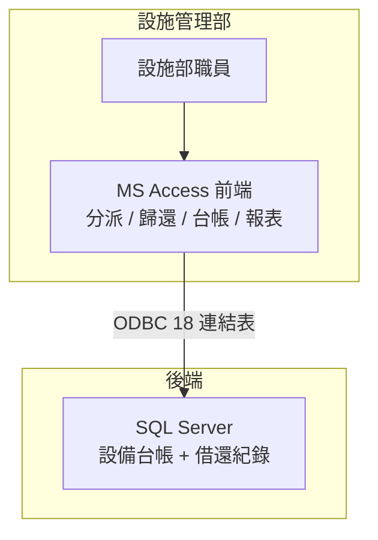
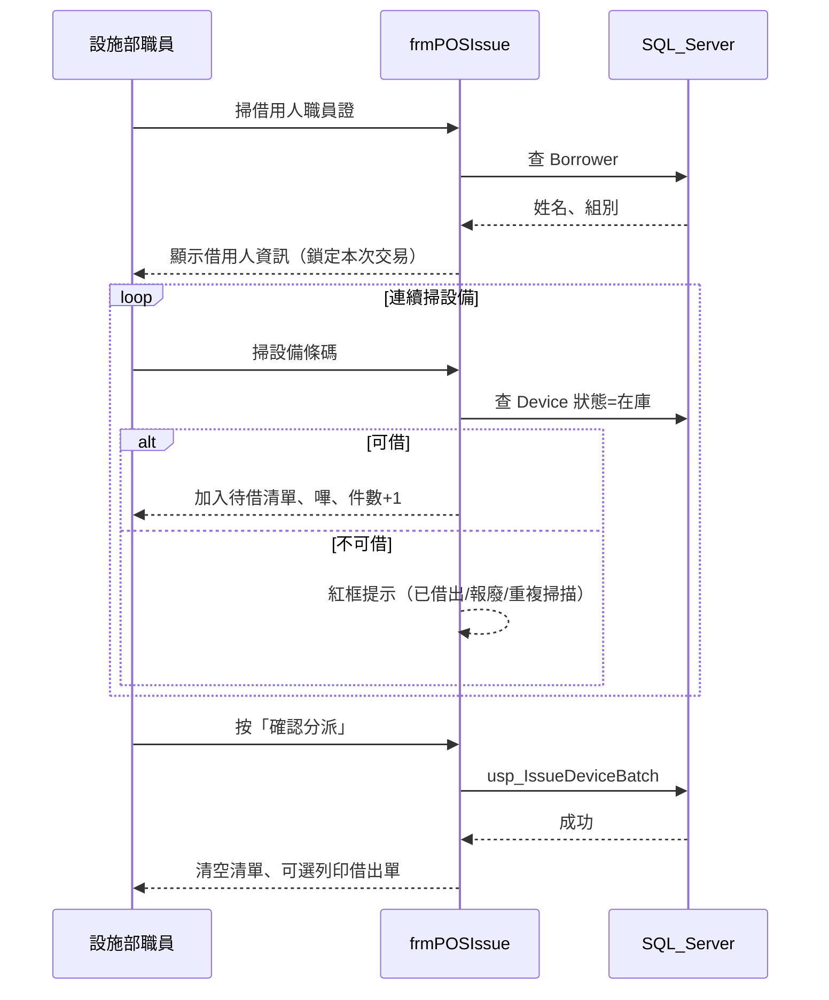
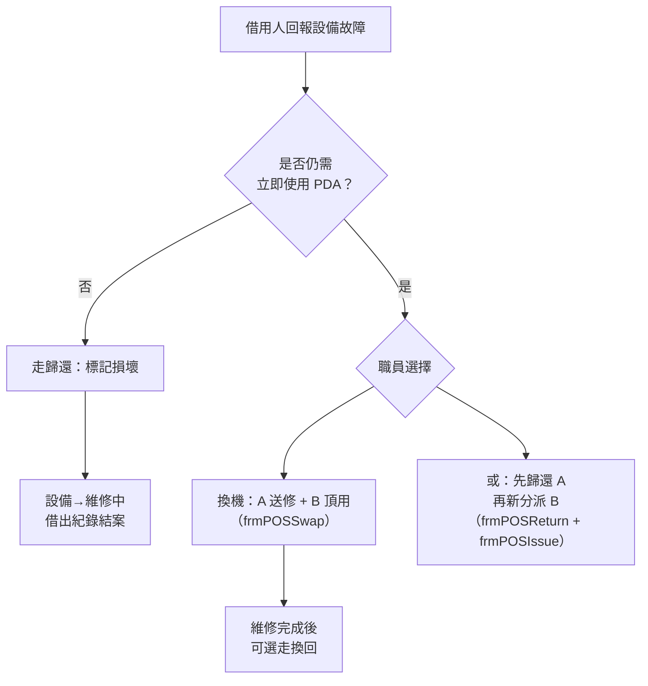
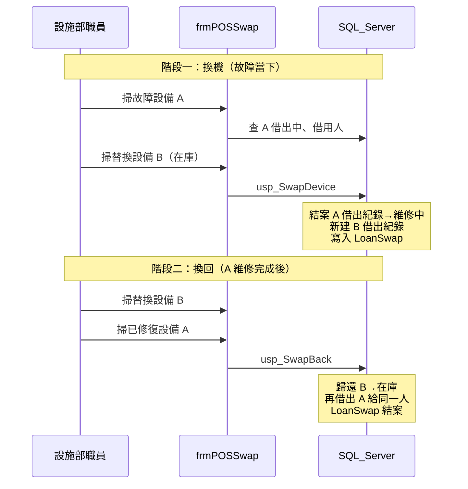
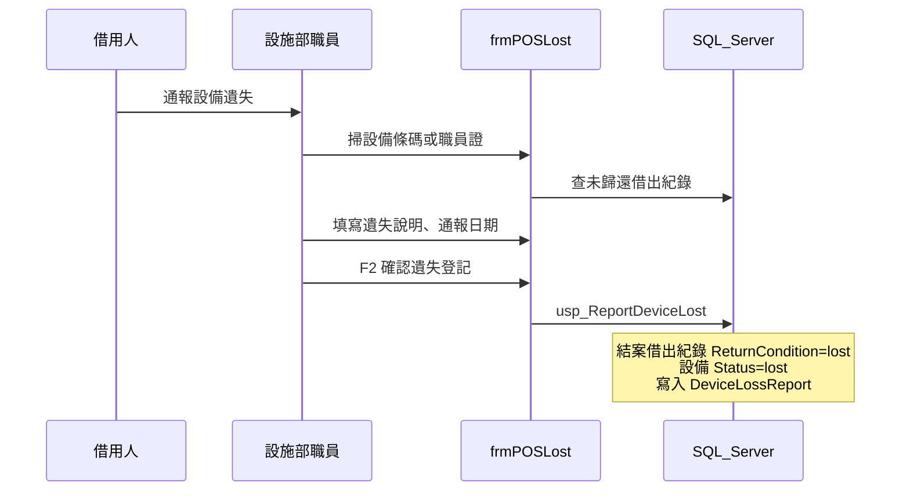
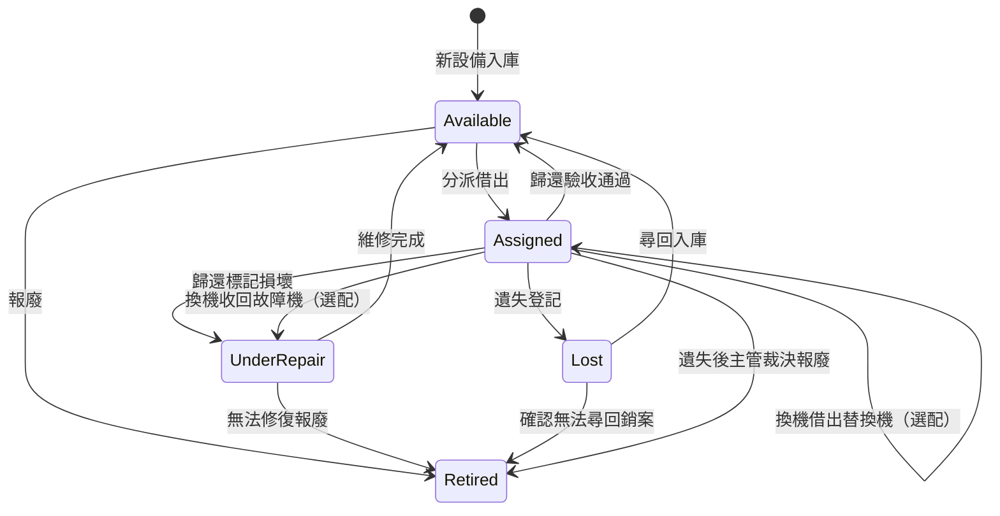

# PDA 設備分派與歸還管理 — Access + SQL Server 轉移計劃

> 本文件為設施管理部 PDA 借還系統遷移計劃（含超市式掃碼操作）。獨立於 TeacherAI／EduSpark。

## 如何在 Cursor iOS App 查看本計劃

Cursor iOS App 主要用於**啟動與追蹤 Cloud Agent**，與桌面版不同：

| 功能 | 桌面版 Cursor | iOS App |
|------|---------------|---------|
| Plan 模式互動預覽（待辦勾選、Build 按鈕） | 支援 | **通常不支援** |
| 內部 `artifacts/plans/` 路徑 | Agent 可寫入 | **可能看不到** |
| 專案內 `docs/*.md` | 可開啟預覽 | 可在檔案瀏覽器開啟（若已 sync） |

**建議在 iPhone 上閱讀的方式（由易到難）：**

1. **直接看本對話** — Agent 訊息內的計劃摘要可在聊天中捲動閱讀（最可靠）。
2. **開啟專案檔案** — 在 iOS App 檔案樹找 `docs/pda-access-sql-server-migration-plan.md`（需 agent 已 push 到遠端並 sync）。
3. **在聊天 @ 檔案** — 輸入 `@docs/pda-access-sql-server-migration-plan.md` 請 Agent 摘要或解答特定章節。
4. **GitHub 網頁** — 若已 push，用 Safari 開啟 repo 的 `docs/pda-access-sql-server-migration-plan.md`（手機閱讀體驗最佳）。
5. **桌面版 Cursor** — 需要 Plan 互動模式或 Build 時，請用 Mac／Windows 開啟同一 repo。

## 系統定位

**用途**：供**設施管理部**自行管理 PDA 實體設備的**分派（借出）**與**歸還**，掌握「哪台設備、借給誰、何時借出、是否已還、設備現況」。

**不是**：軟體登入權限（RBAC）、TeacherAI／EduSpark 帳號管理、學校／班級管理系統。

**組織單位**：系統內的分組單位是**設施管理部內部各組別**（如機電組、清潔組、保安組等），**不是**學校、學部或校外單位。借用人與設備台帳皆歸屬設施部組別維度管理。

| 項目 | 說明 |
|------|------|
| 主要使用者 | 設施管理部職員（櫃台分派／歸還、台帳維護） |
| 組織維度 | 設施管理部**內部組別**（分派對象、設備歸屬、報表統計） |
| 操作介面 | Microsoft Access 表單與報表（繁體中文） |
| 資料儲存 | SQL Server 集中式資料庫 |
| 整合範圍 | 第一階段獨立運作，不與 EduSpark 整合 |

---

## 目標架構



**設計原則**

- SQL Server 為**唯一真相來源**；Access 僅含 UI、查詢、VBA，不存放業務資料。
- 採 **Access 分割資料庫**：`PDA_Loan_UI.accde`（前端）+ SQL Server（後端）。
- 每台 PDA 同一時間**最多一筆「借出中」**紀錄（以資料庫約束強制）。
- 所有分派、歸還、台帳異動寫入 `AuditLog`。
- **掃碼優先**：操作模式比照**超市收銀**—連續掃描、即時清單、一次結帳確認（見下方專節）。

---

## 超市式掃碼操作（核心 UX）

設計目標：職員**幾乎不用滑鼠**，掃描槍掃完即走，體驗接近超市 POS 收銀台。

### 操作隱喻對照

| 超市收銀 | PDA 借還系統 |
|----------|----------------|
| 刷會員卡 | 掃**借用人職員證**（或選定本次服務對象） |
| 掃商品條碼 | 掃**設備標籤條碼**（每台 PDA 一碼） |
| 購物車清單逐項累加 | 畫面右側**待借／待還清單**即時增加 |
| 按「結帳」 | 按**確認分派**／**確認歸還**一次寫入資料庫 |
| 嗶聲／錯誤提示 | 成功嗶一聲；失敗紅框＋錯誤音＋繁中說明 |

### 分派模式（超市「結帳」流程）



**畫面配置（`frmPOSIssue`）**

```
┌─────────────────────────────────────────────────────────┐
│  【分派設備】                              待借：3 件   │
├──────────────────────────┬──────────────────────────────┤
│ 掃描輸入： [____________] │  #  設備編號    型號    狀態  │
│  （游標常駐此欄）          │  1  PDA-00123  XX型   ✓    │
│                            │  2  PDA-00456  YY型   ✓    │
│ 借用人：陳大文（機電組）    │  3  PDA-00789  XX型   ✓    │
│ 預計歸還：[2026-07-07]     │                              │
│ 備註：    [____________]   │  [移除選取]                  │
├──────────────────────────┴──────────────────────────────┤
│  [確認分派 F2]   [清空 F4]   [列印借出單]   [取消 Esc]   │
└─────────────────────────────────────────────────────────┘
```

### 歸還模式（超市「退貨」流程）

- 開啟 `frmPOSReturn` 後**直接連續掃設備**，無需先選借用人。
- 每掃一台：系統查詢未歸還紀錄，帶出借用人與借出日，加入**待還清單**。
- 掃到不屬於「借出中」的設備 → 錯誤提示，不加入清單。
- 預設歸還狀況為「正常」；可在清單中對單筆改為「損壞／配件缺漏」。
- **故障但不需要替換機**：在歸還清單標記「損壞」即可 → 設備入維修、借出結案，**無需**走換機流程。
- 按**確認歸還** → 批次呼叫 `usp_ReturnDeviceBatch`。

### 故障處理（換機為選配，非強制）

借用人回報故障時，設施部依實際需要選擇處理方式；**不強制**一定要給替換機。



| 情境 | 建議操作 | 是否用換機 |
|------|----------|------------|
| 故障、對方**暫時不用**機 | `frmPOSReturn` 標記**損壞** | 否 |
| 故障、對方**仍需**用機 | `frmPOSSwap` 一鍵換機 | 是（選配） |
| 故障、對方仍需用機（簡單做法） | 先歸還 A（損壞）→ 再 `frmPOSIssue` 借 B | 否（兩步，不建 `LoanSwap`） |
| 曾換機、原機修好 | `frmPOSSwap` 換回分頁 | 僅適用於已建立 `LoanSwap` 者 |

> **設計原則**：換機是**便利功能**（一筆交易完成「收回 A + 借出 B」並保留配對關係），不是故障的必經路徑。

### 換機模式（選配：故障且需頂用機時）

適用情境：借用人**仍需繼續使用** PDA，且職員選擇用**換機**（而非先歸還再重新分派）時；原機送修、替換機頂用；維修完成後可選擇**換回**。



**畫面配置（`frmPOSSwap`）— 兩段式，同一表單切換**

```
┌─────────────────────────────────────────────────────────┐
│  【換機】（選配）  ①掃故障機  ②掃替換機  ③F2 確認     │
│  ※ 若對方不需頂用機 → 請用「歸還」標記損壞即可        │
├─────────────────────────────────────────────────────────┤
│  故障設備：  PDA-00123  （陳大文／機電組）              │
│  替換設備：  PDA-00999  （在庫可借 ✓）  [略過替換機]   │
│  故障說明：  [螢幕無法觸控____________]                 │
├─────────────────────────────────────────────────────────┤
│  [確認換機 F2]   [改為僅收回送修]   [清空 F4]   [Esc]  │
└─────────────────────────────────────────────────────────┘

┌─────────────────────────────────────────────────────────┐
│  【換回】（選配）  ①掃替換機  ②掃原機  ③F2 確認        │
│  ※ 僅適用於當初有走換機、且借用人要取回原機時          │
├─────────────────────────────────────────────────────────┤
│  歸還替換機：PDA-00999  →  在庫                         │
│  取回原機：  PDA-00123  （已維修完成、在庫可借 ✓）      │
│  借用人：    陳大文（機電組）— 自動帶出                  │
├─────────────────────────────────────────────────────────┤
│  [確認換回 F2]   [清空 F4]   [取消 Esc]                 │
└─────────────────────────────────────────────────────────┘
```

**操作規則**

| 規則 | 說明 |
|------|------|
| **非強制換機** | 故障預設可走「歸還＋損壞」；僅在借用人需頂用機時才換機 |
| 替換機須在庫 | 狀態為 `available` 才可掃入；可按「略過替換機」改走歸還 |
| 故障機須借出中 | 須有未歸還紀錄；系統自動帶出借用人 |
| 換回為選配 | 僅在當初有建立 `LoanSwap` 且借用人要取回原機時才走換回 |
| 換回時原機須已修復 | 狀態須為 `available`（維修完成後在 `frmDevice` 改回在庫） |
| 一對一綁定 | 每筆 `LoanSwap` 記錄「原機 A ↔ 替換機 B」，避免搞混 |
| 預計歸還日 | 換機後**繼承**原借出紀錄的 `DueDate`（不因換機而延長） |

**主畫面（`frmMain`）按鈕**：`分派`｜`歸還`｜`換機（選配）`｜`遺失登記`

### 遺失登記（分派後對方報失）

適用情境：設備**已借出**，借用人事後通報**遺失**（設備未實物歸還）。



**畫面配置（`frmPOSLost`）**

```
┌─────────────────────────────────────────────────────────┐
│  【遺失登記】                                            │
├─────────────────────────────────────────────────────────┤
│  掃描輸入： [____________]  （設備條碼 或 職員證）        │
│                                                          │
│  設備編號：  PDA-00123        借用人：陳大文（機電組）   │
│  借出日期：  2026-06-15       預計歸還：2026-07-15       │
│  遺失通報日：[2026-06-28]     通報方式：[當面 ▼]         │
│  說明：      [借用人表示於工地遺失______________]         │
│  跟進備註：  [已通知主管____________________]（選填）   │
├─────────────────────────────────────────────────────────┤
│  [確認遺失登記 F2]   [清空 F4]   [取消 Esc]              │
└─────────────────────────────────────────────────────────┘
```

**操作規則**

| 規則 | 說明 |
|------|------|
| 僅限借出中設備 | 須有未歸還的 `LoanTransaction` |
| 掃碼方式 | 掃**設備條碼**直接定位；或掃**職員證**列出該員未還設備再選一台 |
| 設備狀態 | 登記後設備改為 `lost`（遺失），**不同於** `retired`（報廢銷案） |
| 借出紀錄 | 以 `ReturnCondition='lost'` 結案（非實物歸還） |
| 進行中換機 | 若該設備涉及未完成的 `LoanSwap`，須先處理替換機關係（見下方） |
| 遺失後補機 | **不自動**分派替換機；若需補發，職員另走 `frmPOSIssue`（新借出紀錄） |
| 尋回 | 日後尋回可在 `frmDevice` 將狀態 `lost` → `available`（另記尋回備註） |

**換機情境下的遺失**

| 遺失對象 | 處理 |
|----------|------|
| **替換機 B** 遺失 | 登記 B 遺失；`LoanSwap` 標記 `cancelled` 或專用狀態；原機 A 若已修好仍可在庫，由主管決定是否再借 |
| **原機 A**（已送修、借出紀錄已結） | A 已在 `under_repair`，通常不會再報遺失；若整機失蹤改在 `frmDevice` 直接標 `lost` |
| **一般借出機** 遺失 | 標準 `frmPOSLost` 流程 |

### 條碼規範

| 標籤對象 | 建議條碼內容 | 範例 | 備註 |
|----------|--------------|------|------|
| PDA 設備 | `PDA` + `AssetTag` | `PDA001234` | Code 128 貼於機身 |
| 職員證 | `STAFF` + `StaffNo` | `STAFFA1023` | 與 `Borrower.StaffNo` 對應 |
| 組別（選配） | `TEAM` + `TeamCode` | `TEAMEM` | 快速篩選報表用 |

- 前綴用於掃描後**自動判斷類型**（設備 vs 職員），同一輸入框即可處理。
- 遷移時為每台在庫設備**補貼條碼標籤**；借用人使用現有職員證條碼或加貼。

### 硬體需求

| 項目 | 建議規格 |
|------|----------|
| 掃描槍 | USB **鍵盤模擬模式**（Keyboard Wedge），掃完自動送 Enter |
| 電腦 | 設施部櫃台 PC，Access 全螢幕或最大化 |
| 標籤機（選配） | 列印設備條碼；型號如 Zebra GK420t 或同級 |
| 音效 | 成功／失敗以 VBA `Beep` 或 `.wav` 區分 |

### 資料庫批次 API（配合超市式一次結帳）

```sql
-- 批次分派（待借清單一次提交）
CREATE PROCEDURE dbo.usp_IssueDeviceBatch
  @BorrowerId INT,
  @AssetTags  NVARCHAR(MAX),   -- 逗號分隔，如 N'PDA001,PDA002'
  @DueDate    DATE = NULL,
  @IssueNotes NVARCHAR(500) = NULL,
  @IssuedBy   NVARCHAR(100)
AS
BEGIN
  -- 逐筆驗證；任一失敗則整批 ROLLBACK 並回傳錯誤設備編號
END;

-- 批次歸還
CREATE PROCEDURE dbo.usp_ReturnDeviceBatch
  @Items NVARCHAR(MAX),  -- JSON: [{assetTag, returnCondition}, ...]
  @ReturnedBy NVARCHAR(100)
AS
BEGIN
  -- 逐筆歸還；整批交易
END;

-- 換機：故障機 A → 替換機 B（同一借用人）
CREATE PROCEDURE dbo.usp_SwapDevice
  @FaultyAssetTag     NVARCHAR(50),
  @ReplacementAssetTag NVARCHAR(50),
  @SwapReason         NVARCHAR(500) = NULL,
  @HandledBy          NVARCHAR(100)
AS
BEGIN
  -- 1. 驗證 A=借出中、B=在庫可借、同一 Borrower 上下文
  -- 2. 結案 A 的 LoanTransaction（ReturnCondition='swapped_for_repair'）
  -- 3. A.Status = under_repair
  -- 4. 新建 B 的 LoanTransaction（繼承 DueDate；IssueNotes 註明替換自 A）
  -- 5. INSERT LoanSwap（Status='active'）
  -- 整批 TRANSACTION；失敗則 ROLLBACK
END;

-- 換回：歸還替換機 B + 原機 A 再借出給同一人
CREATE PROCEDURE dbo.usp_SwapBack
  @ReplacementAssetTag NVARCHAR(50),
  @OriginalAssetTag    NVARCHAR(50),
  @HandledBy           NVARCHAR(100)
AS
BEGIN
  -- 1. 驗證存在 active 的 LoanSwap（B 借出中、A=available）
  -- 2. 結案 B 借出（ReturnCondition='normal'）；B.Status = available
  -- 3. 新建 A 借出給原 Borrower（繼承 DueDate）
  -- 4. LoanSwap.Status = completed；SwapBackAt = now()
END;

-- 遺失登記（借出中設備）
CREATE PROCEDURE dbo.usp_ReportDeviceLost
  @AssetTag           NVARCHAR(50),
  @ReportedAt         DATE = NULL,           -- 通報日期，預設今天
  @ReportChannel      NVARCHAR(50) = NULL,   -- 當面/電話/Email 等
  @LossDescription    NVARCHAR(500) = NULL,
  @FollowUpNotes      NVARCHAR(500) = NULL,
  @HandledBy          NVARCHAR(100)
AS
BEGIN
  -- 1. 驗證設備借出中
  -- 2. 結案 LoanTransaction（ReturnCondition='lost', ReturnedAt=通報時間）
  -- 3. Device.Status = 'lost'
  -- 4. INSERT DeviceLossReport
  -- 5. 若存在 active LoanSwap 且遺失的是替換機→更新 LoanSwap 狀態並寫 AuditLog
END;
```

---

## 核心業務流程



> 註：`lost`（遺失）表示設備下落不明、借出已結案；`retired`（報廢）表示資產正式銷案，不再流通。

### 分派（借出）流程 — 超市模式

1. 開啟 `frmPOSIssue`；游標在掃描欄。
2. **先掃借用人職員證**（或從下拉選單選定，等同「刷會員卡」）。
3. **連續掃設備條碼**，每台即時加入右側待借清單並顯示件數。
4. 可選填預計歸還日、備註。
5. 按 **F2 確認分派** → 批次寫入 → 清空清單，準備下一位借用人。

### 歸還流程 — 超市模式

1. 開啟 `frmPOSReturn`；直接連續掃設備。
2. 每台帶出借用人資訊，累加至待還清單。
3. 必要時在清單中標記單台為「損壞」。
4. 按 **F2 確認歸還** → 批次關閉借出紀錄、更新設備狀態。

### 故障處理 — 不換機（常見）

1. 借用人送回故障設備、**暫時不需要**替換機。
2. 開啟 `frmPOSReturn`；掃設備 → 在清單選**損壞**（或配件缺漏）。
3. **F2 確認歸還** → 設備進入維修中，借出結案，**流程結束**。

### 換機流程 — 選配（故障且需頂用機）

1. 開啟 `frmPOSSwap`（換機分頁）。
2. **掃故障設備 A** → 系統帶出借用人、組別。
3. **掃替換設備 B**（須在庫）→ 顯示配對預覽。
4. 填寫故障說明（選填）→ **F2 確認換機**。
5. 結果：A 送修、B 借給同一人；列印換機單（選配）。
6. 若掃完故障機後發現**不需替換機** → 按「改為僅收回送修」跳轉歸還流程。

### 換回流程 — 選配（僅限曾換機者）

1. 維修人員在 `frmDevice` 將 A 狀態改為**在庫可借**。
2. 開啟 `frmPOSSwap`（換回分頁）。
3. **掃替換設備 B** → **掃原設備 A**。
4. **F2 確認換回** → B 歸還入庫、A 再次借出給同一人。

### 遺失登記流程

1. 借用人向設施部通報遺失。
2. 開啟 `frmPOSLost`；掃**設備條碼**或**職員證**（後者列出該員未還清單供選取）。
3. 確認借用人、借出日；填寫通報日、通報方式、說明。
4. **F2 確認遺失登記** → 借出紀錄結案、設備標為遺失。
5. 若需補發另一台 → 另走 `frmPOSIssue` 新借出（不與遺失紀錄混為一筆）。

### 傳統表單（備用）

- `frmIssue`／`frmReturn` 保留為**單筆手動**模式，供條碼損毀、例外處理使用。

---

## Phase 0：現況盤點與需求凍結

### 0.1 盤點現有資料與作業

- 匯出目前台帳：設備編號、型號、購入日、保固、存放位置、現況。
- 匯出借還紀錄：借用人、所屬組別、借出日、歸還日、未還清單。
- 訪談設施部 2–3 位操作者，確認：
  - 設施部現有**組別清單**（有幾個組、組別名稱與代碼）。
  - 每日分派／歸還量與尖峰時段；**單次最多借幾台**（影響批次上限）。
  - **超市式掃碼**為預設操作；確認是否已有掃描槍、職員證條碼。
  - 條碼標籤：設備是否需新貼 Code 128？職員證是否已有可掃條碼？
  - 借用人是否限定為**設施部內職員**，或含其他單位臨時借用？
  - 是否有**預計歸還日**與**逾期提醒**需求？
  - 損壞、遺失、報廢如何處理與記錄？
  - **換機政策**：**非強制**；僅在借用人需頂用機時使用。替換機是否限同型號？維修 SLA 幾天？
  - **遺失處理**：通報後是否補發？誰核准？是否需要書面／主管簽核欄位？
  - 需哪些報表（在借清單、逾期、月統計、**各組別借用排行**、**進行中換機清單**、**遺失設備清單**）？

### 0.2 資料實體模型

| 實體 | 說明 |
|------|------|
| `FacilitiesTeam` | **設施部組別**（組別代碼、組別名稱，如機電組、清潔組） |
| `Device` | PDA 設備主檔（編號、型號、序號、狀態、歸屬組別） |
| `Borrower` | 借用人主檔（職員編號、姓名、所屬組別、電話） |
| `LoanTransaction` | 借還交易（一筆分派到歸還的完整紀錄；可關聯 `BatchId`） |
| `LoanSwap` | **換機紀錄**（故障機 ↔ 替換機配對、換機／換回時間、狀態） |
| `DeviceLossReport` | **遺失通報紀錄**（通報日、方式、說明、跟進、經手人） |
| `DeviceStatusHistory` | 設備狀態變更歷程（選配） |
| `AuditLog` | 操作稽核 |

**設備狀態枚舉**

| 狀態碼 | 繁中名稱 | 說明 |
|--------|----------|------|
| `available` | 在庫可借 | 可進行分派 |
| `assigned` | 借出中 | 已有未歸還紀錄 |
| `under_repair` | 維修中 | 歸還驗收異常、換機收回故障機、或主動送修 |
| `lost` | 遺失 | 借出後通報遺失，待尋回或銷案 |
| `retired` | 已報廢 | 確認無法使用／無法尋回，正式銷案 |

**歸還狀況補充（`ReturnCondition`）**

| 狀況碼 | 繁中名稱 | 說明 |
|--------|----------|------|
| `normal` | 正常 | 一般歸還或換回時歸還替換機 |
| `damaged` | 損壞 | 歸還時發現損壞 |
| `missing_parts` | 配件缺漏 | 充電器等缺件 |
| `swapped_for_repair` | 換機收回 | 因故障換機而結案原借出紀錄（設備送修） |
| `lost` | 遺失 | 借用人通報遺失，無實物歸還 |

### 0.3 產出文件

- 《PDA 借還管理需求規格書》（流程圖、報表清單）
- 《資料字典》（欄位、約束、範例）
- 《舊資料遷移對照表》

**驗收**：設施部主管簽核作業流程與報表清單。

---

## Phase 1：SQL Server 建置與 Schema

### 1.1 環境選型

| 選項 | 適用情境 |
|------|----------|
| **SQL Server on-premises** | 設施部與 DB 同校內網，延遲低、無雲端費用 |
| **Azure SQL Database** | 需遠端多點連線、日後擴充 |
| **SQL Server Express** | 開發／測試；設備量小且併發低可考慮正式使用 |

建議設施部內部系統優先考慮**校內 SQL Server**。

### 1.2 建議 Schema（T-SQL 骨架）

```sql
-- 設施管理部內部組別（非學校、非校外單位）
CREATE TABLE dbo.FacilitiesTeam (
  TeamId     INT IDENTITY(1,1) PRIMARY KEY,
  TeamCode   NVARCHAR(20) NOT NULL UNIQUE,   -- 如 EM、CLN、SEC
  TeamName   NVARCHAR(100) NOT NULL,         -- 如 機電組、清潔組
  IsActive   BIT NOT NULL DEFAULT 1
);

-- 借用人（設施部職員）
CREATE TABLE dbo.Borrower (
  BorrowerId     INT IDENTITY(1,1) PRIMARY KEY,
  StaffNo        NVARCHAR(30) NULL,          -- 職員編號
  FullName       NVARCHAR(100) NOT NULL,
  TeamId         INT NOT NULL REFERENCES dbo.FacilitiesTeam(TeamId),
  Phone          NVARCHAR(30) NULL,
  Email          NVARCHAR(255) NULL,
  IsActive       BIT NOT NULL DEFAULT 1,
  CreatedAt      DATETIME2 NOT NULL DEFAULT SYSUTCDATETIME()
);

-- 設備主檔
CREATE TABLE dbo.Device (
  DeviceId       INT IDENTITY(1,1) PRIMARY KEY,
  AssetTag       NVARCHAR(50) NOT NULL UNIQUE,  -- 財產/設備編號（條碼用）
  SerialNo       NVARCHAR(80) NULL,
  Model          NVARCHAR(100) NULL,
  TeamId         INT NULL REFERENCES dbo.FacilitiesTeam(TeamId),  -- 設備歸屬／管理組別
  PurchaseDate   DATE NULL,
  WarrantyUntil  DATE NULL,
  Location       NVARCHAR(100) NULL,            -- 存放位置（可細至某組物料櫃）
  Status         NVARCHAR(20) NOT NULL DEFAULT 'available'
                 CHECK (Status IN ('available','assigned','under_repair','lost','retired')),
  Notes          NVARCHAR(500) NULL,
  CreatedAt      DATETIME2 NOT NULL DEFAULT SYSUTCDATETIME(),
  UpdatedAt      DATETIME2 NOT NULL DEFAULT SYSUTCDATETIME()
);

-- 借還交易（核心）
CREATE TABLE dbo.LoanTransaction (
  LoanId         INT IDENTITY(1,1) PRIMARY KEY,
  DeviceId       INT NOT NULL REFERENCES dbo.Device(DeviceId),
  BorrowerId     INT NOT NULL REFERENCES dbo.Borrower(BorrowerId),
  IssuedAt       DATETIME2 NOT NULL DEFAULT SYSUTCDATETIME(),
  DueDate        DATE NULL,                     -- 預計歸還日
  ReturnedAt     DATETIME2 NULL,                -- NULL = 尚未歸還
  ReturnCondition NVARCHAR(20) NULL             -- normal / damaged / missing_parts / swapped_for_repair / lost
                 CHECK (ReturnCondition IS NULL OR ReturnCondition IN ('normal','damaged','missing_parts','swapped_for_repair','lost')),
  IssueNotes     NVARCHAR(500) NULL,
  ReturnNotes    NVARCHAR(500) NULL,
  IssuedBy       NVARCHAR(100) NOT NULL,          -- 經手設施部職員
  ReturnedBy     NVARCHAR(100) NULL,
  HandledByTeamId INT NULL REFERENCES dbo.FacilitiesTeam(TeamId),  -- 經手櫃台所屬組別（選配）
  LegacyId       NVARCHAR(50) NULL              -- 舊系統對照
);

-- 同一設備不可有兩筆未歸還紀錄
CREATE UNIQUE INDEX UX_LoanTransaction_OpenLoan
  ON dbo.LoanTransaction(DeviceId)
  WHERE ReturnedAt IS NULL;

CREATE INDEX IX_LoanTransaction_Borrower_Open
  ON dbo.LoanTransaction(BorrowerId, ReturnedAt);

CREATE INDEX IX_LoanTransaction_DueDate_Open
  ON dbo.LoanTransaction(DueDate)
  WHERE ReturnedAt IS NULL;

-- 換機配對（故障機 ↔ 替換機）
CREATE TABLE dbo.LoanSwap (
  SwapId               INT IDENTITY(1,1) PRIMARY KEY,
  OriginalLoanId       INT NOT NULL REFERENCES dbo.LoanTransaction(LoanId),
  OriginalDeviceId     INT NOT NULL REFERENCES dbo.Device(DeviceId),
  ReplacementLoanId    INT NOT NULL REFERENCES dbo.LoanTransaction(LoanId),
  ReplacementDeviceId  INT NOT NULL REFERENCES dbo.Device(DeviceId),
  BorrowerId           INT NOT NULL REFERENCES dbo.Borrower(BorrowerId),
  SwapReason           NVARCHAR(500) NULL,
  SwappedAt            DATETIME2 NOT NULL DEFAULT SYSUTCDATETIME(),
  SwappedBy            NVARCHAR(100) NOT NULL,
  SwapBackAt           DATETIME2 NULL,
  SwapBackBy           NVARCHAR(100) NULL,
  Status               NVARCHAR(20) NOT NULL DEFAULT 'active'
                       CHECK (Status IN ('active','completed','cancelled'))
);

CREATE INDEX IX_LoanSwap_Status ON dbo.LoanSwap(Status) WHERE Status = 'active';
CREATE INDEX IX_LoanSwap_Borrower ON dbo.LoanSwap(BorrowerId, Status);

-- 遺失通報
CREATE TABLE dbo.DeviceLossReport (
  LossReportId    INT IDENTITY(1,1) PRIMARY KEY,
  LoanId          INT NOT NULL REFERENCES dbo.LoanTransaction(LoanId),
  DeviceId        INT NOT NULL REFERENCES dbo.Device(DeviceId),
  BorrowerId      INT NOT NULL REFERENCES dbo.Borrower(BorrowerId),
  ReportedAt      DATE NOT NULL,
  ReportChannel   NVARCHAR(50) NULL,       -- 當面、電話、Email 等
  LossDescription NVARCHAR(500) NULL,
  FollowUpNotes   NVARCHAR(500) NULL,
  FollowUpStatus  NVARCHAR(20) NOT NULL DEFAULT 'open'
                  CHECK (FollowUpStatus IN ('open','found','written_off')),
  HandledBy       NVARCHAR(100) NOT NULL,
  CreatedAt       DATETIME2 NOT NULL DEFAULT SYSUTCDATETIME(),
  ResolvedAt      DATETIME2 NULL
);

CREATE INDEX IX_DeviceLossReport_Status ON dbo.DeviceLossReport(FollowUpStatus);
CREATE INDEX IX_DeviceLossReport_Device ON dbo.DeviceLossReport(DeviceId);

-- 稽核
CREATE TABLE dbo.AuditLog (
  AuditId     BIGINT IDENTITY(1,1) PRIMARY KEY,
  TableName   NVARCHAR(128) NOT NULL,
  RecordId    NVARCHAR(50) NOT NULL,
  Action      NVARCHAR(10) NOT NULL,
  OldValue    NVARCHAR(MAX) NULL,
  NewValue    NVARCHAR(MAX) NULL,
  ChangedBy   NVARCHAR(100) NOT NULL,
  ChangedAt   DATETIME2 NOT NULL DEFAULT SYSUTCDATETIME()
);
```

### 1.3 常用檢視與 Stored Procedure

```sql
-- 目前在借設備
CREATE VIEW dbo.vw_OpenLoans AS
SELECT
  lt.LoanId, d.AssetTag, d.Model, d.SerialNo,
  b.FullName AS BorrowerName, b.StaffNo,
  bt.TeamName AS BorrowerTeam,          -- 借用人所屬組別
  dt.TeamName AS DeviceTeam,            -- 設備歸屬組別
  lt.IssuedAt, lt.DueDate, lt.IssueNotes,
  DATEDIFF(day, lt.DueDate, CAST(GETDATE() AS DATE)) AS DaysOverdue
FROM dbo.LoanTransaction lt
JOIN dbo.Device d ON d.DeviceId = lt.DeviceId
JOIN dbo.Borrower b ON b.BorrowerId = lt.BorrowerId
JOIN dbo.FacilitiesTeam bt ON bt.TeamId = b.TeamId
LEFT JOIN dbo.FacilitiesTeam dt ON dt.TeamId = d.TeamId
WHERE lt.ReturnedAt IS NULL;

-- 進行中換機（待換回）
CREATE VIEW dbo.vw_ActiveSwaps AS
SELECT
  ls.SwapId,
  dOrig.AssetTag AS OriginalAssetTag,
  dRepl.AssetTag AS ReplacementAssetTag,
  b.FullName AS BorrowerName,
  ft.TeamName AS BorrowerTeam,
  ls.SwappedAt,
  ls.SwapReason,
  lt.DueDate
FROM dbo.LoanSwap ls
JOIN dbo.Device dOrig ON dOrig.DeviceId = ls.OriginalDeviceId
JOIN dbo.Device dRepl ON dRepl.DeviceId = ls.ReplacementDeviceId
JOIN dbo.Borrower b ON b.BorrowerId = ls.BorrowerId
JOIN dbo.FacilitiesTeam ft ON ft.TeamId = b.TeamId
JOIN dbo.LoanTransaction lt ON lt.LoanId = ls.ReplacementLoanId
WHERE ls.Status = 'active';

-- 遺失設備清單
CREATE VIEW dbo.vw_LostDevices AS
SELECT
  d.AssetTag, d.Model, b.FullName AS BorrowerName, ft.TeamName,
  lr.ReportedAt, lr.ReportChannel, lr.LossDescription,
  lr.FollowUpStatus, lr.HandledBy, lt.IssuedAt AS OriginalIssuedAt
FROM dbo.DeviceLossReport lr
JOIN dbo.Device d ON d.DeviceId = lr.DeviceId
JOIN dbo.Borrower b ON b.BorrowerId = lr.BorrowerId
JOIN dbo.FacilitiesTeam ft ON ft.TeamId = b.TeamId
JOIN dbo.LoanTransaction lt ON lt.LoanId = lr.LoanId
WHERE d.Status IN ('lost', 'retired') OR lr.FollowUpStatus = 'open';

-- 分派（借出）— 由 Access 呼叫
CREATE PROCEDURE dbo.usp_IssueDevice
  @AssetTag   NVARCHAR(50),
  @BorrowerId INT,
  @DueDate    DATE = NULL,
  @IssueNotes NVARCHAR(500) = NULL,
  @IssuedBy   NVARCHAR(100)
AS
BEGIN
  SET NOCOUNT ON;
  BEGIN TRANSACTION;
  DECLARE @DeviceId INT;
  SELECT @DeviceId = DeviceId FROM dbo.Device
  WHERE AssetTag = @AssetTag AND Status = 'available';
  IF @DeviceId IS NULL
    THROW 50001, N'設備不存在或不可借出', 1;
  INSERT INTO dbo.LoanTransaction (DeviceId, BorrowerId, DueDate, IssueNotes, IssuedBy)
  VALUES (@DeviceId, @BorrowerId, @DueDate, @IssueNotes, @IssuedBy);
  UPDATE dbo.Device SET Status = 'assigned', UpdatedAt = SYSUTCDATETIME()
  WHERE DeviceId = @DeviceId;
  COMMIT;
END;

-- 歸還
CREATE PROCEDURE dbo.usp_ReturnDevice
  @AssetTag          NVARCHAR(50),
  @ReturnCondition   NVARCHAR(20),
  @ReturnNotes       NVARCHAR(500) = NULL,
  @ReturnedBy        NVARCHAR(100)
AS
BEGIN
  SET NOCOUNT ON;
  BEGIN TRANSACTION;
  DECLARE @DeviceId INT, @LoanId INT;
  SELECT @DeviceId = DeviceId FROM dbo.Device WHERE AssetTag = @AssetTag AND Status = 'assigned';
  IF @DeviceId IS NULL
    THROW 50002, N'設備不在借出狀態', 1;
  SELECT @LoanId = LoanId FROM dbo.LoanTransaction
  WHERE DeviceId = @DeviceId AND ReturnedAt IS NULL;
  UPDATE dbo.LoanTransaction
  SET ReturnedAt = SYSUTCDATETIME(), ReturnCondition = @ReturnCondition,
      ReturnNotes = @ReturnNotes, ReturnedBy = @ReturnedBy
  WHERE LoanId = @LoanId;
  UPDATE dbo.Device
  SET Status = CASE WHEN @ReturnCondition = 'normal' THEN 'available' ELSE 'under_repair' END,
      UpdatedAt = SYSUTCDATETIME()
  WHERE DeviceId = @DeviceId;
  COMMIT;
END;
```

### 1.4 資料庫帳號

| 帳號 | 權限 | 用途 |
|------|------|------|
| `pda_loan_admin` | DDL + DML | DBA／遷移腳本 |
| `pda_loan_rw` | EXEC sp + DML | Access 設施部操作 |
| `pda_loan_ro` | SELECT | 報表唯讀（選配） |

**驗收**：分派／歸還 SP 在 DEV 環境測試通過；同一設備無法重複借出。

---

## Phase 2：Microsoft Access 前端建置

### 2.1 連結與分割

1. ODBC Driver 18 連結 SQL Server 所有業務表與檢視。
2. 分割資料庫：`PDA_Loan_UI.accde` 分發給設施部；後端為 SQL Server。
3. 連線建議用 Windows 整合驗證（校內網域帳號）。

### 2.2 核心表單（繁體中文介面）

| 表單 | 功能 | 使用頻率 |
|------|------|----------|
| `frmPOSIssue` | **超市式分派**：掃職員證 → 連續掃設備 → 待借清單 → F2 確認 | **最高** |
| `frmPOSReturn` | **超市式歸還**：連續掃設備 → 待還清單 → F2 確認 | **最高** |
| `frmPOSSwap` | **換機／換回（選配）**：僅在需頂用機或要換回時使用 | 中 |
| `frmPOSLost` | **遺失登記**：掃設備或職員證 → 填通報資訊 → F2 確認 | 中 |
| `frmActiveSwaps` | 進行中換機清單（待換回，基於 `vw_ActiveSwaps`） | 中 |
| `frmLostDevices` | 遺失設備清單與跟進（基於 `vw_LostDevices`） | 中 |
| `frmIssue` | 單筆分派（條碼損毀／例外備用） | 低 |
| `frmReturn` | 單筆歸還（例外備用） | 低 |
| `frmDevice` | 設備台帳維護（新增、貼碼登記、報廢、維修完成） | 中 |
| `frmBorrower` | 借用人查詢／新增（必選所屬組別） | 中 |
| `frmTeam` | 設施部組別維護（新增／停用組別） | 低 |
| `frmOpenLoans` | 目前在借清單（唯讀，基於 `vw_OpenLoans`） | 高 |
| `frmOverdue` | 逾期清單（`DaysOverdue > 0`） | 中 |
| `frmAuditLog` | 操作稽核查詢 | 低 |

**啟動畫面（`frmMain`）**：`分派`｜`歸還`｜`換機（選配）`｜`遺失登記`（歸還為故障預設入口）。

### 2.3 報表

| 報表 | 內容 |
|------|------|
| `rptLoanSlip` | 借出單（設備編號、借用人、借出日、預計歸還日）— 可選列印 |
| `rptOpenLoans` | 目前在借清單（PDF／列印） |
| `rptMonthlyStats` | 月分派／歸還統計（**依組別分組**） |
| `rptTeamUsage` | 各組別借用排行與未還清單 |
| `rptActiveSwaps` | **進行中換機清單**（誰還拿著替換機、原機維修狀態） |
| `rptSwapSlip` | 換機單（故障機、替換機、借用人、時間） |
| `rptLostDevices` | **遺失設備報表**（通報日、借用人、組別、跟進狀態） |
| `rptDeviceInventory` | 設備台帳總表（依組別、狀態分組） |

### 2.4 VBA 重點邏輯（超市掃碼）

**模組 `modBarcode`**

- `ParseScan(raw)`：依前綴拆類型 — `PDA`→設備、`STAFF`→職員、`TEAM`→組別。
- `LookupDevice(assetTag)` / `LookupBorrower(staffNo)`：查 SQL Server，回傳狀態或錯誤訊息。

**`frmPOSIssue`**

- `Form_Open`：焦點鎖定 `txtScan`；註冊快捷鍵 F2 確認、F4 清空、Esc 取消。
- `txtScan_KeyDown`（Enter）：呼叫 `HandleScan`；**掃完即清空輸入框**，準備下一碼。
- `HandleScan`：
  - 職員碼 → 設定當前 `BorrowerId`，更新畫面借用人區塊。
  - 設備碼 → 若已在待借清單則提示「重複掃描」；否則查庫、加入 `lstCart`（ListBox），`Beep` 成功音。
  - 錯誤 → 紅框閃爍、`PlaySound` 錯誤音、StatusBar 繁中說明。
- `btnConfirm_Click`：將 `lstCart` 組成字串 → `usp_IssueDeviceBatch`；成功後清空並重置借用人。
- 待借清單存在**前端記憶體**（未確認前不寫 DB），避免掃到一半留痕。

**`frmPOSReturn`**

- 不需先掃職員；每掃一台設備即查 `vw_OpenLoans` 加入待還清單。
- 清單欄位：設備編號、借用人、借出日、歸還狀況（下拉，預設正常）。
- 確認 → `usp_ReturnDeviceBatch`。

**`frmPOSSwap`**

- 分頁：**換機**／**換回**；皆為掃描欄常駐焦點。
- 換機：掃 A →（可選）掃 B → F2 呼叫 `usp_SwapDevice`；按「改為僅收回送修」→ 開啟 `frmPOSReturn` 並預填該設備、狀況=損壞。
- 換回：僅在存在 `active` 的 `LoanSwap` 時可用；掃 B → 掃 A → F2 呼叫 `usp_SwapBack`。

**`frmPOSLost`**

- 掃設備碼：直接帶出借出中紀錄；掃職員證：ListBox 列出該員所有未還設備供選一台。
- F2 呼叫 `usp_ReportDeviceLost`；成功後提示「已登記遺失，如需補發請走分派」。

**共用**

- 單筆備用表單 `frmIssue`／`frmReturn` 仍呼叫 `usp_IssueDevice`／`usp_ReturnDevice`。
- 連線失敗：顯示「無法連線資料庫，請聯絡 IT」，禁止離線寫入。

### 2.5 使用體驗建議

- **預設入口**為超市式 POS 表單，職員無需選單找功能。
- 掃描欄常駐焦點；掃描槍送 Enter 即觸發，無需按滑鼠。
- 待借／待還**件數大字顯示**於畫面右上角（如超市「共 X 件」）。
- 確認後自動清空，游標回掃描欄，可立即服務下一位。
- 建議櫃台張貼**掃碼步驟卡**：①掃職員證 ②掃設備 ③按 F2；換機：①掃故障機 ②掃替換機 ③F2。

**驗收**：職員在不碰滑鼠情況下，完成「掃職員證 → 連掃 3 台設備 → F2 確認」全流程 ≤ 30 秒。

---

## Phase 3：資料遷移

### 3.1 遷移範圍

| 資料 | 優先級 |
|------|--------|
| 設備台帳（全部） | 必遷 |
| 借用人主檔 | 必遷 |
| 歷史借還紀錄 | 建議遷（至少近 2 年） |
| 目前在借未還 | **必遷且需逐筆對帳** |

### 3.2 步驟

1. 從舊 Excel／Access 匯出 CSV（UTF-8 BOM）。
2. 載入 `staging` schema 暫存表。
3. 清洗：
   - 設備編號去空白、統一大小寫
   - 建立 `FacilitiesTeam` 組別主檔（依設施部實際組別清單）
   - 合併重複借用人（同職員編號），對照所屬組別
   - 未還設備：建立 `LoanTransaction`（`ReturnedAt = NULL`）且 `Device.Status = 'assigned'`
   - 已還設備：`ReturnedAt` 填歷史日期，`Device.Status = 'available'`
4. 驗證：
   - 設備總數對帳
   - 目前在借筆數 = 舊系統未還清單筆數
   - 無「借出中」設備缺對應 `LoanTransaction`
5. 正式載入 `dbo`，保留 `LegacyId`。

**驗收**：實地抽查 20 台設備，借還狀態與舊系統一致。

---

## Phase 4：安全、備份與維運

### 4.1 存取控制

- 僅設施部指定 Windows 帳號可使用 Access 前端。
- SQL 帳號 `pda_loan_rw` 僅授權給設施部電腦或 Citrix。
- 借用人資料（電話、Email）依機構個資規範處理。

### 4.2 備份

| 項目 | 頻率 |
|------|------|
| SQL Server 完整備份 | 每日 |
| 交易記錄備份 | 每小時（正式環境） |
| Access 前端原始碼 | 版本控管（Git 或檔案伺服器） |

### 4.3 日常維運

- 每季盤點：實體設備 vs 系統台帳。
- 逾期超過 N 天（可設定，如 7 天）自動出現在 `frmOverdue`。
- 維修完成：在 `frmDevice` 將狀態從 `under_repair` 改回 `available`。

---

## Phase 5：測試與 UAT

### 5.1 測試案例

| 類型 | 案例 |
|------|------|
| 掃碼 | 連續掃 5 台後一次確認；重複掃同一台提示；掃已借出設備拒絕加入 |
| 批次 | 確認前關閉表單不寫 DB；確認中斷則整批 rollback |
| 故障不換機 | 歸還標記損壞 → 維修中、借出結案；不建立 LoanSwap |
| 換機 | 僅在選擇頂用機時：故障機借出中 + 替換機在庫 → 換機成功 |
| 換回 | 替換機歸還 + 原機在庫 → 原機再借給同一人；LoanSwap 結案 |
| 換機阻擋 | 替換機已借出、原機非借出中、原機未維修完成即換回 → 皆拒絕 |
| 遺失 | 借出中設備登記遺失 → 借出結案、狀態=lost；非借出中設備拒絕 |
| 遺失後尋回 | `frmDevice` lost→available；LossReport FollowUpStatus=found |
| 歸還 | 正常歸還後可再次借出；損壞歸還進入維修中 |
| 逾期 | 超過 `DueDate` 出現在逾期清單 |
| 併發 | 兩職員同時分派同一台設備，僅一筆成功 |
| 遷移 | 舊系統未還設備全部可在新系統歸還 |
| 報表 | 在借清單、月統計數字正確 |

### 5.2 UAT

- 設施部實際操作 3 個工作日（含真實分派／歸還）。
- Blocker 清零後才 Cutover。

---

## Phase 6：上線與 Cutover

### 6.1 Cutover 時序

| 時間 | 動作 |
|------|------|
| T-3d | 通知設施部各組別：舊借還登記簿停止更新 |
| T-1d | 最終盤點實體設備；匯出舊系統最終快照 |
| T0 上午 | 舊系統凍結；執行最終遷移；部署 `PDA_Loan_UI.accde` |
| T0 下午 | 設施部試運行：實際分派 3 台、歸還 3 台 |
| T+1d | 1 小時操作培訓（分派、歸還、逾期查詢、台帳維護） |
| T+7d | 回顧：是否有漏遷未還設備 |

### 6.2 交付物

- `PDA_Loan_UI.accde`（正式版）
- 《設施部操作手冊》（圖文步驟：分派、歸還、逾期處理）
- 《DBA 維運手冊》（備份還原、新增設備入庫）
- 遷移對帳報告
- 設備台帳與在借清單快照（Cutover 當日）

---

## 風險與緩解

| 風險 | 緩解 |
|------|------|
| 舊台帳與實物不符 | Cutover 前實地盤點；以實物為準修正 |
| 未還設備漏遷 | 專項對帳「舊未還清單 vs vw_OpenLoans」 |
| 職員不熟新系統 | 簡化主畫面（僅兩個大按鈕）；一頁式操作手冊 |
| 條碼與編號不一致 | 統一 `AssetTag` 規則；Cutover 前批次列印貼標 |
| 掃描槍未送 Enter | 採購可設定後綴 Enter 的型號；或 VBA Timer 偵測輸入間隔自動提交 |
| 多人同時操作衝突 | SP + 唯一索引防止雙借 |
| 換機後搞混設備 | `LoanSwap` 強制一對一配對；`frmActiveSwaps` 待換回清單 |
| 遺失與借出狀態不一致 | 遺失必須透過 `usp_ReportDeviceLost` 一次結案借出並改狀態 |

---

## 建議工作分解（WBS）

1. Phase 0：訪談設施部、盤點台帳與借還流程、簽核規格
2. Phase 1：SQL Server DEV + 設備／借還 schema + SP
3. Phase 2：**超市式 POS 表單** + **換機／換回**（`frmPOSSwap`）+ 條碼模組 + 批次 SP
4. Phase 3：舊資料遷移試跑，重點對帳未還設備
5. Phase 4：帳號、備份、稽核設定
6. Phase 5：設施部 UAT
7. Phase 6：Cutover + 培訓 + 結案

---

## 待確認事項

開始 Phase 0 前，建議確認：

1. **現況資料形式**：Excel、獨立 Access 檔、或紙本＋Excel 混合？
2. **設備規模**：約多少台 PDA？每日借還量？
3. **組別清單**：設施部目前有幾個組別？各組名稱與代碼？
4. **借用人範圍**：僅設施部內職員，或含其他單位臨時借用？
5. **SQL Server 位置**：機房實體主機或 Azure SQL？
6. **條碼**：設備貼碼規劃、掃描槍採購（Keyboard Wedge + 自動 Enter）？

若您提供現有 Excel／Access 欄位截圖或範例檔，可進一步產出精確欄位對照表與完整 T-SQL 遷移腳本。
